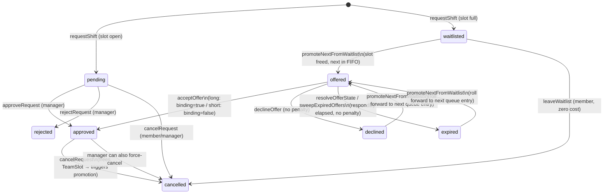

# MedOps Signup, Waitlist & Priority Access — Implementation Plan

> **Status:** **In build. Revision 4.** PR zero and Phase 0 are committed locally (not pushed);
> Phases 0.5 → 3 are in progress. See [§10 Implementation log](#10-implementation-log-r4) for what
> has actually shipped and what the build discovered that the plan did not predict.
> **Scope:** Extends the existing event / shift-signup system (`app/events`, `app/lib/events.ts`)
> with a waitlist queue, tiered notice-based promotion, priority access windows for high-demand
> events, tenure tracking, and reminder notifications.
> **Policy is settled.** The tiered-notice promotion model and the no-show rules in §3 are the
> output of a resolved internal debate and are treated here as fixed requirements. This document
> plans *how to build them against the current code*, not whether to.

> ### Revision 4 — 2026-08-29 (build begins; three defects the plan missed)
>
> The plan left approval and entered implementation. Scope agreed with Ivan: **PR zero → Phase 3**
> (Phases 4a/4b excluded). Git handling **overrides P14's "open a PR"** for now: branch and commit
> each phase locally, **never push** — per the repo's standing "never commit or push unless the user
> explicitly asks" rule, of which committing locally is the part that was asked for.
>
> Implementation surfaced three defects **not in this plan**, all now fixed in Phase 0. Each is
> written up in [§10.3](#103-discoveries--things-the-plan-did-not-predict); the short version:
>
> | # | What the plan missed | Why it mattered |
> |---|---|---|
> | **D1** | §2.1's audit enumerated 25 **client-side** `===`/`!==` sites but **no Firestore `where('status', …)` filters**. `subscribePendingRequests` filters status *server-side*. | A different and worse risk class. Every client fix in the audit is recoverable by reading the code; an over-narrow **query** never fetches the docs at all, so Phase 1's manager queue panel would have rendered a plausible, silent, permanently-empty list. |
> | **D2** | `EventTeam.startTime` per-team overrides mean an offered member's real shift start is **not** `Event.callTime`. | Classing notice from the event-level time can stamp `binding: true` on a shift that is genuinely inside the short-notice window — a direct **P4** violation with real no-show liability attached. |
> | **D3** | `pickArray`'s "empty array means unset, use defaults" rule is wrong for the new **opt-out** config lists. | Deleting every reminder row would silently restore `[48, 12]` and keep firing reminders. Reads to the admin as "the settings page ignored my edit" — a **P11** violation. |
>
> One thing the plan got right and is worth recording as such: §9.5's three CI defects were each
> independently verified in the repo before PR zero touched them, and Phase 0.5's safety claim holds
> (186 top-level `collection(db, …)` call sites, **0** subcollection accesses).
>
> Changes introduced by this revision are marked **[R4]** inline. **[R3]**/**[R2]** markers are
> left as-is.

> ### Revision 3 — 2026-08-28 (issue sweep + delivery workflow)
>
> Two asks: **close every remaining open item** so nothing in this document is left to "confirm
> later", and **write down how the feature actually ships** — a branch, local testing, a push, and a
> PR into `origin/main`. Both are done. What changed:
>
> | Area | Change |
> |---|---|
> | **New §9** | [Delivery workflow](#9-delivery-workflow--branch-local-verification-and-pr-to-originmain-r3): branch-per-phase off `main`, the local emulator verification script per phase, staging, push, PR, merge order, and rollback. New **P14** makes "never commit to `main` directly" binding. |
> | **§9.5 — three real CI defects, verified in the repo** | Two workflows both deploy `channelId: live` on every push to `main` and **race**; one of them (`firebase-hosting-merge.yml`) builds with placeholder secret names and no `webframeworks` flag, so it publishes `firebase.json`'s `"public": "public"` — the stock *"Welcome to Firebase Hosting"* page — over the live app. The PR preview workflow has the same missing flag, so **the preview URL is not yet a trustworthy test surface**. A one-file "PR zero" fixes all three before Phase 0 starts. |
> | **§8 Phase 0.5 — the proposed ruleset was a no-op** | `firestore.rules` ends with `match /{document=**} { allow read, write: if true; }`, and Firestore rules are **additive**: the restrictive `shift_requests` block Revision 2 sketched would not have denied a single write. The catch-all must be narrowed. Scope also shrinks to `shift_requests` only — see §8 Phase 0.5. |
> | **§8 Phase 0.5 — the rules file is emulator-only** | The file carries a "Do NOT deploy this file to a live project" banner, and five emulator test scripts write to it **unauthenticated**. Tightening it in place breaks `test:invariants` / `test:properties` / `test:simulation` / `test:events` / `test:e2e`. Resolved by splitting the file (`firestore.rules` = production, `firestore.emulator.rules` + `firebase.emulator.json` = harness). |
> | **§9.6 — nothing deploys rules or indexes** | No workflow runs `firebase deploy --only firestore`. Rules and `firestore.indexes.json` (§2.6, currently an empty `{"indexes": []}`) are **manual**, and index-before-code ordering is now written down. |
> | **§2.1 — the consumer audit stops guessing** | Revision 2 said the manager inbox filter was "presumably `status === 'pending'`" and that the list was "not fully enumerated". It is now enumerated: **25 verified `ShiftRequest.status` comparison sites across 8 files**, each with a required action — including one (`events.ts:274`) that the obvious grep **misses**, because it aliases `status` to a local first. |
> | **§7 "Still to confirm"** | All four items closed. Notably: **the repo is public** (verified via the GitHub API), so the Actions-minutes ceiling in §6.5 does not apply — and a different consequence does. |
>
> Changes introduced by this revision are marked **[R3]** inline. **[R2]** markers are left as-is.

> ### Revision 2 — 2026-08-26 (Ivan's review of §7)
>
> All ten open questions are answered; §7 is now a record of decisions, not a question list.
> The governing change is **more of this feature is configurable and less of it is hardcoded**
> (new **P11**). Specifically:
>
> | # | Answer | What moved |
> |---|---|---|
> | Q1 | **Blaze deferred** — no card on file for now. Asked for an email workaround. | §6.4 is rewritten: a **free external clock** (GitHub Actions / Apps Script) replaces "wait for Cloud Functions". Blaze becomes an optional later swap, not a prerequisite. |
> | Q2 | **In-app only for now**; push/SMS revisited after cost. | §6.1 channel column collapses to in-app for Phases 1–3; the short-notice limitation is stated to members in copy, not engineered around. |
> | Q3 | **Make it customizable.** | 48h cancellation becomes `cancellationPolicy` config with four modes + per-event override (§3.4, §4.1). |
> | Q4 | **Make it customizable** — shift types are in. | `eventType` denormalized onto `ShiftRequest`; `MemberShiftStats.shiftsByType`; `minShiftsByType` tier criterion (§2.1, §3.7). |
> | Q5 | **The roster spreadsheet is the truth**; joins happen at semester boundaries. | `joinedOn` is *derived from a configured term start date*, not parsed by guesswork. New `terms` config; `joinedTerm` becomes a config-backed picker (§2.3, §4.1). |
> | Q6 | **Agreed** — minimum viable rules. | New Phase 0.5 (§8) with a rules sketch. |
> | Q7 | **Agreed, but configurable.** | `declinedOfferBehavior: 'terminal' \| 'requeue_back'` + `maxOffersPerMember` (§4.1). |
> | Q8 | **Per event.** | The queue key changes from `(eventId, teamId, role)` to **`(eventId, role)`**, with an optional soft team preference. Touches §2.1, §2.6, §3.5, §5.1, §5.4. **P2/P13.** |
> | Q9 | **No manager approval to join a queue.** | Unchanged from Revision 1 — and deliberately *not* made configurable (§7 Q9 explains why this is the one knob not added). |
> | Q10 | **`callTime` required on every event**, not just waitlist-enabled ones. | The "cannot classify notice" branch becomes legacy-only (§3.3, §3.5). **P12.** |
>
> Two structural changes follow from the answers rather than from any single one:
> **§4 is now "Config, customization and settings"** and roughly triples in size — six settings
> cards, a per-event override layer (`resolveEventPolicy`), and a **§4.5 inventory of every knob
> MedOps can turn without a deploy**, which is the check on P11. And **§8 goes from four phases to
> six**: a new **Phase 0.5** (Firestore rules) lands before the waitlist reaches members, and the old
> Blaze-gated Phase 4 splits into **4a** (free external clock, buildable today) and **4b** (optional
> Blaze swap, may never be built).
>
> Changes introduced by this revision are marked **[R2]** inline.

## Table of contents

| § | Section |
|---|---|
| 0 | [Binding design decisions (P1–P14)](#0-binding-design-decisions-referenced-as-p1p14-throughout) |
| 1 | [Summary of current state](#1-summary-of-current-state) |
| 2 | [Data model changes](#2-data-model-changes) |
| 3 | [Business logic — states and transitions](#3-business-logic--states-and-transitions) |
| 4 | [Config, customization and settings](#4-config-customization-and-settings) |
| 5 | [UI and component changes](#5-ui-and-component-changes) |
| 6 | [Notification and reminder implementation](#6-notification-and-reminder-implementation) |
| 7 | [Resolved decisions (was: open questions)](#7-resolved-decisions-was-open-questions) |
| 8 | [Suggested build order and phasing](#8-suggested-build-order-and-phasing) |
| 9 | **[R3]** [Delivery workflow — branch, local verification and PR to `origin/main`](#9-delivery-workflow--branch-local-verification-and-pr-to-originmain-r3) |
| 10 | **[R4]** [Implementation log — what shipped, and what the build discovered](#10-implementation-log-r4) |

## 0. Binding design decisions (referenced as **P1–P14** throughout)

These were fixed up front so the sections below could be drafted against a single consistent
design. They are referenced by number in the text. Changing one of these is a re-plan, not a
tweak — each has downstream consequences in at least two other sections.

| # | Decision | Rationale |
|---|---|---|
| **P1** | The waitlist reuses `shift_requests`; **no new collection**. `ShiftRequestStatus` widens to include `waitlisted`, `offered`, `declined`, `expired`. | Reuses all existing subscription, inbox and history plumbing. Cost: every existing consumer of `status` must be audited (§8, Phase 0). |
| **P2** **[R2]** | Queue position is **derived, never stored** — ascending `waitlistedAt` within **`(eventId, role)`**. | No renumbering write storm when someone leaves the middle of a queue. Position is a read-time computation. The key dropped `teamId` in Revision 2 — see P13. |
| **P3** **[R2]** | Offer state lives in one `offer` sub-object, and `noticeClass`, `binding` **and the resolved policy snapshot** are **computed once at offer time and frozen**. | Retuning an org-config threshold — or a per-event override — later must not retroactively change what a past offer meant to the person who accepted it. |
| **P4** | No-show liability is an explicit `commitmentBinding: boolean`, true **only** after (a) a normal approved signup or (b) explicit acceptance of a *long*-notice offer. | The core policy guarantee: joining a queue, being offered a slot, and any short-notice promotion carry **no no-show risk under any circumstance**. |
| **P5** **[R2]** | Tiered events are a **staged release window, not an eligibility gate**, and an event may define **any number of tier windows**. After `generalOpensAt`, everyone can sign up with no manual override. | A tier that fails to fill must not block general signup or require an admin to remember to unlock it. Multiple windows ("FTOs at 21 days, veterans at 14, everyone at 7") is the shape MedOps actually described; one window is just a one-element list. |
| **P6** **[R2]** | Timed behaviour is **evaluated client-side on read**, with an opportunistic sweep write by manager clients. An **external free-tier worker** (§6.4) may drive the same sweep on a real clock; it is an accelerator, never a correctness dependency. | There is no scheduler in this stack (§1.2). Reads are always correct; the queue advances when a client opens the app, or sooner if the worker is running. |
| **P7** **[R2]** | Add `User.joinedOn: Timestamp` for tenure, **derived from a configured term start date** rather than parsed from freeform text. Shift **counts** stay derived — no denormalized counters. | The roster spreadsheet is the source of truth and members join at semester boundaries (Q5), so "when did you join" is really "which term did you join in" — a picker over configured terms, not a date guess. |
| **P8** **[R2]** | Thresholds, windows, **member-facing copy**, and every other policy number live in `org_settings/current`, **with an optional per-event override** resolved by one function (`resolveEventPolicy`). Defaults: long-notice threshold **24h**, long response window **12h**, short response window **2h**. | Config is data, not code, in this codebase. MedOps must be able to retune without a deploy, and per-event exceptions must not require a new global default. |
| **P9** | The policy itself is settled and is not re-litigated in this document. | This plan covers implementation of a resolved decision. |
| **P10** | Where a genuine choice existed, the plan **makes the call and justifies it** rather than presenting options. | Unresolved ambiguity in a spec becomes two incompatible implementations. |
| **P11** **[R2]** | **Nothing about this feature's policy is hardcoded.** Every threshold, window, mode, criterion, and member-facing string is org-config data with a `/settings` form and an optional per-event override. A behaviour that can only be changed by editing TypeScript is a defect in this plan, not a simplification. | Ivan's governing note on the review: "more customization options would be better." It also keeps the feature retunable by MedOps officers who change every year. |
| **P12** **[R2]** | **`callTime` is required on every event at creation** (Q10) — not just waitlist-enabled ones. | Notice class, reminders, lateness and the external worker's bounded queries all derive from the shift's start instant. Making it optional pushes a null branch into five call sites to save one required field. |
| **P13** **[R2]** | **The waitlist is per-event-per-role** (Q8). A member joins one queue per role per event; the *team* is an outcome of promotion, not part of the queue key. An optional `preferredTeamId` is a **soft hint**, honoured by a configurable strategy. | Matches member intent ("I want an EMT slot at this game"), and means a seat freeing on Team A reaches everyone waiting, not only the subset who happened to queue on Team A. |
| **P14** **[R3]** | **No part of this feature is committed to `main`.** Every phase is a branch off `main`, verified locally against the emulator, pushed, and merged through a pull request (§9). | A push to `main` **deploys the live site automatically** (§9.5) — `main` is production, not an integration area. This is also the only reason the CI defects in §9.5 are in scope for this plan at all: they sit directly in the path between "the code is done" and "members can use it". |

## 1. Summary of current state

Findings from a read-only pass over the events subsystem. Everything below is verified against
the code, not assumed.

### 1.1 What exists

| Area | Where | State |
|---|---|---|
| Event model | `app/types.ts:198-218` | `Event` with an **embedded** `teams: EventTeam[]` array — not a subcollection |
| Team / slots | `app/types.ts:158-194` | `EventTeam` = 1 `ftoSlot`, optional supernumerary `ftoInternSlot`, `emtSlots: TeamSlot[]` (2–4). `TeamSlot = { userId?, userName?, requestId? }`; an empty object means open |
| Signup | `app/lib/events.ts:241-318` | `requestShift()` writes a `shift_requests` doc at `status:'pending'` |
| Staffing | `app/lib/events.ts:325-390` | `approveRequest()` places the member into an open slot inside a **transaction on the event doc** |
| Cancellation | `app/lib/events.ts:427-461` | `cancelRequest()` clears the slot and frees the seat |
| Attendance | `app/lib/events.ts:484-618` | `recordAttendance` / `checkInMember` / `checkOutMember`; record stored **inline** on `ShiftRequest.attendance` |
| Member stats | `app/lib/events.ts:693-744` | `getMemberShiftStats()` — **derived on read**, no persisted counters |
| Permissions | `app/lib/events.ts:69-84`, `app/components/events/event-utils.ts:228-292` | `isEventManagerRole`, `canRequestRole`, `getAttendanceAccess` |
| Cert gating | `app/lib/certifications.ts:66-73` | `canSignUpForShifts()` — EMT + CPR, kill-switched by `requireCertsForShiftSignup` |
| Notifications | `app/lib/notifications.ts` | In-app Firestore docs only, read by the bell / dashboard feed |
| Config | `app/config/org-config.ts:537-600`, `app/lib/org-config-store.ts:60-139` | Runtime-editable `org_settings/current` with `/settings` form UI |

### 1.2 What does **not** exist — the five facts that shape this plan

1. **No waitlist or queueing concept of any kind.** Capacity is not a stored number; "full" is
   computed inline from slot occupancy (`teamFilledCount`, `app/lib/events.ts:134-140`;
   `emtHasOpenSlot` in `team-card.tsx`). When a team is full, `renderRequestControl` in
   `app/components/events/team-card.tsx` simply returns `null` — there is nothing to extend, only
   somewhere to insert.

2. **No server-side execution whatsoever.** `next.config.ts:5` is `output: 'export'` — no API
   routes, no middleware. There is no `functions/` directory, no `functions` block in
   `firebase.json`, and no mail/push/cron dependency in `package.json`. Every line of logic in
   this app runs in the member's browser.

3. **No scheduler.** Nothing clock-driven can run today. This is the single biggest constraint on
   the feature: response windows, offer expiry, staged tier openings, and shift reminders are all
   *timed* behaviours, and there is currently no clock to drive them. §3.6 and §6 address this
   head-on rather than assuming it away.

4. **No usable tenure signal.** `User.joinedTerm` is a **freeform string** (`"Fall 2025"`) and
   `formatMemberExperience` (`app/lib/events.ts:231-235`) is a label formatter, not a duration
   calculation. There is no date to compare against, so priority-tier eligibility cannot be
   computed from the current schema. Shift *counts* are derivable
   (`getMemberShiftStats(...).shiftsAllTime`) but shift *type* is not broken out anywhere in
   member stats, even though `Event.eventType` exists.

5. **No enforced security rules.** `firestore.rules` is explicitly labelled emulator-only and ends
   in a catch-all `allow read, write: if true`. Every role check in this app — `isEventManagerRole`,
   `canRequestRole`, `getAttendanceAccess` — is **UI-only**. This plan does not change that, but it
   materially raises the stakes: a waitlist with priority tiers is the first feature where a member
   has a concrete incentive to bypass the client. See §7.

### 1.3 Load-bearing conventions this plan must respect

- **`medops` is not `isAdmin`** (D-13). Event surfaces gate on `isEventManagerRole`
  (`app/lib/events.ts:69-71`) = `admin | quartermaster | medops`. Every new manager-facing waitlist
  control follows that gate, never `isAdmin`.
- **FTO intern is supernumerary** (D-30) and is excluded from staffing math. A waitlist must not
  count the intern slot toward "full", and the intern slot gets its own independent queue.
- **`undefined` means "off" for new optional flags** (the `hasFtoIntern` precedent, D-30). Every new
  optional field in §2 declares its legacy-undefined semantics explicitly.
- **`deepRemoveUndefined`** (`app/lib/audit.ts:43-72`) preserves `Date` / `Timestamp` / `FieldValue`
  but strips `undefined`. New date fields must be real Timestamp instances — rebuilding them as
  `{seconds,nanoseconds}` maps is a known past bug in this exact subsystem.
- **Config is data, not code.** Thresholds and windows belong in `org_settings/current` with a
  `/settings` form, per the existing pattern — never hardcoded constants.

## 2. Data model changes

No new collections. Every addition is a field on `ShiftRequest`, `Event`, `User`, or
`AppNotification` in `app/types.ts`, per P1. All new fields are optional — legacy docs
without them must produce defined, non-ambiguous behavior (see 2.5).

### 2.1 `ShiftRequest` extensions (`app/types.ts:272-300`)

**Widened status union** (P1), replacing `types.ts:223`:

```ts
export type ShiftRequestStatus =
  | 'pending' | 'approved' | 'rejected' | 'cancelled'   // existing
  | 'waitlisted' | 'offered' | 'declined' | 'expired';  // new
```

| Value | Meaning |
|---|---|
| `waitlisted` | No slot was open at request time; entry sits in the FIFO queue for `(eventId, role)`. |
| `offered` | A slot opened and this entry was selected to fill it; the member has an open response window (`offer.respondBy`). |
| `declined` | Member explicitly declined an `offered` slot. Terminal **by default** — `waitlist.declinedOfferBehavior` can be set to `'requeue_back'` instead (§4.1) **[R2]**. |
| `expired` | `offer.respondBy` passed with no response; the lazy sweep (P6) or the external worker (§6.4) transitioned it. Same behaviour as `declined` for queue purposes. |

`waitlisted`/`offered` are the only two "live" new states; `declined`/`expired` are terminal siblings of the existing `rejected`/`cancelled` under the default policy.

#### The queue key is `(eventId, role)` **[R2]**

Revision 1 keyed the queue on `(eventId, teamId, role)`. Ivan's answer to Q8 changes it to
**`(eventId, role)`** (P13). Consequences, spelled out because this is the single most
structural change in Revision 2:

- A member joins **one queue per role per event** — "EMT at the Oct 4 game" — not one per team.
  A seat freeing on *any* team reaches *everyone* waiting for that role.
- `teamId` is therefore **not known when the request is written**. A waitlist entry writes
  `teamId: ''` and `teamName: ''` (documented sentinel = "not yet assigned"), and both are
  filled in with the real team at **offer** time, inside the same transaction that holds the slot.
  Rejected alternative: widening `ShiftRequest.teamId` to `string | undefined`. That would
  compiler-flag every existing consumer, which sounds appealing, but most of those consumers
  (`teams.find(t => t.id === r.teamId)`, `r.teamId === team.id`) are already correct against a
  sentinel and would need no change — so the widening buys churn, not safety. Add one helper,
  `isUnassignedQueueEntry(r)`, and check it where it matters.
- **`preferredTeamId?: string`** — the member's optional soft preference, captured in the same
  inline note flow as the join action (§5.1). It never removes them from the queue and never
  changes their position; how promotion treats it is governed by
  `waitlist.honorTeamPreference` (§3.5, §4.1): `'ignore'`, `'soft'` (default), or `'strict'`.
- Per-team queueing is still reachable — `waitlist.scope: 'team'` restores the Revision 1 key
  wholesale (§4.1). Keep both code paths behind the single `queueKeyOf(request, policy)` helper
  rather than branching at each call site.

**`waitlistedAt?: Timestamp`** (P2) — set once, at the moment a request is written as `waitlisted` (either because it started that way — no open slot at request time — or because it fell back onto the queue). This is the sole ordering key: `getWaitlistPosition` sorts a queue's `waitlisted` requests ascending on `waitlistedAt` and returns the caller's 1-based index. Never renumbered, never rewritten on a queue change — position is a read-time computation over N docs, not a stored rank. Not set on `pending`/`approved` requests (direct signups don't queue).

**`skippedAt?: Timestamp`** (added during reconciliation, to support the manager **Skip** action in §5.4) — set when a manager deprioritizes a queued member without removing them. `getWaitlistPosition` sorts by `(skippedAt == null ? 0 : 1)` **first**, then ascending `waitlistedAt`. A skipped entry therefore falls behind every non-skipped entry while retaining its original arrival time as the tie-break among other skipped entries. This preserves P2 exactly — position stays a pure read-time computation and nothing is renumbered. Clearing the field restores the member's original position (the "undo"). Legacy/undefined = not skipped.

**`shiftStartAt?: Timestamp`** **[R2]** — the denormalized start instant of the shift this request is for (team `startTime` if set, else `event.callTime`, resolved against `event.date` — §3.3). Written at request time and re-stamped whenever the event's date/call time changes. Three things need it and none of them can afford an event join:

1. The **external worker** (§6.4) needs a bounded query — `where('status','==','offered')` plus a
   date window — without loading every event to find out which requests are near-term. This is
   the difference between a cheap sweep and the unbounded scan called out in §6.5.
2. The **cancellation policy** (§3.4) compares `now` against the shift start; with the value on
   the request doc, a Firestore rule (Phase 0.5, §8) can enforce a `'block'` mode server-side
   instead of it being pure UI theatre.
3. Reminders (§6.2) need "shifts starting in N hours" as a query, not a scan.

Denormalization risk is the usual one: it goes stale if the event's date or call time is edited.
`updateEvent` must re-stamp `shiftStartAt` on every non-terminal request for that event in the
same batch — the same propagation obligation the location model already carries for zone renames
(CLAUDE.md, "Location Model"). Treat a mismatch as a bug, not a tolerable drift.

**`eventType?: string`** **[R2]** — denormalized `Event.eventType` at request time (Q4). Follows the
existing `memberStatus`/`joinedTerm` denormalization precedent on this same doc. This is what makes
`MemberShiftStats.shiftsByType` and the `minShiftsByType` tier criterion (§3.7) derivable from a
member's own `shift_requests` query with no event fan-out. Legacy/undefined = "type unknown";
it must be counted in the flat `shiftsAllTime` total but excluded from every per-type bucket —
never bucketed under a synthesized `'other'`, which would silently satisfy a `minShiftsByType`
rule the member never actually met.

**`offer?: WaitlistOffer`** (P3):

```ts
export interface WaitlistOffer {
  offeredAt: Timestamp;
  /** Deadline for the member to accept/decline. */
  respondBy: Timestamp;
  /** Which notice-window bucket produced this offer — see P8 thresholds. */
  noticeClass: 'long' | 'short';
  /**
   * Whether accepting this offer creates no-show liability. Computed ONCE at
   * offer time from the RESOLVED policy (org config + per-event override) and
   * FROZEN on the doc — a later retune must not retroactively change what a
   * past offer meant. See commitmentBinding below.
   */
  binding: boolean;
  /**
   * [R2] The resolved policy this offer was made under, frozen alongside it.
   * Everything a reader needs to explain the offer months later without
   * re-deriving it from today's config. See resolveEventPolicy (§4.3).
   */
  policy: {
    longNoticeThresholdHours: number;
    responseWindowHours: number;
    cancellationNoticeHours: number;
    cancellationMode: 'ignore' | 'flag' | 'confirm' | 'block';
  };
  /** [R2] Which team's slot this offer is for — the queue itself is team-agnostic (P13). */
  teamId: string;
  teamName: string;
  offeredBy: string;
  respondedAt?: Timestamp;
  response?: 'accepted' | 'declined' | 'expired';
}
```

`offer` is present only while `status` is `'offered'`, or as the final snapshot after it resolves to `approved` (accepted), `declined`, or `expired`. It is never present on a plain `pending`/`waitlisted` doc.

**Why the frozen `policy` block is not redundant with `binding`** **[R2]**: `binding` answers "does
accepting create liability," which is the only thing the *accept transaction* needs. The `policy`
block answers "under what rules was this offered," which is what the *member-facing copy*, the
manager's audit view, and any later dispute need — including the cancellation terms that attach
only after acceptance. Since P11 makes all of these per-event overridable, re-deriving them at read
time from current config would be wrong for every offer made before the last edit.

**`offerCount?: number`** **[R2]** — how many offers this member has been made for this event, used by
`waitlist.maxOffersPerMember` (§4.1) to cap the requeue loop when `declinedOfferBehavior` is
`'requeue_back'`. Absent = 0. Without this cap, a member who declines everything cycles to the back
forever and blocks nobody but wastes every promotion round on a known decline.

**`commitmentBinding?: boolean`** (P4) — governs whether a no-show against this request is held against the member. Set explicitly, never left to infer from `status` alone:

| Set to `true` when | Set to `false` when |
|---|---|
| A normal direct signup (no waitlist involved) is `approved`. | Any `waitlisted` entry (queued, not yet offered). |
| A **long-notice** offer (`offer.noticeClass === 'long'`) is explicitly **accepted** (`offer.response === 'accepted'`). | An `offered` entry with no response yet. |
| | Any **short-notice** offer, regardless of outcome — even if accepted. |
| | `declined` / `expired` / `rejected` / `cancelled` requests (moot — no shift to no-show on). |

> **Legacy-undefined asymmetry (footgun, spelled out per P4):** `commitmentBinding` did not
> exist before this phase, so every pre-existing doc has it `undefined`. The read-side default
> is **status-conditional, not a single default**:
> - `undefined` **and** `status === 'approved'` → treat as `true`. These are legacy direct
>   approvals from before waitlisting existed; they were always binding in practice (the old
>   binary approved/not-approved model had no non-binding approved state), so defaulting them
>   to non-binding would silently forgive existing no-show liability on every historical record.
> - `undefined` **and** `status !== 'approved'` (i.e. `pending`, `rejected`, `cancelled`, or any
>   new waitlist status on a doc written by code that hasn't been updated yet) → treat as `false`.
>   There is no shift to be liable for.
>
> Any code reading this field must branch on `status`, not just do `request.commitmentBinding ?? true`
> or `?? false` uniformly — both single-default reads are wrong for half the doc population.
> Centralize this as a helper (e.g. `isCommitmentBinding(request)`) rather than inlining the
> branch at every no-show call site.

**`lateCancellation?: boolean`** and **`lateCancellationHours?: number`** **[R2]** — stamped by
`cancelRequest` when the configured cancellation policy is triggered (§3.4). The hours figure is
stored alongside the flag because the *threshold* is configurable and per-event overridable: a flag
alone can't tell a manager six weeks later whether "late" meant 48h or 12h on that event.

**`offerHistory?: WaitlistOffer[]`** — append-only log of every offer this request has received (oldest first), pushed to whenever `offer` is overwritten (e.g. offer 1 expires, entry rejoins queue under `'requeue_back'`, offer 2 is made later). Keep it. Justification: without it, a member offered a slot who declines and is later re-queued has their entire first offer overwritten and unrecoverable — `event-detail-drawer.tsx`'s manager inbox and any future no-show dispute ("I never got offered a slot in time") have nothing to point to. Doc-size cost is trivial: an offer object is a handful of scalars plus the frozen policy block (~300 bytes), and a single request realistically accumulates low single digits of offers over its lifetime — nowhere near Firestore's 1 MiB doc cap. `maxOffersPerMember` bounds it explicitly. Do not build a similar unbounded log for anything higher-cardinality (e.g. don't do this for attendance edits).

**Consumer audit** — a widened union with stale `switch`/equality/filter sites is the top regression risk in this whole plan. Every one of these must be checked against the new values before ship:

| Site | Current behavior | Required check |
|---|---|---|
| `getMemberShiftStats` (`events.ts:693-744`) | `events.ts:711`: `if (r.status !== 'approved') continue;` | **Already correct** — new statuses are silently excluded, no change needed. Confirmed by reading; call this out in review so nobody "fixes" it into a switch. |
| Duplicate-active-request guard, `requestShift` (`events.ts:241-318`) | `events.ts:273-277`: `hasActive` = `status === 'pending' \|\| status === 'approved'` | **Must widen.** A member with an open `waitlisted` or `offered` entry for the same event must also be blocked from a second request. **[R2]** With a per-event queue this guard gets *simpler*, not harder: one active request per `(eventId, userId)` regardless of team, which is exactly what the existing `where('eventId','==',…).where('userId','==',…)` query already returns. |
| `cancelRequest` (`events.ts:427-461`) | Frees the `TeamSlot` only when the request was `approved` (matches by `requestId`/`userId`) | Must also handle cancelling a `waitlisted` or `offered` entry — no slot to free for a waitlisted doc (it never held one); an offered entry holds a slot softly (§3.5) and must release it. This is **the exact hook where, on cancelling an `approved` seat, the promotion sweep should fire**. Declining an `offered` entry must NOT re-trigger promotion recursively in the same call (avoid reentrant sweep loops). Also the site that evaluates the cancellation policy (§3.4). |
| Manager pending inbox, `event-detail-drawer.tsx:158` | **[R3] Verified, not presumed:** `requests.filter(r => r.status === 'pending')` | `waitlisted`/`offered` entries belong in a **separate waitlist panel** (§5.4) — different actions (promote/extend vs. approve/reject). The type-level requirement: don't let an unfiltered `pending`-only query silently drop new statuses from *any* list that's supposed to show "still needs my attention." |
| Anything grouping requests by team | Assumes every request has a real `teamId` | **[R2] New risk.** A `waitlisted` doc carries `teamId: ''`. Any `groupBy(teamId)` in the drawer, roster, or stats must exclude non-`approved`/non-`offered` docs or it grows a phantom "" group. Grep `\.teamId` alongside the `status ===` grep. |

**[R3] The full grep, run.** Revision 2 left this list "not fully enumerated" and guessed at the
likely sites. Here is the actual result of
`grep -rn "status === 'pending'\|status === 'approved'\|status !== 'approved'\|status === 'rejected'\|status === 'cancelled'" app --include=*.ts --include=*.tsx`,
filtered to `ShiftRequest` consumers (the `assets/page.tsx` and `stats/procurement.ts` hits are
`MaintenanceLog.status` and `Purchase.status` — different unions, out of scope). **25 comparison
sites across 8 files**, collapsed into 16 rows below. Every row must be ticked off in the Phase 0 PR:

> **The grep does not find everything, and the first row proves it.** `events.ts:273-277` reads
> `const s = (d.data() as ShiftRequest).status; return s === 'pending' || s === 'approved';` — the
> literal is compared against `s`, not against `.status`, so the pattern above walks straight past
> the single most important site in the audit. Run the string-literal form as well —
> `grep -rn "'waitlisted'\|'offered'\|'pending'\|'approved'" app --include=*.ts --include=*.tsx` —
> and read the hits. **Treat the table below as verified-but-not-provably-complete**; the union is
> small enough that a TypeScript-side forcing function is worth more than any grep: if a `switch` over
> `ShiftRequestStatus` gets an `assertNever` default, the compiler enumerates the remaining sites for
> you.

| File:line | Expression | Required action |
|---|---|---|
| `app/lib/events.ts:273-277` | `hasActive` = `pending \|\| approved` | **Widen** — add `waitlisted`, `offered`. One active request per `(eventId, userId)`. |
| `app/lib/events.ts:431` | `cancelRequest`: `if (request.status !== 'approved')` — early-exit path that just marks cancelled | **Widen the branch** — a `waitlisted` doc has no slot to free (correct today by accident); an `offered` doc holds a slot softly and **must release it** (§3.5). Today it would leak the soft hold. |
| `app/lib/events.ts:499` | Attendance path: `if (request.status !== 'approved')` throw | **Already correct** — attendance only ever applies to an approved seat. Leave. |
| `app/lib/events.ts:711` | `getMemberShiftStats`: `if (r.status !== 'approved') continue` | **Already correct** — new statuses are excluded by construction. Call this out in review so nobody "fixes" it into a `switch`. The `noShowNonBinding` / `lateCancellations` counters of §3.4 are added *beside* this loop, not inside its filter. |
| `app/lib/stats/staffing.ts:100,181,282,375` | Four `status === 'approved'` / `!== 'approved'` guards | **Already correct, and must stay that way** — staffing metrics count filled seats. A `waitlisted` doc entering these loops would inflate every fill-rate tile on `/stats`. Add a one-line comment at each so the intent survives. |
| `app/components/events/event-utils.ts:59` | `findMyRequest`: `pending \|\| approved` | **Widen** — a member with a live `offered` or `waitlisted` entry must see it as their request on the card, not see an "Request a slot" button that would create a duplicate. |
| `app/components/events/event-utils.ts:69-70` | Chip label: `approved` → "Confirmed", `pending` → "Requested" | **Extend** — needs `waitlisted` → "Waitlisted #n", `offered` → "Offer pending", `declined`/`expired` → neutral past-tense. Falls through to the event-status branch on line 72 today, which would mislabel a waitlisted member's card as "Closed". |
| `app/components/events/event-utils.ts:117` | Manager badge count: `status === 'pending'` | **Decide, don't widen by reflex** — this is the "needs my decision" count. Waitlist entries need **no** decision (Q9), so they must **not** be added here; `offered` entries are awaiting the *member*, not the manager. Correct as-is; add a comment saying so. |
| `app/components/events/event-detail-drawer.tsx:155` | `myActiveRequest`: `pending \|\| approved` | **Widen** — same reason as `event-utils.ts:59`. This is also the value the offer-response modal (§5.2) keys off. |
| `app/components/events/event-detail-drawer.tsx:158,159` | `pending` / `approved` memos | **Leave, and add a third** — `waitlisted`/`offered` go to the new queue panel (§5.4), not into either of these. |
| `app/components/events/event-detail-drawer.tsx:162,486,489` | `status === 'approved'` for the check-in gate and the Confirmed/Requested chip | **Leave 162** (only an approved seat can check in). **Extend 486/489** — the binary `approved ? 'success' : 'warning'` renders every new status as an amber "Requested". |
| `app/dashboard/member-dashboard.tsx:225` | `approved \|\| pending` upcoming-shifts filter | **Widen to include `offered`** — an unanswered offer is the single most time-critical thing a member can have, and this is the surface they actually look at (§5.2 entry point). |
| `app/dashboard/member-dashboard.tsx:519,523` | Same binary chip as the drawer | **Extend** — same fix. |
| `app/events/page.tsx:143,144` | `myConfirmedCount` / `myPendingCount` | **Extend** — add a waitlisted/offered count, or the header undercounts a member's involvement. |
| `app/history/page.tsx:101` | `status === 'approved'` | **Leave the existing filter; add a second list** — §5.5 renders waitlist outcomes distinctly and non-punitively. Do **not** fold `expired`/`declined` into the approved history list. |
| `app/roster/page.tsx:484` | `status === 'approved'` | **Already correct** — the roster counts real shifts. |

**Second grep, for the `teamId: ''` sentinel:** `grep -rn "\.teamId" app --include=*.ts --include=*.tsx`
before ship. Any `groupBy(teamId)` or `teams.find(t => t.id === r.teamId)` that runs over unfiltered
requests grows a phantom `''` group once queue entries exist (§2.1). The rule: **filter by status
first, group by team second** — never the reverse.

**Worked example** (concretizes the P2/P3/P4 field interaction on one doc across its lifecycle, per-event queue):

1. Member requests EMT at an event whose EMT slots are all full → doc written `status: 'waitlisted'`, `waitlistedAt: <now>`, `teamId: ''`, `preferredTeamId: 'team-b'` (they'd rather be with Team B, but said they'd take anything), `eventType: 'football'`, `shiftStartAt: <event start>`. No `offer`, `commitmentBinding` reads as `false`.
2. A seat frees — **on Team A, not their preference**. Under the default `honorTeamPreference: 'soft'`, the sweep first looks for a queued member who either wants Team A or has no preference; finding none ahead of them, it offers this member the Team A slot anyway. Say the shift is 30h out, above the resolved 24h long-notice threshold: the doc gets `status: 'offered'`, `offer: { offeredAt, respondBy: now+12h, noticeClass: 'long', binding: true, policy: {…frozen…}, teamId: 'team-a', teamName: 'Team A', offeredBy: <manager or system actor> }`. `commitmentBinding` is still read as `false` — `offer.binding` is a separate frozen field that only takes effect once accepted.
3a. **Accepted in time**: doc updates `status: 'approved'`, `teamId/teamName: 'team-a'/'Team A'`, `offer.respondedAt`, `offer.response: 'accepted'`, and — because it's a long-notice offer — `commitmentBinding: true` explicitly. A `waitlist_promoted` notification fires (2.4).
3b. **Declined**: `status: 'declined'`, `offer.respondedAt`, `offer.response: 'declined'`, `offerCount += 1`. Under the default `declinedOfferBehavior: 'terminal'` the doc stays terminal; under `'requeue_back'` it instead returns to `status: 'waitlisted'` with a **fresh** `waitlistedAt` (back of the queue) and the resolved offer pushed onto `offerHistory` — until `offerCount` hits `maxOffersPerMember`, after which it is terminal regardless. `commitmentBinding` stays `false` either way.
3c. **Expired** (no response by `respondBy`): the lazy sweep (P6) or the external worker (§6.4) transitions `status: 'expired'`, `offer.response: 'expired'`. Same non-binding outcome as 3b, same requeue rule.

This example is also why `offer.binding` (frozen at offer time, P3) and `commitmentBinding` (mutable, set at acceptance, P4) are two separate fields rather than one: `offer.binding` records "would accepting this have been binding" as a permanent fact about the offer itself, independent of whether it was ever accepted, while `commitmentBinding` records the actual current liability state of the request. Collapsing them would lose the ability to distinguish "an unaccepted long-notice offer" from "a short-notice offer" purely from the frozen record once `commitmentBinding` reads `false` for both.

### 2.2 `Event` extensions (`app/types.ts:198-218`)

**`callTime` becomes required** **[R2]** (P12, Q10). It is currently optional
(`callTime?: string`). Three changes:

- Type: `callTime: string` — no longer optional on new events.
- `event-editor-modal.tsx`: required field, save blocked with an inline error if empty. This is
  the whole enforcement mechanism; there is no server to reject it.
- **Legacy events already in Firestore may still lack it**, so read paths keep a null branch —
  but that branch is now "legacy data" handling, not a supported state. `scripts/` gets a
  one-off report (not a guess-and-write migration) listing events with no `callTime` so MedOps
  can fill them in from the drawer. Any legacy event without one is **excluded from auto-promotion**
  and surfaced to managers as "needs a call time" (§3.5), which is a far more visible failure than
  Revision 1's silent fallback.

**`accessTier?: EventAccessTier`** (P5) — **[R2] now a list of windows, not a single window:**

```ts
export interface EventAccessTier {
  enabled: boolean;
  /**
   * [R2] Ordered staged-release windows, earliest first. Zero windows = a pure
   * "opens on a date" event. One window = Revision 1's behaviour exactly.
   */
  tiers: TierWindow[];
  /** After this instant, signup is open to everyone — no override needed or possible. */
  generalOpensAt: Timestamp;
  /** Author-written explanation, rendered to a blocked member BEFORE they hit the restriction. */
  rationale: string;
}

export interface TierWindow {
  id: string;
  /** Member-facing label for this window, e.g. "FTOs & 5+ shift members". */
  label: string;
  opensAt: Timestamp;
  criteria: TierCriteria;
}
```

```ts
export interface TierCriteria {
  /** Role allowlist — omitted means "no role restriction" for this criterion. */
  roles?: User['role'][];
  /** Member experience tier — omitted means no restriction. */
  memberStatus?: NonNullable<User['memberStatus']>[];
  minCompletedShifts?: number;
  /** [R2] Q4: per-event-type minimums, e.g. { football: 2 }. Keyed by eventType id. */
  minShiftsByType?: Record<string, number>;
  minTenureDays?: number;
  /** [R2] Q5: tenure in configured terms — the unit MedOps actually thinks in. */
  minSemesters?: number;
  requireCommitteeMember?: boolean;
  /** [R2] How the specified criteria combine. Default 'all'. */
  combine?: 'all' | 'any';
}
```

`User['role'][]` rather than a `UserRole` alias: the codebase has no standalone `UserRole` type today — the role union is inlined directly on `User.role` (`types.ts:97`). Introducing a named alias here is a small, real cleanup opportunity (`export type UserRole = User['role'];` in `types.ts`, then use it everywhere including `TierCriteria`) but is out of scope for this data-model section since it would touch existing call sites across the codebase; note it as a nice-to-have, not a requirement.

**Criteria combination defaults to AND, and is now author-selectable** **[R2]**. Every criterion
that is *specified* (non-`undefined`) must hold when `combine` is `'all'` (the default and the
Revision 1 behaviour); with `combine: 'any'`, one satisfied criterion is enough. `{}` means "anyone,
once this window opens" under either mode — a pure timing tier with no eligibility filter. The
default stays `'all'` because it is the conservative reading and the one Revision 1 was written
against; `'any'` exists because "FTOs **or** anyone with 5+ shifts" is a real MedOps sentence that
`'all'` cannot express, and forcing it into two separate `TierWindow`s with identical `opensAt`
works but reads badly in the settings form.

**Multi-window evaluation** (detail in §3.7): a member's access opens at the **earliest** `opensAt`
among the windows whose criteria they satisfy, falling back to `generalOpensAt`. That single rule
replaces Revision 1's `priorityOpensAt`/`generalOpensAt` pair and makes the member-facing copy much
better — the UI can say *"you can sign up from Oct 3 (FTOs & veterans)"* rather than only *"not yet
eligible."*

> **Migration note:** no `accessTier` docs exist yet (nothing has shipped), so this is a design
> change, not a data migration. If any staging event was hand-written with the Revision 1 shape,
> `{priorityOpensAt, criteria}` maps to `tiers: [{ id, label: 'Priority', opensAt: priorityOpensAt, criteria }]`.

**`policy?: EventPolicyOverride`** **[R2]** — the per-event escape hatch required by P11. Shape,
defaults and resolution order are specified once in §4.3; the field is declared here because it
lives on the event doc. Every key is optional and `undefined` means "inherit org config." Nothing
reads this field directly — everything goes through `resolveEventPolicy(event)`.

**`waitlistEnabled?: boolean`** on `Event` — per-event kill switch for whether a full team offers a waitlist at all, or just shows "Full." (Kept as its own field rather than folded into `policy` because it is the one flag the event editor surfaces as a prominent switch, and because the UI reads it before any policy resolution happens.)

**Default when `undefined`: ON (waitlisting is available).** Rationale: the point of this whole feature is that oversubscribed high-demand events (the common case motivating this plan) get a queue instead of silently turning members away; defaulting off would mean every event created before this field existed — i.e. all of them — opts out until someone remembers to flip a per-event switch, which defeats the purpose for exactly the events most likely to benefit. This mirrors the `hasFtoIntern` precedent's *mechanism* (undefined has one fixed meaning, checked everywhere) but deliberately inverts its *polarity* — `hasFtoIntern` defaults off because it adds a slot type existing UIs don't expect, whereas waitlisting only activates on an already-full team and has no effect on an event with open slots, so there's no equivalent "don't retroactively sprout surface area" risk to guard against. Document this default at the field declaration site, not just here.

### 2.3 `User` extensions (`app/types.ts:83-123`)

**`joinedOn?: Timestamp`** (P7), added alongside the existing `joinedTerm?: string` at `types.ts:120`.
Both fields coexist permanently: `joinedTerm` stays the label rendered by `formatMemberExperience`
(`events.ts:231-235`); `joinedOn` is the only field tenure math may read.

**[R2] `joinedOn` is derived from a configured term, not parsed from freeform text.** Ivan's answer
to Q5: *the roster spreadsheet is the source of truth, and members join at the start of a semester.*
That collapses the hard problem (parse "fall 25" / "Aug 2025" / "" into a date) into an easy one
(pick a term from a list that has a start date on it):

1. **New config group `terms`** (§4.1) — an ordered list of `{ id, label, startDate, endDate? }`,
   editable in `/settings`, seeded with the org's actual semesters. This also absorbs the existing
   standalone `semesterStartDate` setting, which becomes "the current term's `startDate`" — one
   concept instead of two that can disagree.
2. **`joinedTerm` becomes a picker** over `terms` in the roster modal (`MemberDetailModal`), not a
   free text input. Selecting a term writes both `joinedTerm` (the label, unchanged semantics for
   display) and `joinedOn` (`Timestamp.fromDate(term.startDate)`) in the same write.
   `deriveJoinedOn(joinedTerm, terms)` is the one place the mapping lives.
3. **Backfill becomes a match, not a guess** — `scripts/backfill-joined-on.cjs`, dry-run default per
   repo convention (governed by the `bmrc-migrations` skill; real Firestore writes, no undo).
   For each user, normalize `joinedTerm` (case-fold, collapse whitespace, expand `'25' → '2025'`,
   accept `Fa/Sp` abbreviations) and match it against the configured term labels. **A match writes
   `joinedOn` from the term's own `startDate`; anything unmatched is left `null` and reported.**
   No date is ever invented. The dry-run output is a two-column report — matched (with the date it
   would write) and unmatched (with the raw string) — which is exactly the list to reconcile against
   the roster spreadsheet by hand.
4. **The spreadsheet stays the source of truth.** This plan does not build a spreadsheet importer;
   it makes the roster modal's term picker the place a correction lands. A bulk importer remains the
   existing TODO (CLAUDE.md, D-15), and `joinedOn` is derived by the same `deriveJoinedOn` call when
   it eventually ships, so the importer inherits this for free.

**Tenure is expressible in terms as well as days** **[R2]**. `TierCriteria.minSemesters` counts how
many configured terms have *started* since `joinedOn` (§3.7). This is the unit MedOps actually uses
("second-semester members and up"), and unlike `minTenureDays` it doesn't drift relative to the
academic calendar — 180 days means something different in August than in March. Both criteria are
available; `minSemesters` is the one the settings UI recommends.

**No denormalized shift counters** (P7, reaffirmed at the field level: this section deliberately does
NOT add e.g. `User.completedShiftCount`, and **[R2]** does not add `shiftsByType` to `User` either).
Reasoning: `minCompletedShifts` and `minShiftsByType` are only ever evaluated against the *viewing
member's own* history when they load the signup UI — never aggregated across all members in this
phase — and that's already a `where('userId', '==', viewer.uid)` query the app performs today
(`app/profile/page.tsx:114`, `app/roster/page.tsx:333,481`). With `eventType` denormalized onto the
request (§2.1), the per-type breakdown is a `reduce` over rows already in memory. A denormalized
counter would need write-time maintenance on every approve/attendance path for a read that's already
cheap. Revisit only if a future phase needs cross-member shift-count sorting at scale.

**`fcmTokens?: string[]`** — deferred with push itself (Q2: in-app only for now). Listed so the field
name is reserved and consistent if push is revisited after the cost review.

### 2.4 `AppNotification` extensions (`app/types.ts:302-322`)

Extend `NotificationType` (`types.ts:303-308`):

```ts
export type NotificationType =
  | 'event_open' | 'request_approved' | 'request_rejected' | 'broadcast' | 'cert_expiring' // existing
  | 'waitlist_offer' | 'waitlist_promoted' | 'shift_reminder' | 'tier_open';                 // new
```

| Value | Fires when |
|---|---|
| `waitlist_offer` | A `waitlisted` entry transitions to `offered` — recipient is the offered member. |
| `waitlist_promoted` | An accepted offer resolves into a filled slot (i.e. `offered` → `approved`) — distinct from `waitlist_offer` so the notification feed reads as two events ("you were offered" then "you're confirmed"), matching the existing `request_approved` pattern for direct signups. |
| `shift_reminder` | Config-driven pre-shift reminder per `org_settings.shiftReminders` (P8) — evaluated client-side on read per P6, no scheduler. |
| `tier_open` | A tiered event crosses `generalOpensAt` (or a member starts qualifying under `criteria` during the priority window) and becomes signable for a previously-blocked member. |

No new fields on `AppNotification` itself — reuse `link` (`types.ts:317-318`, already `string`) to deep-link to the event, e.g. `link: '/events?event=' + eventId`, same pattern `requestShift`'s broadcast already uses (`events.ts:311`). No structural change needed here; this is purely additive `NotificationType` values plus a convention (deep-link via existing `link`), not a schema change.

### 2.5 Migration & compatibility table

| Field | Collection | Added in phase | Backfill needed? | Legacy-`undefined` semantics |
|---|---|---|---|---|
| `ShiftRequest.status` (new values) | `shift_requests` | 0 | No | Existing docs only ever hold the original 4 values; new values are additive to the type, no rewrite of old docs. |
| `ShiftRequest.waitlistedAt` | `shift_requests` | 1 | No | Absent on every doc predating this phase and on any non-waitlist doc going forward. No doc should ever be `waitlisted` with `waitlistedAt` absent; treat that combination as a data-integrity bug to surface (sort it last), not a silent default. |
| `ShiftRequest.skippedAt` | `shift_requests` | 1 | No | Undefined = not skipped. Only ever written by an explicit manager Skip action; cleared to undo. |
| `ShiftRequest.preferredTeamId` **[R2]** | `shift_requests` | 1 | No | Absent = no preference = "any team", which is the permissive case under every `honorTeamPreference` mode. |
| `ShiftRequest.teamId` on a queue entry **[R2]** | `shift_requests` | 1 | No | `''` = not yet assigned (P13). Never `undefined` — the field stays required so existing consumers keep compiling; the sentinel is checked via `isUnassignedQueueEntry`. |
| `ShiftRequest.shiftStartAt` **[R2]** | `shift_requests` | 0 | **Yes, cheap** — one pass stamping it from each request's event. Without it the external worker (§6.4) can only do unbounded scans. | Absent = fall back to loading the event (correct but slow); the worker **skips** such docs rather than fanning out, and the backfill report lists them. |
| `ShiftRequest.eventType` **[R2]** | `shift_requests` | 0 | Optional — same pass as `shiftStartAt` can stamp it. | Absent = "type unknown": counts toward `shiftsAllTime`, excluded from every per-type bucket. Never bucket it under a synthesized `'other'`. |
| `ShiftRequest.offer` / `offerHistory` / `offerCount` | `shift_requests` | 1 | No | Absent = no offer has ever been made on this request; `offerCount` absent = 0. Never defaulted/synthesized. |
| `ShiftRequest.commitmentBinding` | `shift_requests` | 1 | No (read-side default only — see 2.1) | **Status-conditional**, not a flat default: `true` if `status === 'approved'`, else `false`. Do not implement as a single `?? true`/`?? false`. |
| `ShiftRequest.lateCancellation(+Hours)` **[R2]** | `shift_requests` | 1 | No | Absent = not flagged. The hours figure is stored because the threshold is configurable per event. |
| `Event.callTime` **[R2]** | `events` | 0 | **No write-migration — report only.** | Absent on a legacy event = auto-promotion disabled for it, surfaced as "needs a call time" in the drawer. Never guessed. |
| `Event.accessTier` | `events` | 2 | No | Absent (or `enabled: false`) = untiered event, open to everyone immediately, same as every existing event. `tiers: []` with a `generalOpensAt` = a plain "opens on this date" event. |
| `Event.policy` **[R2]** | `events` | 0 (field) / 1–2 (UI) | No | Absent, or any absent key inside it, = inherit org config. Read only via `resolveEventPolicy` (§4.3). |
| `Event.waitlistEnabled` | `events` | 1 | No | Absent = **ON** (see 2.2 for why this defaults on, unlike most "undefined = off" precedents in this codebase). |
| `User.joinedOn` **[R2]** | `users` | 2 (field + backfill) | Yes — `scripts/backfill-joined-on.cjs`, dry-run default, **matches configured terms, never guesses** (2.3) | Absent = tenure unknown. `minTenureDays`/`minSemesters` must treat it as **not qualifying** (fail-closed), never as infinite or zero tenure. |
| `AppNotification.type` (new values) | `notifications` | 1 | No | Purely additive union member; no existing doc holds these values. |
| `org_settings.current.*` (new groups) | `org_settings` | 0 | No — the org-config pattern seeds from `DEFAULT_ORG_CONFIG`, not a data migration | Missing on the live doc → defaults apply via `applyOrgConfigDoc` (`org-config-store.ts:60-83`). **[R2]** Note the nested-merge trap in §4.1 — with more nested config groups in Revision 2, a whole-object fallback silently freezes an org on stale defaults. |

Every new field above defaults to a documented, fail-closed reading with no ambiguous state — the deliberate exceptions are `Event.waitlistEnabled` (fail-open, justified in 2.2), `commitmentBinding` (status-conditional, justified in 2.1), and `preferredTeamId` (absent = permissive, which is the intended meaning of "no preference").

### 2.6 Firestore indexes

`firestore.rules` today is emulator-only (`allow read, write: if true`) so nothing is enforced
locally and missing composite indexes won't surface as errors against the emulator — **but a real
Firestore project requires every compound query below to have an index, and query failures at that
point are silent-to-the-developer until the first production-shaped read.** List these now so a real
rollout (staging or prod) doesn't discover them one broken query at a time.

**[R2] The per-event queue key (P13) makes these indexes narrower, not wider** — dropping `teamId`
removes one equality field from the main queue index.

| Collection | Composite index (fields, in query order) | Query it serves |
|---|---|---|
| `shift_requests` | `eventId ASC, role ASC, status ASC, waitlistedAt ASC` | **[R2]** The queue for one event+role: the promotion scan and `getWaitlistPosition`'s source query. Under `waitlist.scope: 'team'` the same query adds `teamId` as a leading equality field — if that mode is ever enabled, add `eventId, teamId, role, status, waitlistedAt` as a second index rather than trying to serve both from one. |
| `shift_requests` | `eventId ASC, userId ASC` (existing shape, `events.ts:266-272`) | The duplicate-active-request guard. Already in use; unchanged by this phase. |
| `shift_requests` | `userId ASC, status ASC` | Per-member "do I have anything pending/waitlisted/offered right now" for the signup UI and the dashboard offer card. |
| `shift_requests` | `status ASC, shiftStartAt ASC` **[R2]** | The external worker's bounded sweep (§6.4): outstanding `offered` requests whose shift starts inside the next N days. **This index is the whole reason `shiftStartAt` is denormalized** (§2.1) — without it the sweep degenerates into the unbounded scan called out in §6.5. |
| `shift_requests` | `userId ASC, status ASC, shiftStartAt ASC` **[R2]** | Reminder evaluation for one member ("my confirmed shifts starting in the next 48h") on dashboard load. |

Single-field queries (e.g. `status == 'offered'` alone) use Firestore's automatic single-field
indexes and need no composite entry. Note that `firestore.indexes.json` is the file to write these
into — deploying rules (Phase 0.5, §8) and indexes are the same `firebase deploy --only firestore`
step, so land them together.

## 3. Business logic — states and transitions

### 3.1 State set

`ShiftRequestStatus` extends from `'pending'|'approved'|'rejected'|'cancelled'` (`types.ts:223`) to add four values (P1):

| State | Definition | `commitmentBinding` |
|---|---|---|
| `pending` | Direct request on an open slot, awaiting manager decision. | `false` |
| `approved` | Manager placed the member in a `TeamSlot`, or a long-notice offer was accepted. | `true` **iff** direct-signup approval or accepted long-notice offer; `false` if it arrived here via short-notice offer acceptance |
| `rejected` | Manager declined a `pending` request. Terminal. | `false` |
| `cancelled` | Member/manager withdrew a `pending`/`approved`/`waitlisted` request. Terminal. | `false` |
| `waitlisted` | Team/role was full at request time; queued FIFO by `waitlistedAt`. | `false` |
| `offered` | A slot opened and this queue entry was offered it; `offer.respondBy` pending. | `false` (mirrors `offer.binding`, which is `false` until accepted) |
| `declined` | Member explicitly declined an offer. Terminal, no penalty. | `false` |
| `expired` | Offer's `respondBy` elapsed with no response. Terminal, no penalty. | `false` |

Note `commitmentBinding` is **not** derivable from `status` alone once `approved` is reachable by two paths (direct approval vs. offer acceptance) — it must be a stored field, per P4. It is written once, at the transition into `approved`, and never recomputed.

### 3.2 The state diagram



The transition table below is normative; the diagram is orientation only.

| From | Event | To | Side effects | Guards |
|---|---|---|---|---|
| `∅` | `requestShift` (open slot found) | `pending` | Writes `shift_requests` doc. Broadcast to managers+FTO (`events.ts:301-313`). | `event.status==='open'`, `canSignUpForShifts`, `canRequestRole`, no existing active request (`events.ts:264-274`) |
| `∅` | `requestShift` (slot full) | `waitlisted` | Same doc write, `waitlistedAt: serverTimestamp()` instead of slot assignment. No slot touched. | Same eligibility guards; "full" = `teamFilledCount` shows no open slot for `role` |
| `pending` | `approveRequest` (manager) | `approved` | `events.ts:325-390` tx: place into `TeamSlot`, `commitmentBinding: true`. | Slot still open at tx time (existing oversubscription guard) |
| `pending` | `rejectRequest` (manager) | `rejected` | `events.ts:392-421`, notify member. | — |
| `pending` | `cancelRequest` (member/manager) | `cancelled` | `events.ts:427-461`, no slot to free (never held one). | — |
| `approved` | `cancelRequest` | `cancelled` | Tx clears the matching `TeamSlot` (`events.ts:445-459`) **then** `promoteNextFromWaitlist(event, teamId, role, actor)` runs — the promotion trigger. | This is the ONLY organic seat-freeing path today (besides a manager clearing a slot via direct edit) |
| `waitlisted` | `promoteNextFromWaitlist` (slot opens, this entry is next FIFO) | `offered` | Writes `offer{offeredAt, respondBy, noticeClass, binding:false, offeredBy}`. `binding` frozen per P3 even though `offered` itself never carries liability. Soft-holds the slot (§3.5). | Entry passes eligibility re-check (§3.5); is next by `waitlistedAt` |
| `offered` | `acceptOffer` | `approved` | `commitmentBinding = offer.noticeClass === 'long'`. Places into `TeamSlot` (same tx shape as `approveRequest`). Stamps `offer.respondedAt/response:'accepted'`. | Must be within `offer.respondBy` — else `resolveOfferState` already reads it as `expired` and the accept tx should fail closed (§3.6) |
| `offered` | `declineOffer` | `declined` | Stamps `offer.respondedAt/response:'declined'`. Triggers `promoteNextFromWaitlist` for the same slot. **No penalty regardless of noticeClass.** | — |
| `offered` | expiry (`respondBy` elapsed, unanswered) | `expired` | Materialized lazily: `resolveOfferState` for reads, `sweepExpiredOffers` for the write + roll-forward. **No penalty.** | `now > offer.respondBy` and no `offer.response` set |
| `declined` \| `expired` | `promoteNextFromWaitlist` (roll-forward) | `offered` (next entry) | Same as waitlisted→offered, applied to the next entry in the same `(eventId, role)` queue **[R2]** (ordered by `waitlistComparator`, §3.5 — not raw FIFO once team preference is honoured). The declined/expired doc itself stays terminal — it does not re-enter the queue. | — |
| `waitlisted` | `leaveWaitlist` (member) | `cancelled` | Plain status update, zero side effects, zero cost — this is not a no-show surface. | — |
| any open (`pending`/`waitlisted`/`offered`) | manager direct assignment | `approved` | Manager places a specific member into a slot bypassing the queue entirely (existing `approveRequest` on a `pending` doc created ad hoc, or a new manager-only variant). `commitmentBinding:true` (it's a direct placement, not an offer flow). | See §3.5 failure-mode discussion for the case where this collides with an outstanding `offered` doc on the same slot |
| any open | manager force-promote | `offered` or `approved` | Manager manually advances a specific waitlisted member out of FIFO order (e.g. covering an FTO gap). Same writes as the automatic path but `offeredBy`/`decidedBy` = manager, and FIFO order guard is intentionally skipped. | Manager role only (`isEventManagerRole`) |

### 3.3 The notice-class decision

```
function getShiftStartInstant(event: Event, team?: EventTeam): Date | null {
  // Team-level start overrides the event call time; both are "HH:mm" strings,
  // event.date is the Timestamp/Date carrying the day. Reuses the exact
  // day-extraction eventCallDateTime() already does (event-utils.ts:125-135),
  // generalized to accept either time string.
  // [R2] team is optional: a per-event queue entry has no team until it is
  // offered one, so the queue-time value falls back to event.callTime, which
  // P12 now guarantees exists on every event created from here on.
  const timeStr = team?.startTime ?? event.callTime;
  if (!timeStr) return null;                 // legacy events only (P12)
  const day = toJsDate(event.date);
  if (!day) return null;
  const match = /^(\d{1,2}):(\d{2})$/.exec(timeStr.trim());
  if (!match) return null;
  const d = new Date(day);
  d.setHours(Number(match[1]), Number(match[2]), 0, 0);   // browser-local zone — no server, no stored TZ
  return d;
}

function computeNoticeClass(event: Event, team: EventTeam, now: Date, policy: ResolvedEventPolicy): 'long' | 'short' | null {
  const shiftStart = getShiftStartInstant(event, team);
  if (!shiftStart) return null;              // legacy event with no call time — see below
  const hoursUntilShift = (shiftStart.getTime() - now.getTime()) / 3_600_000;
  return hoursUntilShift >= policy.longNoticeThresholdHours ? 'long' : 'short';
}
```

**[R2] `policy` replaces `config`** as the second argument everywhere in this plan: thresholds are
resolved per event (org config + `Event.policy` override) by `resolveEventPolicy` (§4.3), not read
straight off org config. The resolved values are then frozen onto `offer.policy` (§2.1), so the
notice class an offer carries is permanently explicable.

Timezone assumption: `d.setHours` operates in the **browser's local timezone**, identical to the existing `eventCallDateTime`/`eventEndDateTime` (`event-utils.ts:125-152`). There is no server, so "local" means whatever machine evaluates it — a manager's laptop running the sweep and a member's phone accepting an offer could theoretically disagree by the DST edge case or a genuinely misconfigured client clock. This is an accepted pre-existing risk (attendance lateness has the same exposure today) — not new to this plan. **[R2]** One thing does change: if the external worker (§6.4) runs the sweep, it runs in *its* timezone, so it must be pinned explicitly (`TZ=America/Los_Angeles` in the workflow env) rather than inheriting the runner's UTC default. A UTC-running sweep would classify a 7pm shift's notice window 7–8 hours off.

> **[R2] Resolved (was a flag, now Q10/P12):** `callTime` is required on every new event, so
> `computeNoticeClass` returning `null` is a **legacy-data** condition, not a supported state.
> When it happens, `promoteNextFromWaitlist` refuses to auto-offer and the drawer surfaces the
> event as **"needs a call time — waitlist promotion is paused"** with a direct link to the editor.
> That is deliberately louder than Revision 1's silent fallback to manager-only promotion: the
> failure is one field, one edit, and a manager can fix it in ten seconds if they're told.

| Notice class | Response window used | Binding on accept? | Penalty on decline | Penalty on non-response |
|---|---|---|---|---|
| `long` (≥ `longNoticeThresholdHours`, default 24h) | `longNoticeResponseWindowHours` (default 12h) | **Yes** — `commitmentBinding:true` | None | None |
| `short` (< threshold) | `shortNoticeResponseWindowHours` (default 2h) | **No** — `commitmentBinding:false` even after acceptance | None | None — never any no-show risk under any circumstance (P4) |

All four numbers are org-config values with per-event overrides (P8/P11). An event with an unusual
shape — an all-day standby, a next-morning callout — can carry its own thresholds without moving the
org default that every other event depends on.

### 3.4 The no-show interaction

`recordAttendance` (`events.ts:484-575`) already guards on `request.status !== 'approved'` — so by construction, attendance (and any `exception:'no_show'`) can only ever be recorded against an `approved` doc, which by §3.1 always carries a `commitmentBinding` value. The gate is one field check, not a new code path:

```
function isPunitiveNoShow(request: ShiftRequest): boolean {
  return request.attendance?.exception === 'no_show' && request.commitmentBinding === true;
}
```

**`getMemberShiftStats` split (`events.ts:693-744`)**: the existing loop already does `if (r.status !== 'approved') continue;` — no change needed there. The change is inside the `attendance?.exception === 'no_show'` branch (`events.ts:717-718`):

```
if (attendance?.exception === 'no_show') {
  if (r.commitmentBinding) stats.noShow += 1;
  else stats.noShowNonBinding += 1;   // informational only
}
```

**[R2] `MemberShiftStats` gains four fields**, all additive:

| Field | Type | Source |
|---|---|---|
| `noShowNonBinding` | `number` | The branch above — never summed into `noShow` on any surface. |
| `lateCancellations` | `number` | `lateCancellation === true` on a cancelled doc, counted only when `cancellationPolicy.countsAgainstRecord` is on (§4.1). |
| `shiftsByType` | `Record<string, number>` | Q4 — `reduce` over approved requests keyed by the denormalized `eventType` (§2.1). Requests with no `eventType` are counted in `shiftsAllTime` but land in no bucket. |
| `shiftsByTypeSemester` | `Record<string, number>` | Same, scoped to the current term, matching the existing all-time/semester pairing this function already returns. |

`/roster` and `/profile` must render `noShowNonBinding` separately from (or omit it beside) the punitive `noShow` count — never sum them into one displayed number. This is a display contract, not just a data one: a manager scanning the roster for reliability problems must not see a short-notice promotion inflate someone's no-show count. `shiftsByType` gets a small breakdown row on `/profile`'s Volunteer Record ("Football 4 · Basketball 2 · Training 1"), which is the member-visible payoff for Q4 beyond tier eligibility.

**Manager UI**: the attendance panel (`event-detail-drawer.tsx`) must not offer a bare "Mark no-show" control indistinguishably on binding vs. non-binding rows. Two options:
- (a) suppress the no-show exception button entirely on a `commitmentBinding===false` row, replacing it with a disabled/labelled state ("not committed — no-show doesn't apply"), or
- (b) keep the button but force a distinct exception value / confirmation copy ("record as unavailable — this will NOT count against them").

Recommend (a) — same principle as making the illegal state unrepresentable that `getAttendanceAccess` already follows (D-29). `recordAttendance`'s signature is unchanged; the drawer conditions which buttons render on `request.commitmentBinding`.

#### The cancellation policy is configurable **[R2] (Q3)**

Revision 1 hardcoded "48 hours" and a soft flag. Ivan asked for this to be customizable, so the
whole rule moves into config (`cancellationPolicy`, §4.1) with a per-event override:

```ts
export interface CancellationPolicyConfig {
  enabled: boolean;                                   // default true
  noticeHours: number;                                // default 48
  mode: 'ignore' | 'flag' | 'confirm' | 'block';      // default 'confirm'
  appliesTo: 'binding' | 'all';                       // default 'binding'
  countsAgainstRecord: boolean;                       // default true
  /** Member-facing copy in the confirm dialog. {hours} is interpolated. */
  memberMessage: string;
}
```

| Mode | Behaviour |
|---|---|
| `ignore` | No marker, no dialog. The policy is off but the field stays in config so it can be switched back on mid-semester. |
| `flag` | Revision 1's behaviour: stamp `lateCancellation` + `lateCancellationHours` silently; managers see it, the member is not interrupted. |
| `confirm` | **Default.** Stamp the flag *and* show the member a confirmation dialog carrying `memberMessage` before the cancel goes through. The write always succeeds if they confirm. Chosen as the default because the flag alone teaches nobody the norm — the dialog is the only part that changes behaviour, and it costs one modal. |
| `block` | The cancel button is disabled inside the window, with the reason inline and a "contact a manager" affordance. **Client-side only until the Phase 0.5 rules land** — say so in the settings helper text rather than implying enforcement. With `shiftStartAt` on the request doc (§2.1), a Firestore rule *can* genuinely enforce this, which is the one place Q6's rules buy real policy teeth rather than just access control. |

`appliesTo: 'binding'` (default) applies the rule only to `commitmentBinding === true` requests —
never to a short-notice pickup, per P4, which would otherwise punish exactly the behaviour the
policy is designed to make safe. `'all'` exists for an org that wants the notice norm to apply to
every confirmed shift; it is deliberately not the default.

Implementation: `cancelRequest` resolves the policy via `resolveEventPolicy(event)`, computes
`hoursUntilShift` from `request.shiftStartAt` (no event fetch needed — §2.1), and stamps
`lateCancellation: true` + `lateCancellationHours: <resolved noticeHours>` in the same update as
`status: 'cancelled'`. Freeing the seat and firing promotion are unchanged and happen regardless of
mode — a late cancellation still needs backfilling, and delaying promotion to punish someone would
hurt the event, not them.

### 3.5 Promotion algorithm

**[R2] Rewritten for the per-event queue (P13).** The trigger is unchanged — a slot frees on a
specific `(teamId, role)` — but the *candidate set* is now every member queued for that `role` at
that event, regardless of team.

```
async function promoteNextFromWaitlist(
  event: Event,
  teamId: string,          // the team whose slot just freed
  role: SlotRole,
  actor: EventActor,
): Promise<void> {
  const policy = resolveEventPolicy(event);          // §4.3 — org config + per-event override
  if (!policy.waitlistEnabled || !policy.autoPromote) return;

  // 1. Candidate query — outside the transaction, and NOT filtered by teamId (P13).
  const candidatesSnap = await getDocs(query(
    collection(db, 'shift_requests'),
    where('eventId', '==', event.id),
    where('role', '==', role),
    where('status', '==', 'waitlisted'),
    orderBy('waitlistedAt', 'asc'),
  ));
  // Skipped entries sort last — same rule as getWaitlistPosition, one shared comparator.
  const queue = candidatesSnap.docs
    .map(d => ({ id: d.id, ...d.data() } as ShiftRequest))
    .sort(waitlistComparator);

  // 2. [R2] Team-preference ordering. The queue order itself never changes —
  //    this only decides which pass a candidate is considered in.
  const ordered =
    policy.honorTeamPreference === 'ignore'
      ? queue
      : policy.honorTeamPreference === 'strict'
        ? queue.filter(c => !c.preferredTeamId || c.preferredTeamId === teamId)
        : [ ...queue.filter(c => !c.preferredTeamId || c.preferredTeamId === teamId),
            ...queue.filter(c => c.preferredTeamId && c.preferredTeamId !== teamId) ];  // 'soft'

  for (const candidate of ordered) {
    // 3. Eligibility re-check — a queued member can go stale (certs lapse, role
    //    changes, or they got approved onto ANOTHER team for this same event).
    const user = await fetchUser(candidate.userId);
    if (!canSignUpForShifts(user)) continue;
    if (!canRequestRole(user.role, role)) continue;
    if (await hasActiveApprovalOnEvent(candidate.userId, event.id)) continue;
    if (!getTierAccess(event, user, await statsFor(user), new Date()).eligible) continue;   // §3.7

    // 4. Notice class — computed ONCE here, frozen onto the offer (P3).
    const team = event.teams.find(t => t.id === teamId)!;
    const noticeClass = computeNoticeClass(event, team, new Date(), policy);
    if (noticeClass === null) {
      // Legacy event with no callTime (P12). Do not auto-offer; flag the event.
      await flagEventNeedsCallTime(event.id);
      return;
    }
    const windowHours = noticeClass === 'long'
      ? policy.longNoticeResponseWindowHours
      : policy.shortNoticeResponseWindowHours;
    const respondBy = new Date(Date.now() + windowHours * 3_600_000);

    // 5. Transactional soft-hold against the EVENT doc — same shape as
    //    approveRequest (events.ts:325-390).
    const ok = await runTransaction(db, async (tx) => {
      const eventSnap = await tx.get(doc(db, 'events', event.id));
      const liveEvent = eventSnap.data() as Event;
      const teams = liveEvent.teams.map(t => ({ ...t }));
      const liveTeam = teams.find(t => t.id === teamId)!;
      const slotRef = resolveSlotRef(liveTeam, role);   // ftoSlot / ftoInternSlot / emtSlots[idx]

      if (slotRef.userId || slotRef.heldUntil) return false;   // taken or already held — try next

      slotRef.heldUntil = respondBy;                    // SOFT HOLD
      slotRef.requestId = candidate.id;
      tx.update(doc(db, 'events', event.id), { teams, updatedAt: serverTimestamp() });
      tx.update(doc(db, 'shift_requests', candidate.id!), {
        status: 'offered',
        // [R2] the queue is team-agnostic; the OFFER names the team.
        teamId, teamName: liveTeam.name,
        offer: {
          offeredAt: serverTimestamp(), respondBy, noticeClass,
          binding: noticeClass === 'long',
          policy: freezePolicy(policy),                 // §2.1 frozen block
          teamId, teamName: liveTeam.name,
          offeredBy: actor.uid,
        },
      });
      return true;
    });

    if (ok) { notifyOffer(candidate); return; }         // best-effort, outside tx
    // else: slot claimed between query and tx — continue to the next candidate.
  }
  // No eligible candidate — slot stays open, untouched.
}
```

**Why `soft` is the default `honorTeamPreference`** **[R2]**: `strict` lets a queue stall — the person
at the front waits for a Team B seat while a Team A seat sits empty and the event goes short-staffed.
`ignore` throws away information the member volunteered. `soft` preserves strict FIFO fairness
(nobody is ever *overtaken* by someone who joined later unless that person's preference matches and
the head candidate's doesn't) while still filling the seat: if nobody prefers the freed team, the
head of the queue is offered it anyway and may decline for free (P4). The one behaviour to be
explicit about in the UI copy: **a preference is a hint, not a filter** — you may be offered a
different team, and declining costs nothing.

**The `getTierAccess` re-check in step 3** **[R2]** is new, and matters more with multi-window tiers
(§3.7): a member who joined the queue during the general window must not be promoted ahead of the
window they actually qualify for if the event's tiers changed underneath them. It is the same
predicate `requestShift` uses, so there is exactly one eligibility definition.

**Soft-hold representation — decision (unchanged from Revision 1)**: write `heldUntil: Timestamp`
(+ `requestId`) directly onto the `TeamSlot` in `teams[]`, reusing the slot object `approveRequest`
already writes into. **Rejected alternative**: leaving the slot structurally open and relying on the
accept transaction to fail on races — that gives no signal to `team-card.tsx` that a slot is spoken
for, so a manager could direct-assign into a genuinely outstanding offer with no indication, silently
orphaning the offeree. Writing `heldUntil` means (a) the UI can render "offer pending, expires in Xh"
instead of "open", (b) the accept transaction's guard is one extra condition, and (c) an expired hold
(`heldUntil < now`) reads as effectively open again without a write, consistent with §3.6.

`acceptOffer` must therefore check inside its transaction: the slot is still held for **this**
`requestId`, and `now <= offer.respondBy` (else fail closed with "offer expired" — the client should
already have disabled the button via `resolveOfferState`; this is defence in depth). On success it
clears `heldUntil`, sets `slot.userId/userName`, and — **[R2]** — writes `teamId`/`teamName` onto the
request if they weren't already stamped at offer time.

**Failure mode — manager direct-assigns into a held slot**:
- The manager's approve transaction runs the same guard and, seeing `heldUntil` still in the future,
  **refuses** with a clear error ("this slot has a pending offer to {name}, expiring {time} — wait or
  force-promote instead") rather than silently overwriting.
- If the manager genuinely needs to override (offeree unreachable, event imminent), the explicit
  **force-promote / force-assign** path may clear `heldUntil` and flip the outstanding `offered` doc
  to `expired` in the same transaction, so it doesn't linger as a live promise. This is the one place
  a manager write reaches into another user's request doc; scope it narrowly to this override path.

**`autoPromote: false`** short-circuits at the top: the freed slot stays open and the manager fires
each offer by hand from the waitlist panel (§5.4), which calls the same function with an explicit
`force: true`. One code path, one config switch — not a second manual implementation.

### 3.6 Expiry evaluation without a scheduler (P6)

```
function resolveOfferState(request: ShiftRequest, now: Date): ShiftRequestStatus {
  if (request.status !== 'offered') return request.status;
  if (request.offer?.response) return request.status; // already answered, write just hasn't landed/synced
  if (request.offer && now.getTime() > request.offer.respondBy.toMillis()) return 'expired';
  return 'offered';
}
```

Pure, no I/O. Every read surface (`team-card.tsx` slot render, the member's own request list, the manager inbox) calls this instead of trusting `request.status` directly whenever `status==='offered'`. This guarantees reads are correct even if `sweepExpiredOffers` never runs — the UI never shows a stale "you have an offer, respond by X" past its actual deadline, and `acceptOffer`'s own guard (§3.5) independently re-derives the same expiry check server-round-trip-time, so a client can't accept through a UI that happened to render one tick before expiry.

```
async function sweepExpiredOffers(event: Event, actor: EventActor): Promise<void> {
  // Called opportunistically when a manager client opens the event drawer
  // (event-detail-drawer.tsx mount / event subscription tick). Not on member
  // clients — keeps write volume to the population that already has write
  // access to the event doc contours, and avoids every member's phone racing
  // to sweep the same event.
  const offeredSnap = await getDocs(query(
    collection(db, 'shift_requests'),
    where('eventId', '==', event.id),
    where('status', '==', 'offered'),
  ));
  const now = new Date();
  for (const docSnap of offeredSnap.docs) {
    const req = { id: docSnap.id, ...docSnap.data() } as ShiftRequest;
    if (resolveOfferState(req, now) !== 'expired') continue;

    // Idempotent: guard the write on status still being 'offered' inside the
    // same transaction that clears the slot hold, so two managers' clients
    // racing this sweep both attempt it but only one write "wins" — the
    // second tx's precondition (status==='offered') fails harmlessly because
    // the first already flipped it, and Firestore's tx retry sees the new
    // state and no-ops.
    await runTransaction(db, async (tx) => {
      const reqRef = doc(db, 'shift_requests', req.id!);
      const freshReqSnap = await tx.get(reqRef);
      const freshReq = freshReqSnap.data() as ShiftRequest;
      if (freshReq.status !== 'offered') return; // already handled by a concurrent sweep
      const eventRef = doc(db, 'events', event.id);
      const eventSnap = await tx.get(eventRef);
      const liveEvent = eventSnap.data() as Event;
      const teams = liveEvent.teams.map(t => ({ ...t }));
      const team = teams.find(t => t.id === req.teamId);
      if (team) {
        const slotRef = resolveSlotRef(team, req.role);
        if (slotRef.requestId === req.id) { slotRef.heldUntil = undefined; slotRef.requestId = undefined; }
        tx.update(eventRef, { teams, updatedAt: serverTimestamp() });
      }
      tx.update(reqRef, { status: 'expired', offer: { ...freshReq.offer, response: 'expired', respondedAt: serverTimestamp() } });
    });
    await promoteNextFromWaitlist(event, req.teamId, req.role, actor); // roll queue forward
  }
}
```

**Debounce**: call at most once per event-drawer mount (a `useRef` guard keyed on `event.id`), not on every `onSnapshot` tick — the drawer already re-renders on every event/request change, and re-sweeping on each tick would re-run the query needlessly (though it's idempotent, so a double-run is wasted reads, not a correctness bug).

**Stated plainly**: the queue only advances when a manager client opens the event. A slot freed at 2am (a `declineOffer` fired by a member on their phone, say) sits with `heldUntil` cleared and status `declined`, but the *next* candidate is not offered until either (a) a manager opens the drawer and `sweepExpiredOffers`-adjacent logic (the decline path itself should also trigger `promoteNextFromWaitlist` synchronously — see §3.2 table, `declineOffer` calls it directly, no sweep needed for that branch) or (b) for the *expiry* branch specifically, nobody looks until a manager client loads. This is tolerable for long-notice offers because the response window is measured in hours (default 12h) against a shift that's ≥24h out — a few hours of delay before the next candidate gets offered still leaves runway. It is the sharpest argument for the Phase 4a external worker (P6) **[R2]**: short-notice offers have only a 2h window against a shift that's <24h out, so an unswept expiry there can eat a meaningful fraction of the remaining lead time. Phase 1 accepts this; Phase 1 UI should make the "manager needs to check the board" expectation explicit (e.g., a badge count of stale offers) rather than implying real-time promotion.

### 3.7 Tier window evaluation (P5)

**[R2] Rewritten for multi-window tiers.** A member's access opens at the **earliest** `opensAt`
among the windows whose criteria they meet, falling back to `generalOpensAt`. This subsumes
Revision 1's single priority window (one-element `tiers` array) and lets the UI say *when* a member
can sign up rather than only *that* they can't yet.

```
interface TierAccess {
  phase: 'closed' | 'priority' | 'general';
  eligible: boolean;
  /** [R2] The instant THIS member can sign up. Drives "you can sign up from Oct 3" copy. */
  opensForYouAt: Date | null;
  /** [R2] Which window granted it, for the badge label. */
  matchedTier: TierWindow | null;
  reason: string;
}

function getTierAccess(event: Event, user: User, stats: MemberShiftStats, now: Date): TierAccess {
  const tier = event.accessTier;
  if (!tier?.enabled) return { phase: 'general', eligible: true, opensForYouAt: null, matchedTier: null, reason: '' };
  if (isEventManagerRole(user.role))
    return { phase: 'general', eligible: true, opensForYouAt: null, matchedTier: null, reason: 'Manager override.' };

  const general = toJsDate(tier.generalOpensAt);
  if (general && now >= general)
    return { phase: 'general', eligible: true, opensForYouAt: general, matchedTier: null, reason: '' };

  // Earliest window this member qualifies for.
  const matches = (tier.tiers ?? [])
    .filter(w => meetsTierCriteria(w.criteria, user, stats, now))
    .sort((a, b) => toJsDate(a.opensAt)!.getTime() - toJsDate(b.opensAt)!.getTime());
  const mine = matches[0] ?? null;
  const opensForYouAt = mine ? toJsDate(mine.opensAt) : general;

  if (mine && opensForYouAt && now >= opensForYouAt)
    return { phase: 'priority', eligible: true, opensForYouAt, matchedTier: mine, reason: '' };

  return {
    phase: mine ? 'priority' : 'closed',
    eligible: false,
    opensForYouAt,
    matchedTier: mine,
    reason: tier.rationale || 'Signups are not open to you yet.',
  };
}

function meetsTierCriteria(c: TierCriteria, user: User, stats: MemberShiftStats, now: Date): boolean {
  const checks: boolean[] = [];
  if (c.roles?.length)        checks.push(c.roles.includes(user.role));
  if (c.memberStatus?.length) checks.push(c.memberStatus.includes(user.memberStatus ?? 'general'));
  if (c.minCompletedShifts != null) checks.push(stats.shiftsAllTime >= c.minCompletedShifts);
  if (c.minShiftsByType) {                                        // [R2] Q4
    for (const [type, min] of Object.entries(c.minShiftsByType))
      checks.push((stats.shiftsByType?.[type] ?? 0) >= min);
  }
  if (c.minTenureDays != null) {                                  // fail-closed on missing joinedOn
    const d = user.joinedOn ? (now.getTime() - toJsDate(user.joinedOn)!.getTime()) / 86_400_000 : -1;
    checks.push(d >= c.minTenureDays);
  }
  if (c.minSemesters != null) {                                   // [R2] Q5
    checks.push(completedTermsSince(user.joinedOn, now, getTerms()) >= c.minSemesters);
  }
  if (c.requireCommitteeMember) checks.push(isCommitteeMember(user));

  if (checks.length === 0) return true;                           // {} = anyone, once the window opens
  return c.combine === 'any' ? checks.some(Boolean) : checks.every(Boolean);
}
```

**`completedTermsSince`** **[R2]** counts configured terms (§4.1 `terms`) whose `startDate` falls at
or after `joinedOn` and at or before `now` — i.e. "how many semesters have you been here for,
counting the one you joined in." A member with no `joinedOn` returns `-1`, so any `minSemesters ≥ 0`
fails closed, matching `minTenureDays`. Put this helper next to `deriveJoinedOn` in
`app/lib/certifications.ts` or a new `app/lib/tenure.ts` — it is used by both criteria evaluation and
the roster display, and duplicating semester math is exactly how two surfaces end up disagreeing
about who is a second-year.

`rationale` renders in the request UI **before** a member hits the restriction, i.e. unconditionally
whenever `tier.enabled && phase !== 'general'`, not only as an error after a blocked attempt.
**[R2]** With `opensForYouAt` available, the copy improves from "you're not eligible" to
*"You can sign up from **Oct 3** (FTOs & 5+ shift members). General signup opens **Oct 10**."* —
which is the entire point of publishing tiers rather than silently gating.

> **[R2] Sequencing (was Q5, now answered):** `minTenureDays`/`minSemesters` are unsatisfiable until
> the `joinedOn` backfill runs, which now depends on the `terms` config being filled in first. The
> order is therefore **terms config → backfill → enable tenure criteria**, and the settings UI
> disables both tenure inputs with an inline warning ("_N of M members have no join term recorded_")
> until coverage is adequate. Role, member-status, shift-count and shift-type criteria have no such
> dependency and can ship immediately.

### 3.8 New/changed functions in `app/lib/events.ts`

| Function | New/Modified | Signature | Purpose |
|---|---|---|---|
| `requestShift` | Modified | `(event, teamId, role, requester, opts?: { note?; preferredTeamId? }) => Promise<void>` | Branch to `waitlisted` when no slot is open anywhere on the event for that role (P13); stamp `waitlistedAt`, `shiftStartAt`, `eventType`, `teamId: ''`. |
| `cancelRequest` | Modified | `(request, actor) => Promise<void>` *(actor now required)* | Free the seat, apply the configurable cancellation policy (§3.4), then fire `promoteNextFromWaitlist`. Handles `waitlisted` (nothing to free) and `offered` (release the soft hold). |
| `approveRequest` | Modified | unchanged | Set `commitmentBinding: true` (`events.ts:369-375`); refuse a slot with a live `heldUntil` (§3.5). |
| `joinWaitlist` | New | `(event, role, requester, opts?) => Promise<void>` | **[R2]** Per-event-per-role queue entry. Thin wrapper over `requestShift`'s waitlist branch so the UI has an intention-revealing call. |
| `leaveWaitlist` | New | `(request, actor) => Promise<void>` | `waitlisted → cancelled`, no slot interaction, no penalty. |
| `promoteNextFromWaitlist` | New | `(event, teamId, role, actor, opts?: { force?: boolean }) => Promise<void>` | §3.5 — event-scoped candidate scan, preference ordering, soft-hold, `offered` write. `force` is the manager path and skips the FIFO/auto-promote guards. |
| `acceptOffer` | New | `(request, actor, now?) => Promise<void>` | `offered → approved`; `commitmentBinding = offer.noticeClass === 'long'`; stamps team; clears the hold; fails closed if expired. |
| `declineOffer` | New | `(request, actor) => Promise<void>` | `offered → declined` **or** back to `waitlisted` per `declinedOfferBehavior` (§4.1); increments `offerCount`; clears the hold; rolls the queue forward. Never punitive. |
| `sweepExpiredOffers` | New | `(event, actor) => Promise<void>` | §3.6 — opportunistic write on manager-client mount; also the exact function the external worker calls (§6.4). Idempotent via tx precondition. |
| `getWaitlistPosition` | New | `(requests, entry, policy) => number` | Pure — 1-based rank among `waitlisted` docs sharing the queue key, ordered by `(skippedAt, waitlistedAt)`. Takes `policy` so it honours `waitlist.scope` without a second implementation (P13). |
| `queueKeyOf` | New **[R2]** | `(request, policy) => string` | The single place the `(eventId, role)` vs `(eventId, teamId, role)` decision is made. |
| `resolveOfferState` | New | `(request, now) => ShiftRequestStatus` | §3.6 pure read-time expiry resolution — the "reads are always correct" primitive. |
| `resolveEventPolicy` | New **[R2]** | `(event, orgConfig?) => ResolvedEventPolicy` | §4.3 — org config + `Event.policy` override, one merge, one type. Everything policy-shaped in this plan takes its values from here. |
| `getTierAccess` | New | `(event, user, stats, now) => TierAccess` | §3.7 — multi-window staged release; used by `requestShift`, `promoteNextFromWaitlist`, and `team-card.tsx`. |
| `meetsTierCriteria` | New **[R2]** | `(criteria, user, stats, now) => boolean` | §3.7 — the AND/OR criteria evaluator, exported for tests. |
| `getMemberShiftStats` | Modified | unchanged | Add `noShowNonBinding`, `lateCancellations`, `shiftsByType`, `shiftsByTypeSemester` (§3.4). |
| `deriveJoinedOn` / `completedTermsSince` | New **[R2]** | `(joinedTerm, terms) => Timestamp \| null` / `(joinedOn, now, terms) => number` | §2.3, §3.7 — term↔date mapping in one place (`app/lib/tenure.ts`), shared by the roster modal, the backfill script and tier evaluation. |
| `flagEventNeedsCallTime` | New **[R2]** | `(eventId) => Promise<void>` | Surfaces a legacy event with no `callTime` as blocked-for-promotion rather than silently skipping it (§3.3, P12). |

`requestShift`, `joinWaitlist` and `promoteNextFromWaitlist`'s eligibility branch all route through `getTierAccess` — a member blocked by a priority window must not be able to land on the waitlist either, since queueing during a window they don't qualify for would let them jump the line the moment the queue processes. Concretely: throw using `TierAccess.reason`, the same pattern as the existing `canSignUpForShifts` check (`events.ts:249-251`).

## 4. Config, customization and settings

**[R2] This section grew the most in Revision 2.** P11 says no policy in this feature may be
expressible only in code, so everything Revision 1 hardcoded — the 48-hour rule, the declined-offer
rule, the AND-only criteria, the single priority window, the member-facing copy — is now config with
a form. Five grouped keys land on `OrgConfigDoc`: `waitlist`, `cancellationPolicy`, `priorityTiers`,
`shiftReminders`, `terms`, plus `notificationDelivery`. All follow the existing runtime-config pattern
exactly (`app/config/org-config.ts` defaults → `DEFAULT_ORG_CONFIG` → public getter → runtime-store
getter/merge → settings UI). No new collection, no new doc — everything lives under
`org_settings/current`.

Two rules keep this from becoming unmanageable:

1. **One resolver.** Nothing reads these groups directly for event behaviour; everything goes through
   `resolveEventPolicy(event)` (§4.3), which merges org config with the event's own override and
   returns one flat `ResolvedEventPolicy`. Adding a knob means adding it in two places (the config
   type and the resolver), not sixteen call sites.
2. **One freeze point.** Anything that must not change retroactively is copied onto the offer at
   offer time (`offer.policy`, §2.1) or onto the event at creation time (`accessTier`, §4.3). A
   config edit changes future behaviour, never a promise already made.

### 4.1 New `OrgConfigDoc` fields

**Types** — add near the `VenueDef` block, `org-config.ts:530`:

```ts
export interface WaitlistConfig {
  enabled: boolean;
  /** [R2] Q8. 'event' = one queue per role per event (P13). 'team' = Revision 1's per-team queue. */
  scope: 'event' | 'team';
  /** [R2] How a member's preferredTeamId affects promotion order — see §3.5. */
  honorTeamPreference: 'ignore' | 'soft' | 'strict';
  /** When false, a freed slot sits open until a manager sends the next offer by hand. */
  autoPromote: boolean;
  /** Offers made with more than this many hours' notice are "long notice" (binding on accept). */
  longNoticeThresholdHours: number;
  longNoticeResponseWindowHours: number;
  shortNoticeResponseWindowHours: number;
  /** [R2] Q7. Whether a declined/expired offer is terminal or returns to the back of the queue. */
  declinedOfferBehavior: 'terminal' | 'requeue_back';
  /** [R2] Caps the requeue loop; only meaningful with 'requeue_back'. */
  maxOffersPerMember: number;
  /** [R2] 0 = unlimited. A visible cap ("waitlist full") beats an invisible one. */
  maxQueueLength: number;
  /** [R2] Whether a member may still join a queue after the shift has started. */
  allowQueueAfterShiftStart: boolean;
  /** [R2] P11 — member-facing copy, editable without a deploy. {placeholders} interpolated. */
  copy: {
    joinButtonLabel: string;          // "Join waitlist"
    queuedLabel: string;              // "#{position} in line"
    offerLongNotice: string;          // the binding warning, §5.2
    offerShortNotice: string;         // the no-penalty reassurance, §5.2
    preferenceHint: string;           // "A team preference is a hint — you may be offered another."
  };
}

export interface CancellationPolicyConfig {   // [R2] Q3
  enabled: boolean;
  noticeHours: number;
  mode: 'ignore' | 'flag' | 'confirm' | 'block';
  appliesTo: 'binding' | 'all';
  countsAgainstRecord: boolean;
  /** {hours} interpolated. */
  memberMessage: string;
}

/** [R2] One staged-release window as configured (lead days, not absolute dates). */
export interface DefaultTierWindow {
  id: string;
  label: string;
  /** Days before event.date this window opens. Must exceed defaultGeneralLeadDays. */
  leadDays: number;
  criteria: TierCriteria;   // imported from types.ts — do NOT redeclare here
}

export interface PriorityTierConfig {
  enabled: boolean;
  /** [R2] Ordered list, earliest (largest leadDays) first. One entry = Revision 1's behaviour. */
  defaultTiers: DefaultTierWindow[];
  /** Days before event.date that general signup opens for everyone. */
  defaultGeneralLeadDays: number;
  defaultRationale: string;
}

export interface ShiftReminderConfig {
  enabled: boolean;
  /** Send a reminder this many hours before the shift start. */
  hoursBefore: number[];
  /** [R2] Q2: in-app only for now; 'email' becomes selectable when §6.4's worker is running. */
  channels: ('in_app' | 'email')[];
  /** [R2] {event} {team} {role} {hours} interpolated. */
  template: string;
}

/** [R2] Q5 — the org's academic terms. Absorbs the standalone semesterStartDate setting. */
export interface TermDef {
  id: string;          // 'fa25'
  label: string;       // 'Fall 2025' — what joinedTerm stores, what the roster picker shows
  startDate: string;   // 'YYYY-MM-DD', the date joinedOn derives from
  endDate?: string;
}

/** [R2] Q1/Q2 — which channels exist at all, and who drives them. */
export interface NotificationDeliveryConfig {
  inApp: boolean;
  email: {
    enabled: boolean;
    /** 'none' = in-app only (today). 'worker' = the free external clock, §6.4. 'functions' = Blaze. */
    provider: 'none' | 'worker' | 'functions';
    fromName: string;
    replyTo: string;
    /** Batch manager-facing sends into one email per N minutes. 0 = send individually. */
    digestMinutes: number;
  };
  /** [R2] The zero-infrastructure fallback: a manager button that opens their mail client. */
  allowManagerMailto: boolean;
}
```

**Defaults** — add near `VENUES`/`EVENT_TYPES`, `org-config.ts:537-559`:

```ts
export const WAITLIST_DEFAULTS: WaitlistConfig = {
  enabled: true,
  scope: 'event',                      // [R2] Q8
  honorTeamPreference: 'soft',         // [R2] §3.5
  autoPromote: true,
  longNoticeThresholdHours: 24,
  longNoticeResponseWindowHours: 12,
  shortNoticeResponseWindowHours: 2,
  declinedOfferBehavior: 'terminal',   // [R2] Q7 — Ivan's stated preference, now switchable
  maxOffersPerMember: 2,
  maxQueueLength: 0,
  allowQueueAfterShiftStart: false,
  copy: {
    joinButtonLabel: 'Join waitlist',
    queuedLabel: '#{position} in line',
    offerLongNotice:
      'Accepting this shift commits you to it. The {cancelHours}-hour cancellation policy applies once you accept.',
    offerShortNotice:
      'This is a short-notice offer. You can decline for any reason with no penalty — short-notice slots never count against your attendance record.',
    preferenceHint:
      'A team preference is a hint, not a guarantee — you may be offered a different team, and you can decline for free.',
  },
};

export const CANCELLATION_POLICY_DEFAULTS: CancellationPolicyConfig = {
  enabled: true,
  noticeHours: 48,
  mode: 'confirm',
  appliesTo: 'binding',
  countsAgainstRecord: true,
  memberMessage:
    'This shift starts in under {hours} hours. Cancelling now is recorded as a late cancellation — please let your FTO know.',
};

export const PRIORITY_TIERS_DEFAULTS: PriorityTierConfig = {
  enabled: true,
  defaultTiers: [
    { id: 'veterans', label: 'FTOs & experienced members', leadDays: 14,
      criteria: { roles: ['FTO'], minCompletedShifts: 5, combine: 'any' } },
  ],
  defaultGeneralLeadDays: 7,
  defaultRationale:
    'FTOs and members with 5+ completed shifts can sign up first. Everyone else can sign up once general registration opens.',
};

export const SHIFT_REMINDERS_DEFAULTS: ShiftReminderConfig = {
  enabled: true,
  hoursBefore: [48, 12],
  channels: ['in_app'],                       // [R2] Q2
  template: 'You have a {role} shift at {event} in {hours} hours.',
};

export const TERMS_DEFAULTS: TermDef[] = [
  // Seeded from the roster spreadsheet at setup; these are placeholders, not truth.
  { id: 'fa25', label: 'Fall 2025',   startDate: '2025-08-20' },
  { id: 'sp26', label: 'Spring 2026', startDate: '2026-01-13' },
  { id: 'fa26', label: 'Fall 2026',   startDate: '2026-08-19' },
];

export const NOTIFICATION_DELIVERY_DEFAULTS: NotificationDeliveryConfig = {
  inApp: true,
  email: { enabled: false, provider: 'none', fromName: 'BMRC MedOps', replyTo: '', digestMinutes: 15 },
  allowManagerMailto: true,
};
```

**Note the default `combine: 'any'`** in `PRIORITY_TIERS_DEFAULTS` **[R2]**: "FTOs **or** 5+ shifts"
is what the default rationale sentence actually says, and Revision 1's AND-only evaluator would have
silently required both — a member with six shifts who isn't an FTO would have been locked out of a
window the copy told them they qualified for. This is the concrete reason `combine` exists.

**`OrgConfigDoc` type wiring**, `org-config.ts:570-585` — after `requireCertsForShiftSignup`:

```ts
export type OrgConfigDoc = {
  // ...existing fields...
  requireCertsForShiftSignup: boolean;
  waitlist: WaitlistConfig;
  cancellationPolicy: CancellationPolicyConfig;
  priorityTiers: PriorityTierConfig;
  shiftReminders: ShiftReminderConfig;
  terms: TermDef[];
  notificationDelivery: NotificationDeliveryConfig;
};
```

`DEFAULT_ORG_CONFIG`, the public getters (`getWaitlistConfig`, `getCancellationPolicy`,
`getPriorityTierConfig`, `getShiftReminderConfig`, `getTerms`, `getNotificationDelivery`) and the
matching `*Runtime()` accessors in `org-config-store.ts:125-139` follow the existing pattern
verbatim — one line each, same shape as `getRequireCertsRuntime`. Extend the
`import type { ... }` block at `org-config-store.ts:24-34` accordingly.

**`getSemesterStart` keeps working** **[R2]**: it becomes a derived read over `terms` — the
`startDate` of the term containing `now` — rather than its own stored field. Keep the existing
`semesterStartDate` key readable for one release as a fallback when `terms` is empty, so an org
that hasn't filled in terms yet doesn't lose its semester stats. Do not write to it any more.

**`applyOrgConfigDoc` merge**, `org-config-store.ts:60-83` — **this is the part to get right, and
Revision 2 makes it more dangerous, not less**, because there are now nested objects two and three
levels deep (`waitlist.copy`, `priorityTiers.defaultTiers[].criteria`,
`notificationDelivery.email`).

```ts
waitlist: {
  ...d.waitlist,
  ...(data.waitlist ?? {}),
  copy: { ...d.waitlist.copy, ...(data.waitlist?.copy ?? {}) },
},
cancellationPolicy: { ...d.cancellationPolicy, ...(data.cancellationPolicy ?? {}) },
priorityTiers: {
  ...d.priorityTiers,
  ...(data.priorityTiers ?? {}),
  // Array of objects: take the saved list wholesale or fall back — do NOT element-merge.
  defaultTiers: pickArray(data.priorityTiers?.defaultTiers, d.priorityTiers.defaultTiers),
},
shiftReminders: {
  ...d.shiftReminders,
  ...(data.shiftReminders ?? {}),
  hoursBefore: pickArray(data.shiftReminders?.hoursBefore, d.shiftReminders.hoursBefore),
  channels: pickArray(data.shiftReminders?.channels, d.shiftReminders.channels),
},
terms: pickArray(data.terms, d.terms),
notificationDelivery: {
  ...d.notificationDelivery,
  ...(data.notificationDelivery ?? {}),
  email: { ...d.notificationDelivery.email, ...(data.notificationDelivery?.email ?? {}) },
},
```

**The failure this avoids, concretely.** Suppose a later change adds a key to
`WAITLIST_DEFAULTS.copy`. Every org that already saved a `waitlist` object has no such key in
Firestore. With a whole-object fallback (`data.waitlist ?? d.waitlist`), `data.waitlist` is truthy —
the org customized *something* — so Firestore's stale object wins outright and the new copy string
reads `undefined`, rendering an empty label in the UI with no error anywhere. The explicit inner
merge makes missing keys fall through to the current code default field-by-field, so only keys the
org actually set stick. **Rule of thumb for this file: every nested object gets its own spread line;
every array gets `pickArray`.** `defaultTiers` is an array *of objects* and is deliberately
all-or-nothing — element-wise merging a list the admin can reorder and delete produces resurrected
zombie entries, which is worse than a stale list.

### 4.2 The settings UI

**A sibling tab, not an extension of `EventsVenuesTab`.** `events-tab.tsx` is already 191 lines
covering four unrelated groups. Waitlist/tier/reminder/cancellation policy is a distinct concern with
a different audience (a MedOps officer tuning notice windows, not an admin renaming a venue) and a
materially bigger form. Add `app/components/settings/waitlist-tier-tab.tsx` exporting
`WaitlistTierTab`, same controlled shape as the existing tab (props in, single `onChange(partial)`
out).

**[R2] The `terms` editor goes on the *existing* Events & Venues tab**, not the new one — it sits
naturally beside `semesterStartDate` (which it replaces) and is org structure, not signup policy.

**Registration** (`app/settings/page.tsx`): import `WaitlistTierTab` beside `EventsVenuesTab`
(~line 14); add `<Tab key="waitlist-tiers" title="Waitlist & Access">` in the same `<Tabs>` block
(~line 227+), passing the new config slices out of `useOrgConfig()` and wiring `onChange` into the
existing merge-and-`saveOrgConfig(patch, actor)` path — no new plumbing.

**Card layout** (`bg-content1 border border-divider rounded-large p-5` per card, matching
`events-tab.tsx:61,113,156,172`). Six cards:

**Card 1 — Waitlist**
```
[Switch] Enable waitlist
  "When on, a member who requests a full slot joins a queue instead of being blocked."

[Select] Queue scope            One queue per event (recommended) | One queue per team
  "Per event means a seat freeing on any team reaches everyone waiting for that role."
[Select] Team preference        Ignore | Honour when possible (recommended) | Strict
  "Strict can leave a seat empty while someone waits for their preferred team."

Input number  Long-notice threshold        endContent="hours"
Input number  Long-notice response window  endContent="hours"
Input number  Short-notice response window endContent="hours"
  "Short-notice acceptance is never binding — a no-show on a short-notice pickup doesn't count
   against them."

[Switch] Auto-promote from waitlist
[Select] After a declined or expired offer   Remove from queue | Move to back of queue
Input number  Max offers per member per event   (only enabled with 'Move to back')
Input number  Max queue length                  0 = unlimited
[Switch] Allow joining after the shift has started
```

**Card 2 — Cancellation policy** **[R2]**
```
[Switch] Enable cancellation policy
Input number  Notice window                endContent="hours"     (default 48)
[Select]      When a member cancels inside the window
                Do nothing | Flag for managers | Warn the member and flag (recommended) | Block the cancel
[Select]      Applies to    Committed shifts only (recommended) | All confirmed shifts
[Switch]      Count late cancellations on the member's record
Textarea      Message shown to the member    ({hours} is replaced)

Inline note under 'Block': "Blocking is enforced in the app only until Firestore rules ship
(see Phase 0.5). A member with developer tools can still cancel."
```

**Card 3 — Priority access tiers** **[R2] (repeatable rows)**
```
[Switch] Enable priority tiers

Windows (drag to reorder; earliest first)
  ┌──────────────────────────────────────────────────────────────┐
  │ Label   [FTOs & experienced members]                         │
  │ Opens   [14] days before the event                           │
  │ Who     Roles [FTO ×]   Member status [—]                    │
  │         Min shifts [5]  Min shifts by type [football: 2 +]   │
  │         Min semesters [—]  Min tenure days [—]               │
  │         Match [any ▾] of the above                           │
  │                                          [Duplicate] [Remove]│
  └──────────────────────────────────────────────────────────────┘
  [+ Add window]

Input number  General signup opens   [7] days before the event
Textarea      Default rationale       (shown to members BEFORE they hit the restriction)
```
The tenure inputs render **disabled with an inline warning** until `joinedOn` coverage is adequate
(§3.7): *"12 of 74 members have no join term recorded — set their term on the roster before using
tenure rules."* Coverage is a cheap count over the already-loaded roster.

**Card 4 — Shift reminders**
```
[Switch] Enable shift reminders
Chip list   [48h ×] [12h ×]  [+ Add]
[CheckboxGroup] Channels   [x] In-app   [ ] Email (requires delivery setup — Card 6)
Textarea    Message template  ({event} {team} {role} {hours})

Note (always visible): "With no scheduler, in-app reminders appear when the member opens the app.
Email requires the delivery worker in Card 6."
```

**Card 5 — Member-facing copy** **[R2]**
```
Textarea  Join button label / queued label
Textarea  Long-notice offer message      (the binding warning)
Textarea  Short-notice offer message     (the no-penalty reassurance)
Textarea  Team preference hint
[Button] Reset copy to defaults
```
This card exists because the offer wording is the part of this feature most likely to need
rewording after the first real weekend, and it should not require a deploy. It is also the part
most likely to be *wrongly* reworded — so put a visible warning above it: *"The short-notice message
is a policy promise. Don't remove the 'no penalty' wording without changing the policy."*

**Card 6 — Notification delivery** **[R2]**
```
[Switch] In-app notifications        (on, not disableable — the bell is the only guaranteed channel)
[Switch] Email notifications
[Select] Sender          None | External worker (free, §6.4) | Cloud Functions (requires Blaze)
Input    From name  /  Reply-to address
Input number  Digest manager emails every [15] minutes   (0 = send individually)
[Switch] Show managers a "email the queue" button   (opens their own mail client — no infrastructure)

Status line: "Email sender: not configured. In-app only." — read live so a MedOps officer can tell
whether the worker is actually running (§6.4 writes a heartbeat doc; render its age here).
```

**Validation** (inline, blocking save or at minimum a visible warning — must not silently accept an
inverted config):
- `longNoticeThresholdHours > 0`; both response windows `> 0`, and each **should** be
  `<= longNoticeThresholdHours` (flag, don't hard-block — an admin might have a reason).
- **[R2] Tier windows**: every `leadDays` must be `> defaultGeneralLeadDays`, and the list must be
  strictly descending after sort. Duplicate `leadDays` across two windows is legal (two different
  criteria opening the same day) but should prompt a confirm. Empty `criteria` with `combine: 'all'`
  means "everyone" — warn, since it makes the window a no-op relative to general.
- `cancellationPolicy.noticeHours > 0` when enabled.
- **[R2] `terms`**: `startDate` must parse, the list must be strictly ascending, and no two terms may
  share a label (the label is the join key for `deriveJoinedOn` — duplicates make the backfill
  ambiguous, which is exactly the failure Q5's answer was meant to eliminate).
- `shiftReminders.hoursBefore` sorted descending, deduplicated, all `> 0`.

### 4.3 Per-event overrides and `resolveEventPolicy` **[R2]**

Two different override mechanisms, deliberately different in kind:

**(a) `Event.accessTier` — a copy, taken once at creation.** The event editor prefills tier windows
and dates from `priorityTiers` config (`event.date − leadDays`) and writes absolute `Timestamp`s onto
the event. Once written it is that event's own record.

> **Non-retroactivity is the whole point.** If `defaultTiers` is retuned next month, every already
> published event keeps the dates it was created with. Members were told "priority opens Oct 3";
> silently moving that because an admin changed a global default is a fairness violation, not a
> config-sync bug. The prefill reads config **at creation time only**; there is no live link after.

**(b) `Event.policy` — a live override, resolved on every read.** Unlike tiers, notice windows and
cancellation rules should follow a config change *until an offer is actually made*, at which point
they freeze onto `offer.policy` (P3). So the event doc stores only the keys a manager deliberately
changed:

```ts
export interface EventPolicyOverride {
  waitlistEnabled?: boolean;
  scope?: 'event' | 'team';
  honorTeamPreference?: 'ignore' | 'soft' | 'strict';
  autoPromote?: boolean;
  longNoticeThresholdHours?: number;
  longNoticeResponseWindowHours?: number;
  shortNoticeResponseWindowHours?: number;
  declinedOfferBehavior?: 'terminal' | 'requeue_back';
  maxQueueLength?: number;
  cancellation?: Partial<CancellationPolicyConfig>;
  reminderHoursBefore?: number[];
}

export interface ResolvedEventPolicy extends Required<Omit<EventPolicyOverride, 'cancellation' | 'reminderHoursBefore'>> {
  cancellation: CancellationPolicyConfig;
  reminderHoursBefore: number[];
}

export function resolveEventPolicy(event: Event, config = getOrgConfig()): ResolvedEventPolicy;
```

Resolution order, one line: **`DEFAULT_ORG_CONFIG` → `org_settings/current` → `Event.policy` →
(at offer time) frozen into `offer.policy`.** Every consumer in §3 takes `ResolvedEventPolicy`, not
raw config — that is what keeps the number of places that know about overrides at exactly one.

**Editor UI**: the per-event overrides live behind a collapsed **"Advanced: this event only"**
disclosure in `event-editor-modal.tsx`, showing each field with its inherited value as the
placeholder and a "Reset to org default" affordance per row (an override is *removing the key*, not
writing the same value — otherwise a later org retune won't reach the event, which is the classic way
overrides quietly ossify). Above the disclosure, the two fields that are *not* advanced: the
**required call time** (P12) and the **waitlist on/off** switch.

**Timestamp gotcha (must be explicit in the editor's save path).** `deepRemoveUndefined`
(`app/lib/audit.ts:43-72`) passes real `Timestamp`/`Date`/`FieldValue` instances through untouched,
but a plain object that merely *looks* like a Timestamp (`{seconds, nanoseconds}`) gets walked and
rebuilt as an ordinary map, and reads that expect `.toDate()` break. This is a documented past bug in
this exact subsystem. Every `opensAt`/`generalOpensAt` must be constructed as a real
`Timestamp.fromDate(...)` (or a plain `Date`, matching whatever `event.date` itself does) — never a
hand-built seconds/nanos map, and never round-tripped through JSON.

### 4.4 Config table

| Key | Type | Default | Affects | Retroactive on config change? |
|---|---|---|---|---|
| `waitlist.enabled` | `boolean` | `true` | Whether a full slot request queues instead of blocking | Yes — read live |
| `waitlist.scope` **[R2]** | `'event'\|'team'` | `'event'` | The queue key (P13) | Yes — but changing it mid-event orphans existing queue entries; warn in the form |
| `waitlist.honorTeamPreference` **[R2]** | `'ignore'\|'soft'\|'strict'` | `'soft'` | Promotion ordering (§3.5) | Yes — read at promotion time |
| `waitlist.autoPromote` | `boolean` | `true` | Whether a freed slot auto-offers | Yes — read at cancellation time |
| `waitlist.longNoticeThresholdHours` | `number` | `24` | Notice class at offer time | **No** — frozen onto `offer` (P3) |
| `waitlist.longNoticeResponseWindowHours` | `number` | `12` | `offer.respondBy` | **No** — stamped at offer time |
| `waitlist.shortNoticeResponseWindowHours` | `number` | `2` | `offer.respondBy` | **No** — stamped at offer time |
| `waitlist.declinedOfferBehavior` **[R2]** | `'terminal'\|'requeue_back'` | `'terminal'` | Whether a decline ends the entry (§2.1) | Yes — read at decline time |
| `waitlist.maxOffersPerMember` **[R2]** | `number` | `2` | Requeue cap | Yes — read at decline time |
| `waitlist.maxQueueLength` **[R2]** | `number` | `0` (unlimited) | Whether joining is refused with "waitlist full" | Yes |
| `waitlist.allowQueueAfterShiftStart` **[R2]** | `boolean` | `false` | Late joins | Yes |
| `waitlist.copy.*` **[R2]** | `string` | see 4.1 | Member-facing labels and offer messages | Yes for labels; **the offer messages are also frozen** onto `offer.policy` context so a past offer renders the terms it was made under |
| `cancellationPolicy.*` **[R2]** | see 4.1 | 48h / `confirm` / binding-only | §3.4 | Yes for future cancels; the **hours in force at offer time** are frozen onto `offer.policy` |
| `priorityTiers.enabled` | `boolean` | `true` | Whether the tier section appears in the editor | New events only |
| `priorityTiers.defaultTiers` **[R2]** | `DefaultTierWindow[]` | one window, see 4.1 | Prefill for `accessTier.tiers` | **No** — copied at event creation (P5) |
| `priorityTiers.defaultGeneralLeadDays` | `number` | `7` | Prefill for `generalOpensAt` | **No** — same |
| `priorityTiers.defaultRationale` | `string` | see 4.1 | Prefill for `accessTier.rationale` | **No** — same |
| `shiftReminders.enabled` / `.hoursBefore` / `.channels` / `.template` | mixed | on / `[48,12]` / `['in_app']` / see 4.1 | Reminder evaluation | Yes — read live |
| `terms` **[R2]** | `TermDef[]` | seeded placeholders | `joinedOn` derivation, `minSemesters`, semester-scoped stats | Yes for stats; **editing a term's `startDate` does not rewrite `joinedOn` on existing users** — offer an explicit "re-derive join dates" action in the roster rather than doing it silently |
| `notificationDelivery.*` **[R2]** | see 4.1 | in-app only | Which channels exist (§6) | Yes — read live |

Everything in `priorityTiers.*` is "No" for one reason: it is a **default that seeds a new event's
own copy**, never re-read by an already-created event. `waitlist.*`, `cancellationPolicy.*`,
`shiftReminders.*` and `notificationDelivery.*` are "Yes" because there is nothing to copy — they gate
live behaviour at the moment of the action — **except** where P3 requires a freeze, which is called
out per row.

### 4.5 Customization inventory — what MedOps can change without a deploy **[R2]**

The check on P11. If something a MedOps officer would plausibly want to change is missing from this
list, the plan is wrong, not the officer.

| They want to… | Where | Needs a deploy? |
|---|---|---|
| Change the 48-hour cancellation rule to 24, or turn it off | Settings → Waitlist & Access → Card 2 | No |
| Make late cancellation actually block, not just warn | Card 2 → mode | No (enforcement is real only after Phase 0.5 rules) |
| Change what "short notice" means (24h → 12h) | Card 1 | No |
| Give one unusual event different notice windows | Event editor → Advanced: this event only | No |
| Add a third priority window for committee members | Card 3 → + Add window | No |
| Require "2 football shifts" rather than "5 shifts" | Card 3 → Min shifts by type | No |
| Switch a tier from "all criteria" to "any criterion" | Card 3 → Match any/all | No |
| Reword the binding warning members see on an offer | Card 5 | No |
| Turn the waitlist off for one event | Event editor → Waitlist switch | No |
| Switch back to per-team queues | Card 1 → Queue scope | No |
| Let declined offers go to the back of the queue instead of dropping out | Card 1 | No |
| Add next year's semester so join dates work | Settings → Events & Venues → Terms | No |
| Change reminder offsets (48h/12h → 72h/24h/2h) | Card 4 | No |
| Turn email on once the worker is running | Card 6 | No |
| Change **who may be a manager**, or what a manager may do | — | **Yes** — role semantics are code (D-13), deliberately |
| Change the no-show / binding model itself (P4) | — | **Yes** — that is the policy this feature implements, not a setting |

The last two rows are the intended limits of P11: configuration tunes *this* policy's parameters, it
does not let someone reconfigure the safety guarantee (P4) or the role model (D-13) from a form.

## 5. UI and component changes

### 5.1 `team-card.tsx` — the waitlist affordance

`renderRequestControl(role, hasOpenSlot)` (`app/components/events/team-card.tsx:86-128`) currently
returns `null` at line 87 whenever `!hasOpenSlot`. That guard is the entire insertion point — no
other structural change to the component. Needs three new props threaded down from
`EventDetailDrawer` (which already loads `requests` at `event-detail-drawer.tsx:138`):

```ts
interface TeamCardProps {
  // ...existing
  /** All shift_requests for this event (not just mine) — needed to derive queue position. */
  eventRequests: ShiftRequest[];
  /** [R2] Resolved once per drawer, not per card — org config merged with the event override. */
  policy: ResolvedEventPolicy;
}
```

**[R2] The queue is per event + role, so every team card for a role shows the same queue.** With
`scope: 'event'` (P13) a member queues once for `EMT` on this event, not once per team. Three
consequences the UI must handle honestly:

1. Once a member holds a queue entry for a role, **every** team card on that event shows the same
   "#N in line" state for that role — not just the card they clicked. The chip must therefore read
   as event-level, e.g. `"#2 in line for EMT"`, not `"#2 in line"` sitting inside Team Alpha where
   it implies a per-team queue.
2. The join button captures an **optional team preference** — the card the member pressed becomes
   `preferredTeamId`. That is a hint, not a claim on the team (§3.5, `honorTeamPreference`).
3. Pressing "Join waitlist" on a second team while already queued must **not** create a second
   entry. It updates `preferredTeamId` on the existing one, with the button label reading
   `"Prefer this team"` instead of `"Join waitlist"`.

Conditional ladder (replaces the single `if (!hasOpenSlot) return null`):

```
renderRequestControl(role, hasOpenSlot):
  if not eventOpen or myActiveRequest exists (pending/approved) → null   // unchanged
  if not canRequestRole(userRole, role) → null                          // unchanged
  if not getTierAccess(event, viewer, now).eligible → tier-blocked state (5.3)   // [R2]

  if hasOpenSlot:
    → existing "Request {role}" flow (Button → inline note Textarea → Confirm)   // UNCHANGED

  // full team/role — waitlist branch
  // [R2] key comes from queueKeyOf(), NOT hardcoded to team.id:
  myQueueEntry = eventRequests.find(r =>
    r.userId === actorUid && r.role === role &&
    (policy.scope === 'team' ? r.teamId === team.id : true) &&
    (r.status === 'waitlisted' || r.status === 'offered'))

  if not policy.waitlistEnabled → null   // team-card looks exactly as it does today

  if policy.maxQueueLength > 0 and queueLength >= max and no myQueueEntry:
    → disabled button, reason line "Waitlist is full ({max})."          // [R2]

  if not policy.allowQueueAfterShiftStart and shift has started → null   // [R2]

  if myQueueEntry?.status === 'offered':
    → render nothing here — the offer is surfaced by the offer modal/banner (5.2),
      not by team-card, to avoid a second competing CTA for the same event

  if myQueueEntry?.status === 'waitlisted':
    position = getWaitlistPosition(eventRequests, myQueueEntry, policy)   // P2, pure, derived
    → chip row: policy.copy.queuedLabel with {position} interpolated, scoped to the role
      ("#2 in line for EMT"), plus:
        · if myQueueEntry.preferredTeamId === team.id → a muted "Preferred" tag
        · else → a small "Prefer this team" light button (updates preferredTeamId only)
        · a small "Leave waitlist" text button (variant="light", color="danger", size="sm")
      [R2] Under honorTeamPreference === 'ignore', the preference control is hidden entirely —
      never show a control that provably does nothing.

  if not canSignUp (cert-gated, same check as line 59/111):
    → same pattern as the existing block at team-card.tsx:119-126:
      Tooltip-wrapped disabled button + inline amber reason line, but button label
      is policy.copy.joinButtonLabel and the disabled reason is unchanged (blockReason from
      getShiftBlockReason) — cert gating blocks the waitlist exactly like it blocks
      a direct request; there is no reason to relax it for a waitlist entry.

  else:
    → Button size="sm" variant="flat" color="warning" (not primary — visually distinct
      from an open-slot "Request", signals "this is the overflow path") onPress opens
      the SAME inline note flow, but on submit calls
      `joinWaitlist(event, role, requester, { note, preferredTeamId: team.id })`
      instead of `requestShift`, labelled with policy.copy.joinButtonLabel.
      [R2] Under scope 'event', show policy.copy.preferenceHint under the note field so
      the member is told up front that they may be offered a different team.
```

Position is **never** read off a stored field — always
`getWaitlistPosition(eventRequests, myQueueEntry, policy)` computed at render time from the full
`eventRequests` array team-card already has via the new prop, per P2. `EventDetailDrawer` must pass
the full unfiltered `requests` array (`event-detail-drawer.tsx:138`), not `scopedApproved`/`pending`,
since team-card needs `waitlisted`/`offered` rows too.

**[R2] `policy` is resolved once in `EventDetailDrawer`** (`resolveEventPolicy(event)`, §4.3) and
passed down, rather than each `TeamCard` calling `useOrgConfig()` itself — `EventDetailDrawer`
already sits under `OrgConfigProvider` via `app/providers.tsx`, and one call avoids N
re-subscriptions for N teams on one event. It also guarantees every card on the event agrees about
scope, which a per-card read cannot.

### 5.2 The offer response UI

An offered member has a `shift_requests` doc with `status:'offered'` and `offer.respondBy` that
may be as little as 2 hours out (P8 default `shortNoticeResponseWindowHours: 2`). They will not be
sitting on `/events` watching a drawer. Two surfaces, both required:

**Surface A — dashboard.** `app/dashboard/member-dashboard.tsx` already renders "Upcoming Shifts"
(`:485-500+`) from `subscribeMyRequests` (`:222`), filtering to `status === 'approved' || 'pending'`
(`:225`). Add a **new section above it**, `"Shift Offers"`, filtering the same subscription to
`status === 'offered' && offer.response == null`. This is not folded into the existing card list —
an outstanding offer is time-critical and must not be one more row a member scrolls past. Render as
a `bg-warning-50 dark:bg-warning-900/20 border border-warning/40` card (reuses the existing
`Card`/`CardBody` primitives already imported at the top of the file), with a live countdown chip
and a tap target that opens the offer modal (5.2 below) directly rather than routing to `/events`
first — one tap from dashboard to decision.

**Surface B — the bell.** `app/components/notification-bell.tsx` already renders `AppNotification`
rows from `subscribeUserNotifications` (`:26`) and routes via `notification.link` on click
(`:38-47`, `handleNotificationClick`). `offerMember(...)` (lib layer, not this section) writes a new
`AppNotification.type: 'shift_offer'` with `link: '/events?event=<id>&offer=<requestId>'`. Extend
`app/events/page.tsx`'s existing deep-link handling (`:47-87`, currently only reads `?event=`) to
also read `?offer=` and auto-open the offer modal on top of the drawer once the event loads. No
new bell UI is needed beyond adding `'shift_offer'` to whatever type→icon/color switch the bell
already has — it is the same generic notification row, just a new `type`.

**The offer modal** — new file `app/components/events/waitlist-offer-modal.tsx`, HeroUI `Modal`
(`placement="center"`, matches `event-editor-modal.tsx:164` conventions, not a drawer — this is a
single decision, not a browsing surface).

```ts
interface WaitlistOfferModalProps {
  isOpen: boolean;
  onClose: () => void;
  request: ShiftRequest;   // status:'offered', offer set
  event: Event;
  actor: EventActor;
  onDecided: (msg: string) => void;
}
```

Content, top to bottom:
- Header: event name, team name, role (`slotRoleLabel(request.role)`), shift start —
  `formatEventDate(event.date)` + `formatTimeRange(event.callTime, event.endTime)` (reuse
  `event-utils.ts` formatters as-is).
- **Live countdown** to `offer.respondBy`: `mm:ss` while under 1 hour, else `Xh Ym`, ticking on a
  1s `setInterval` local to the modal (no shared clock needed — this is P6's client-side-on-read
  pattern applied to a single open modal). Color escalates: default → `warning` under 30min →
  `danger` under 5min.
- **Notice-class-specific copy block**, keyed off `request.offer.noticeClass` — this is the part
  most likely to be misread, so the two strings are exact, not paraphrased at implementation time:

  - `noticeClass === 'long'` (`offer.binding === true`):
    > **Accepting this shift commits you to it.** The 48-hour cancellation policy applies once you
    > accept — cancelling after that window counts against your attendance record like a normal
    > confirmed shift.

  - `noticeClass === 'short'` (`offer.binding === false`):
    > **This is a short-notice offer.** You can decline for any reason with no penalty — short-notice
    > waitlist slots never count against your attendance record, whether you accept, decline, or the
    > offer expires.

  Render as a `bg-content2 rounded-large p-3` info block (matches the existing note/info block
  pattern at `event-detail-drawer.tsx:725-729`), long-notice variant gets a small `ShieldCheck`
  or similar "binding" icon, short-notice gets nothing alarming — deliberately calmer, since the
  copy itself is already carrying the "no penalty" reassurance.

- Accept / Decline buttons: `Button color="primary" onPress={handleAccept}` / `Button
  variant="bordered" color="danger" onPress={handleDecline}`, same `isLoading` pattern as every
  other action button in this codebase (`event-detail-drawer.tsx` `handleApprove`/`handleReject`).
  Accept calls `acceptOffer(request, actor)`; Decline calls `declineOffer(request, actor)` (lib
  functions, out of scope for this section) and closes on success either way.

**Countdown hits zero while the modal is open:** disable both buttons immediately (do not wait for
a round trip), swap the countdown chip for a static `"Offer expired"` `Chip color="default"`, and
call `resolveOfferState(request)` (the P6 lazy-sweep read-side helper) to re-derive whether this
request should now show as `expired` — then re-subscribe/re-fetch so the modal's own `request` prop
reflects the resolved status before the user can retry a stale Accept. No blocking spinner: the
transition is inline, same tab, same modal, no navigation.

### 5.3 Tier badging and the pre-emptive explanation (P5)

**[R2] Multi-window rewrite.** An event may now define any number of tier windows (§2.2), so the
UI's job changes from "priority vs general" to *"tell this specific viewer the date **they** can
sign up"*. `getTierAccess` returns `opensForYouAt` and `matchedTier` precisely so no surface has to
re-walk the windows itself.

**Chip on the event surfaces.** `event-calendar.tsx` (`:192` total, colors via `getViewerRelation`
per `CONTEXT.md`) and `event-list.tsx` (`:92` total, same coloring) both currently render a single
`VIEWER_COLOR_PILL`/`VIEWER_COLOR_CHIP` badge per event (`event-utils.ts:76-88`). Add a second,
independent small chip — not a replacement, not merged into the relation color, since tier and
"is this open to me" are different axes — rendered only when `event.accessTier?.enabled` and only
while `now < event.accessTier.generalOpensAt` (once general access opens the distinction is moot,
so the chip disappears on its own with no extra state): `Chip size="sm" variant="flat"`
`startContent={<Lock size={11}/>}`, label `"Priority access"`. **[R2]** Colour it by the viewer's
own access — `color="success"` when `getTierAccess(...).eligible`, `color="secondary"` when not —
so a member scanning the board can tell at a glance which restricted events are already open to
them without opening each drawer. This must render for **every** viewer, managers included
(managers always bypass the gate per 5.7, but they still need to see that the event is tiered).

**Drawer callout.** In `event-detail-drawer.tsx`, insert a new callout block immediately after the
status chips row (`:387-396`, before the date/time/venue block at `:398-412`) — this is the first
thing a viewer sees on open, ahead of the team slots, matching the "before a member hits the
restriction" requirement. Rendered whenever `event.accessTier?.enabled` **and**
`now < event.accessTier.generalOpensAt` — for **every** viewer regardless of eligibility:

```
┌ bg-secondary-50 dark:bg-secondary-900/20 border border-secondary/30 rounded-large p-3 ┐
│ 🔒  Priority access window                                                             │
│ {event.accessTier.rationale}                                                           │
│ ✓ You can sign up from Oct 3  (FTOs & experienced members)      ← [R2] viewer-specific │
│                                                                                        │
│ Oct 3  FTOs & experienced members                               ← [R2] full schedule,  │
│ Oct 8  Committee members                                          collapsed by default │
│ Oct 12 Everyone                                                                        │
└──────────────────────────────────────────────────────────────────────────────────────┘
```

**[R2] The viewer-specific line comes first and is the only one shown by default**; the full window
schedule sits under a small "See all access dates" disclosure. Three windows plus a general date is
four dates — a member who only needs to know *their* date should not have to parse a table to find
it. Line content by `getTierAccess` result:

| Result | Line |
|---|---|
| `eligible`, phase `priority`/`general` | `"✓ Open to you now"` (success tone) |
| not eligible, `opensForYouAt` set | `"You can sign up from {date} ({matchedTier.label})"` |
| not eligible, `opensForYouAt === null` (matches no window; general only) | `"Opens to everyone {generalOpensAt}"` |

Date phrasing: reuse `toJsDate` + `toLocaleDateString(undefined, {month:'short', day:'numeric'})`
for the compact inline form (full weekday/year is overkill for a list of dates — contrast with the
header's `formatEventDate`, which does want the long form). **[R2] Windows already passed are
rendered struck-through/muted rather than hidden**, so the schedule never silently reorders under a
member who reopens the drawer an hour later.

**Signup button state by phase.** This replaces/wraps the existing `eventOpen` boolean gate in
`team-card.tsx:57,87` (`event.status === 'open'`) with a second, tier-derived gate evaluated
alongside it — both must pass. `getTierAccess(event, viewer, now, config)` → `TierAccess` (§3.7).

| `TierAccess` | Manager | Member |
|---|---|---|
| `phase: 'closed'` | full signup | disabled, amber: *"Signup opens {opensForYouAt}."* |
| `phase: 'priority'`, `eligible: true` | full signup | full signup (Request / Join waitlist per 5.1) |
| `phase: 'priority'`, `eligible: false`, `opensForYouAt` set | full signup | disabled, amber: *"You can sign up from {opensForYouAt} ({matchedTier.label})."* |
| `phase: 'priority'`, `eligible: false`, no match | full signup | disabled, amber: *"This event is in priority signup until {generalOpensAt}. It opens to everyone then."* |
| `phase: 'general'` | full signup | full signup — tier is fully moot, chip and callout both gone |

**[R2] Every disabled state names a date.** *"You're not eligible"* is a dead end; *"you can sign up
from Oct 8"* is an instruction. `getTierAccess` returning `opensForYouAt` is what makes that
possible, and it is why a member who matches no window at all still gets the general date rather
than a bare refusal.

The disabled state reuses the exact existing pattern at `team-card.tsx:119-126` (`Tooltip` wrapping
a disabled `Button`, plus a `text-[11px] text-warning-600 dark:text-warning-400` reason line below
it) — tier ineligibility and cert ineligibility are visually the same *kind* of blocker, just a
different reason string, so `renderRequestControl` checks tier access before cert access and
short-circuits with whichever reason applies (tier gate first, since it's the coarser one: no point
telling someone their certs are fine when the event isn't even open to them yet).

### 5.4 Manager surfaces

**Waitlist queue panel.** New block in `event-detail-drawer.tsx`, placed as its own mobile-page
section (extend the `MobilePage` union at `:193` with `'waitlist'`, add to `mobileSections`
at `:354-361` gated on `canManage && hasAnyWaitlistEntries`) — desktop shows it inline after the
Teams block, before Attendance, matching top-to-bottom priority (who's confirmed → who's queued →
who showed up). **[R2] Grouped by `role` alone, not `(teamId, role)`** — under P13 there is one
queue per role for the whole event, and grouping by team would render the same person once per
team card's worth of heading, implying a per-team queue that no longer exists. Under
`scope: 'team'` the panel falls back to the old `(teamId, role)` grouping; the grouping key comes
from the same `queueKeyOf` helper the promotion path uses, never a second inline expression.

```
EMT — 3 waiting (2 open slots across 2 teams)
  1. Jane Doe        General · Fall 2025    prefers Alpha    [Force-promote ▾] [Skip] [Remove]
  2. Sam Lee — OFFERED Team Bravo, expires in 1h 42m         [Force-promote ▾] [Remove]
  3. Priya Shah      New · Spring 2026      no preference    [Force-promote ▾] [Skip] [Remove]

FTO — 1 waiting (0 open slots)
  1. Alex Kim        General · Fall 2024    prefers Bravo    [Force-promote ▾] [Skip] [Remove]
```

**[R2] Three additions to the row, all consequences of the per-event queue:**

- **Preference column.** `prefers {teamName}` / `no preference`, muted. A manager sorting people
  into teams needs to see the hint the member gave, and a member's disappointment when they're
  placed elsewhere is much cheaper if the manager could see the preference and chose knowingly.
  Hidden entirely when `honorTeamPreference === 'ignore'`.
- **An offered row names the team it was offered for** (`offer.teamName`, frozen at offer time,
  §2.1) — under the per-event queue "Sam is offered" is ambiguous without it.
- **Force-promote is a dropdown, not a button**, listing the open slots across all teams for that
  role (`Force-promote → Team Alpha / Team Bravo`), defaulting to the member's preference when it
  is open. With one queue and several teams, a bare "promote" button has no way to say *where*.
  When exactly one slot is open it degrades to a plain button labelled with that team.

Row shape: position number (from `getWaitlistPosition`, same helper as 5.1 — never a second
implementation), name, `formatMemberExperience(status, term)` (`events.ts:231-235`, already used
identically at `event-detail-drawer.tsx:722` for the pending inbox — reuse verbatim, don't
re-derive), and for a row with `status:'offered'` a countdown chip identical in spirit to the one
in the offer modal (5.2) but compact/inline, `text-xs` not a full countdown display. Actions:
**Force-promote** (manager places them into the chosen open slot immediately, bypassing the
offer/response cycle — for when a manager is confirming in person and doesn't want to wait on a
text reply; calls `promoteNextFromWaitlist(..., { force: true })` so there is one placement path,
§3.5), **Skip** (moves them past without removing — e.g. "I texted them, no answer, try the next
person" — must not delete the entry, since P2's position is order-derived and skipping needs to be
representable without renumbering writes; likely modeled as a `skippedAt` stamp the position
formula treats as "still in queue but deprioritized" — flag this as a lib-layer question, not a UI
one), **Remove** (same destructive pattern as reject: confirm inline, `color="danger"`). This panel
is manager-only, same `canManage` gate as the existing pending inbox at `:705`.

**[R2] Manual-mode banner.** When `policy.autoPromote === false`, the panel header carries an amber
line: *"Auto-promotion is off for this event — freed slots wait for you."* Otherwise a manager who
inherited that setting from a per-event override has no way to know why nobody is being offered
anything.

**Opportunistic expiry sweep (P6).** Triggered from a `useEffect` in `event-detail-drawer.tsx`,
alongside the existing `subscribeEventRequests` effect at `:144-152` — on drawer open (and only
then, not on every re-render), if `canManage`, call the sweep function once against the loaded
`requests` for expired offers / passed tier boundaries. This must be **silent**: no toast, no
loading spinner, no layout shift — it's a maintenance write, not a user action. The `onSnapshot`
subscription already in place means any write the sweep makes flows back through the same listener
and re-renders the queue/offer rows naturally; the sweep function itself returns nothing the UI
needs to consume. If the sweep throws (permission edge case, network blip), swallow it — never
surface an error toast for a background maintenance op the viewer didn't initiate.

**Manager visibility into a held slot.** An outstanding offer (`status:'offered'`) holds a slot
that is neither the old "open" state nor a normal filled `TeamSlot` — the `TeamSlot.userId` is
still empty until acceptance (per the events data model, placement only happens in `approveRequest`'s
transaction, and an offer is deliberately not a placement). Without a UI signal, a manager glancing
at `TeamCard`'s `SlotRow` (`team-card.tsx:31-40`) sees `"Open"` and could round-trip an in-person
assignment into the same slot a pending offer is about to fill. Fix: `SlotRow` (manager view only,
via a new optional prop `heldBy?: string` passed from `TeamCard` when it finds a matching `offered`
request in `eventRequests` for that exact slot) renders a third visual state between filled and
open: `bg-warning-50 dark:bg-warning-900/20`, text `"Offer pending — {name}"` instead of `"Open"`.
This is manager-only decoration; a regular member still just sees "Open" (or their own waitlist
position via 5.1) since they have no action to take on someone else's held offer.

### 5.5 Member history surfaces

`app/profile/page.tsx:114` calls `getMemberShiftStats` for the "Volunteer Record" card; `/history`
scopes similarly by `effectiveUid`. Both must:

1. **Not count a waitlist entry or an unaccepted offer as a shift.** `getMemberShiftStats` already
   only walks `approved` requests for its shift-count math per P1 (verify at implementation time —
   this section only specifies UI, but the display must not contradict it). Add a distinct list/tally
   for `status:'waitlisted'` and `status:'offered'` entries: a small secondary line under the main
   stats grid, e.g. `"2 waitlist requests pending"` — not folded into `shiftsAllTime`.
2. **Show past offers, but not punitively.** A `status:'expired'` or `status:'declined'` offer
   history row must render as neutral, not a strike against the member — no red, no "missed" framing.
   Per P4, `commitmentBinding` is `false` for every non-accepted offer, so the stat surface must not
   emit anything resembling a no-show/lateness penalty for these. Concretely: history-row styling
   for these statuses uses the same neutral `bg-content2` / `text-foreground-500` treatment as a
   plain cancelled request already gets — never the `danger`/warning treatment used for an actual
   recorded no-show (`AttendanceChips`, `event-detail-drawer.tsx:68-73`). Label text: `"Offer
   expired — no action needed"` / `"Offer declined"`, not `"Missed offer"` or anything implying fault.
3. **Stat-label additions** (both pages, same source data via `getMemberShiftStats` or a sibling
   selector over the same `shift_requests` list): `waitlistPending: number`, `offersDeclined:
   number`, `offersExpired: number` — all additive, all rendered as neutral-tone secondary stats,
   never mixed into the `lateCount`/`noShow`/`excused` row group which is specifically about
   recorded attendance at shifts the member actually held (P4's binding distinction again — a
   waitlist/offer stat block and an attendance stat block must stay visually separate groups on the
   page, not one merged stat strip).

### 5.6 Component inventory table

| file | new/modified | change summary | depends on |
|---|---|---|---|
| `app/components/events/team-card.tsx` | modified | waitlist branch in `renderRequestControl`; new `eventRequests`/`policy` props; **[R2]** event-scoped queue chip + team-preference control; held-slot decoration on `SlotRow` | `getWaitlistPosition`, `joinWaitlist`, `leaveWaitlist`, `queueKeyOf`, `getTierAccess` |
| `app/components/events/event-detail-drawer.tsx` | modified | tier callout (**[R2]** multi-window + "opens for you"); waitlist queue panel (new mobile page, **[R2]** grouped by role, force-promote dropdown, manual-mode banner); `resolveEventPolicy` once and pass down; opportunistic sweep effect; offer-deep-link auto-open | `getTierAccess`, `resolveEventPolicy`, sweep fn, `getWaitlistPosition`, `formatMemberExperience` |
| `app/components/events/waitlist-offer-modal.tsx` | **new** | Accept/Decline modal with live countdown + notice-class copy (**[R2]** copy from `offer.policy` + config, never a literal) | `acceptOffer`, `declineOffer`, `resolveOfferState` |
| `app/components/events/event-calendar.tsx` | modified | tier chip alongside existing viewer-relation pill; **[R2]** chip colour reflects viewer eligibility | `event.accessTier`, `getTierAccess` |
| `app/components/events/event-list.tsx` | modified | same tier chip | same |
| `app/components/events/event-editor-modal.tsx` | modified | **[R2]** required `callTime` (P12); repeatable tier-window rows prefilled from `priorityTiers.defaultTiers`; waitlist on/off; "Advanced: this event only" policy override disclosure (§4.3) | `resolveEventPolicy`, `createEvent`/`updateEvent` payload extension |
| `app/dashboard/member-dashboard.tsx` | modified | new "Shift Offers" section above "Upcoming Shifts" (`:485`) | `subscribeMyRequests` (existing), offer modal |
| `app/components/notification-bell.tsx` | modified | handle `type:'shift_offer'` (icon/color only — routing already generic via `link`) | none |
| `app/events/page.tsx` | modified | read `?offer=` deep-link param alongside existing `?event=` (`:47-51`); auto-open offer modal | `waitlist-offer-modal.tsx` |
| `app/profile/page.tsx` | modified | waitlist/offer stat block near existing Volunteer Record card (`:114`); **[R2]** late-cancellation and per-type shift tallies | `getMemberShiftStats` or sibling selector |
| `app/history/...` | modified | same neutral waitlist/offer history rows | same |
| `app/components/settings/waitlist-tier-tab.tsx` | **new [R2]** | the six-card policy editor of §4.2 (waitlist, cancellation, tiers, reminders, copy, delivery) | `saveOrgConfig` (existing) |
| `app/settings/page.tsx` | modified | register the "Waitlist & Access" tab | `WaitlistTierTab` |
| `app/components/settings/events-tab.tsx` | modified | **[R2]** `terms` editor replacing the standalone `semesterStartDate` field | `saveOrgConfig` (existing) |
| `app/components/roster/member-detail-modal.tsx` | modified | **[R2]** `joinedTerm` becomes a term picker writing `joinedOn` via `deriveJoinedOn` (§2.3) | `getTerms`, `deriveJoinedOn` |

### 5.7 Empty/edge states

- **Queue empty.** Waitlist panel (5.4) and the team-card affordance (5.1) both simply don't
  render when there are zero `waitlisted`/`offered` rows for that **[R2]** role — no "no one waiting"
  placeholder text needed in `team-card.tsx` (it already returns `null` for the no-affordance case);
  the drawer's queue panel section itself is omitted from `mobileSections` entirely when the event
  has no waitlist activity at all, rather than rendering an empty-state card, since it's a
  manager-only convenience panel, not a page members expect to always see.
- **[R2] Waitlist full.** With `maxQueueLength > 0` and the queue at capacity, the join button
  renders disabled with *"Waitlist is full ({max})."* — a stated cap, never a silently missing
  button. A member already in the queue is unaffected by the cap.
- **[R2] Member matches no tier window.** `getTierAccess` returns `opensForYouAt: null`; the copy
  falls back to the general-opening date rather than "you're not eligible" (§5.3). There is no state
  in which a member is told they cannot sign up without being told when they can.
- **[R2] Legacy event with no `callTime`.** Notice class is uncomputable (§3.3), so the event is
  excluded from auto-promotion and the manager panel shows *"Needs a call time before offers can be
  sent"* with a link into the editor. The waitlist itself still accepts joins — queueing is safe
  without a clock; only offering is not.
- **Offer already expired on open.** The offer modal (5.2) must handle being opened (via the
  dashboard card or the `?offer=` deep link) against a request whose `offer.respondBy` has already
  passed but hasn't been swept yet — check `now > respondBy` on mount, before rendering the
  countdown at all, and go straight to the "Offer expired" static state described in 5.2's
  countdown-hits-zero handling. Never show a countdown that opens already negative.
- **Member's certs lapsed while queued.** `canSignUpForShifts` is re-evaluated live off `userData`
  wherever it's checked (`team-card.tsx:59`), so a lapsed cert naturally flips their waitlist row's
  "Leave waitlist" control to also show the amber cert-block reason (same block used pre-signup, per
  5.1's ladder) — but the existing `waitlisted` entry itself is **not** auto-removed by the UI; that
  is a lib/manager-facing question (does a lapsed cert auto-drop them from the queue, or does a
  manager see it and skip them at promotion time). Flag as a UI-visible-but-lib-decided edge: the
  drawer's waitlist panel (5.4) should show the same amber cert-reason inline next to that member's
  queue row so a manager doesn't force-promote someone who can no longer legally take the slot.
- **Event cancelled with offers outstanding.** `event.status === 'cancelled'` — the offer modal must
  not be reachable in a state that lets someone Accept a cancelled event. Guard both entry points
  (dashboard card, deep link auto-open): if `event.status === 'cancelled'`, render the modal in a
  read-only "This event was cancelled" state with no Accept/Decline buttons, regardless of
  `offer.respondBy`/countdown state — cancellation trumps a live countdown.
- **Viewer is a manager.** Per P5, managers bypass the tier gate entirely (5.3's table, "Manager"
  column = full signup in every phase). The tier chip (5.3) and drawer callout still render for a
  manager — visibility of the policy is unconditional; only the *button gating* is bypassed. A
  manager also still sees the waitlist affordance from 5.1's normal ladder if a team/role happens to
  be full even for them (tier bypass and capacity are different constraints — a manager doesn't
  jump the physical slot count, only the priority-window date gate).

> **Resolved during reconciliation — Skip is IN, via `skippedAt`.**
> `getWaitlistPosition` sorts by `(skippedAt == null ? 0 : 1)` first, then ascending
> `waitlistedAt`. A skipped entry therefore falls behind every non-skipped entry while keeping
> its original arrival time as the tie-break among skipped entries — no renumbering write, so
> P2 holds. The field is declared in §2.1. A second skip on an already-skipped entry is a no-op
> (the manager should use **Remove** instead), and clearing `skippedAt` restores the original
> position, which is the intended "undo".
## 6. Notification and reminder implementation

**Hard constraint (verified, restated plainly):** `next.config.ts:5` sets `output: 'export'` —
this is a fully static site with no API routes and no middleware. There is no `functions/`
directory, no `functions` block in `firebase.json`, no mail/push/SMS dependency in
`package.json` (no nodemailer/sendgrid/resend/twilio), and no scheduler of any kind — nothing
clock-driven runs server-side today. `app/lib/notifications.ts:6` says it outright: "There is no
email/push layer; this is purely the in-app bell + dashboard feed." Everything below the in-app
bell (email, push, SMS, timed delivery) is **net-new infrastructure**, not a config toggle on
something that already exists. Per P6, offer expiry and tier-window transitions are themselves
evaluated client-side on read in Phase 1 — this section covers *notifying people about* those
events, which has the same clock problem one layer up.

### 6.1 Trigger points

**[R2] Q2: in-app is the only channel for Phases 1–3.** Push and SMS are deferred pending a cost
decision (§6.3); email arrives in Phase 4a via a free external worker (§6.4), with no Blaze plan and
no card on file. The channel column below reflects that, and every row is gated by
`notificationDelivery` config (§4.1) so turning email on later is a settings toggle, not a code
change.

| Trigger | Recipient | Channel | Timing | Phase |
|---|---|---|---|---|
| Waitlist offer issued — long notice (`offer.noticeClass:'long'`) | offeree | in-app → +email | immediate, on offer write | in-app P1 / email P4a |
| Waitlist offer issued — short notice (`noticeClass:'short'`) | offeree | in-app → +email | immediate, on offer write | in-app P1 / email P4a — see flag below |
| Offer expired / rolled to next candidate | previous offeree (courtesy) + next offeree (new offer) | in-app → +email | on sweep (lazy client sweep P1, worker sweep P4a) | P1 (lazy) / P4a (timely) |
| Promotion accepted (`offer.response:'accepted'`, slot filled) | managers + team FTO | in-app | immediate, on accept write | P1 |
| Shift reminder, one per `shiftReminders.hoursBefore[]` offset | confirmed staff (`commitmentBinding:true`) | in-app banner → +email | needs a clock for email | P3 (banner) / P4a (email) |
| Tier window opening (any `TierWindow.opensAt`, then `generalOpensAt`) **[R2]** | members newly eligible at that instant | in-app → +email | needs a clock | P2 (lazy) / P4a (timely) |
| Member leaves queue (self-cancel from `waitlisted`) | managers | in-app | immediate, on cancel write | P1 |
| **[R2]** Late cancellation inside the notice window (`lateCancellation:true`) | managers + team FTO | in-app | immediate, on cancel write | P1 |
| Manager force-promotes a waitlisted member | promoted member | in-app | immediate, on promote write | P1 |

> **Flag, carried forward from Revision 1 and now *accepted* rather than open:** short-notice offers
> have a `shortNoticeResponseWindowHours` default of 2. In-app-only delivery means a member who
> doesn't open the app in that window effectively never saw the offer, and Phase 4a's email doesn't
> fully close that either (inbox latency, spam filtering). Ivan's answer to Q2 was to accept this
> for now and revisit push/SMS on cost. **The design already absorbs it safely**: a short-notice
> offer is never binding (P4), it expires harmlessly, and the queue rolls to the next person. The
> failure mode is a slot filled slower, not a member penalised. Say this to members in the offer
> copy (`waitlist.copy.offerShortNotice`, editable per §4.2) rather than pretending delivery is
> guaranteed. **The one operational mitigation available today at zero cost**: the manager
> "email the queue" `mailto:` button (§6.4, `allowManagerMailto`) — a human with a phone still
> beats every automated channel for a two-hour window.

### 6.2 Phases 1–3 — in-app only, zero new infra

Everything in these phases reuses what's already in the repo: `createNotification` /
`broadcastNotification` (`app/lib/notifications.ts:52-79`) to write `notifications` docs, and the
existing bell fed by `subscribeUserNotifications` (`notifications.ts:101-122`). No new collection,
no new dependency, no deploy change, **no billing account**.

Extend `AppNotification.type` (`types.ts:310-322`, currently
`'event_open'|'request_approved'|'request_rejected'|'broadcast'|'cert_expiring'`) with:

```ts
type NotificationType =
  | 'event_open' | 'request_approved' | 'request_rejected' | 'broadcast' | 'cert_expiring'
  | 'waitlist_offer'      // sent to offeree when offer.offeredAt is written
  | 'waitlist_promoted'   // sent to managers + team FTO when offer.response:'accepted'
  | 'shift_reminder'      // client-computed, see below — not a Firestore-triggered send in P1
  | 'late_cancellation'   // [R2] manager-facing, from the cancellation policy (§3.4)
  | 'tier_open';          // sent when a lazy sweep observes a tier window crossing
```

Every event in the trigger table except the clock-driven rows (shift reminder, tier window opening)
fires from an existing write path already covered by this plan's other sections — the offer-issue
helper, the accept/decline handlers, and the cancel/force-promote paths all call
`createNotification`/`broadcastNotification` inline, the same way `requestShift`
(`events.ts:241-318`) already does a best-effort broadcast to managers. No new plumbing.

**Reminders degrade honestly here, and it's worth being blunt about what that means.** There is no
clock, so "remind a member 24 hours before their shift" cannot mean a message that arrives 24 hours
before the shift. What these phases can do is a **client-side computed banner**: on dashboard load
(or `/events` load), compute `hoursUntil(request)` for the viewer's own confirmed shifts against
`shiftReminders.hoursBefore` and render an inline "you have a shift in 12 hours" card if a due
offset was crossed since their last visit. This is not a push notification, not a reminder in the
ordinary sense of the word — it is a fact displayed when the member happens to open the app. **A
member who doesn't open the app before their shift gets no reminder at all until Phase 4a.** Do not
represent this to users as "reminders are on"; it's closer to "your dashboard tells you when you're
about to work, if you look." The same honesty applies to `tier_open`: a lazy sweep (P6) on a
manager's or an eligible member's page load can retroactively notify "the signup window is now
open," but only once someone's client happens to observe the crossing.

**[R2] The settings UI must not overstate this.** Card 4 (§4.2) carries a permanent note —
*"With no scheduler, in-app reminders appear when the member opens the app"* — and the email channel
checkbox stays disabled until `notificationDelivery.email.provider !== 'none'`. A config screen that
lets someone tick "reminders: on" and walk away believing shifts are covered is worse than no
config screen.

### 6.3 Push and SMS — deferred **[R2] (Q2)**

Ivan's answer: *"going to revisit this after taking cost into account, for now just in app."* So this
section records what was investigated and stops there — **nothing in Phases 1–4a depends on it.**

Firebase Cloud Messaging (FCM) Web Push has two halves — a service worker that *receives* a push and
shows a notification, and a *sender* that calls the FCM HTTP v1 API with a device token. The sender
half requires a credential-holding server; the external worker of §6.4 could do it (it already holds
a service-account key), so **push is not blocked by Blaze** — it is blocked by the fact that web push
on iOS Safari requires the site be installed to the home screen, which for a volunteer roster app is
a per-member setup step most people will never complete. That, not cost, is why it is a poor fit for
the two-hour case it was proposed to solve.

The alternative that keeps coming up — scheduling a local notification with `setTimeout` in a service
worker, no server involved — is not viable: service worker timers don't persist across browser
restarts, don't fire when the browser is fully closed, and are throttled by the OS on an
unpredictable schedule. Fine for "in the next 10 minutes while this tab is warm," useless for
"tomorrow at 07:00."

SMS (Twilio and equivalents) is the channel that would actually solve short notice, and it is the one
with a real per-message cost (~$0.008/SMS US, plus ~$1-2/month for a number) and a compliance surface
(opt-in, STOP handling). At ~750 messages/month that is roughly **$8-10/month** — small in absolute
terms, but it is a recurring bill and a card on file, which is the thing being avoided. **Recommend
revisiting only if in-app + email demonstrably fails on real short-notice fills** — the plan should
collect that evidence (offer-expiry rate by notice class is derivable from the data in §2.1) rather
than pre-buying a channel.

**One piece of groundwork is worth doing anyway** and is already reserved in §2.3: the
`fcmTokens?: string[]` field on `User`. Do **not** build token collection now — an unused permission
prompt costs goodwill — but keep the field in the type so a later push phase doesn't need a schema
migration.

### 6.4 Phase 4a — a free external clock **[R2] (Q1: the Blaze workaround)**

Ivan's answer: *"i can upgrade to blaze, but lets hold that off... is there a workaround for email
notifications?"* **Yes.** Cloud Functions and the Firebase "Trigger Email" extension both hard-require
Blaze — the Spark plan cannot run functions or make outbound network calls at all, so there is no way
to keep the clock *inside* Firebase for free. The workaround is to **move the clock outside Firebase**
and let it talk to Firestore over the normal SDK, exactly as a browser does.

> **This is an accelerator, never a correctness dependency (P6 [R2]).** The lazy client-side sweep
> from §3.6 stays in place permanently. If the worker is misconfigured, rate-limited, disabled, or
> deleted, the system degrades to Phase 1 behaviour — offers still expire, the queue still advances,
> just only when someone opens the app. Nothing becomes *wrong*, only slower. **Do not let any later
> work delete the lazy sweep on the grounds that "the worker handles it."**

**Options compared** (all free tiers, no card):

| Option | Clock granularity | Email path | Setup cost | Verdict |
|---|---|---|---|---|
| **GitHub Actions scheduled workflow** | `cron:` ≥5 min, **best-effort** (5–20 min late under load is normal, and it can skip runs) | any SMTP (Gmail app password) or Resend API from the job | Low — a workflow file + two repo secrets | **Recommended.** Lives in this repo, reuses the project's TypeScript and Firestore types, reviewed like any other code |
| Google Apps Script time-driven trigger | 1 min | `MailApp` — 100/day consumer, 1,500/day Workspace | Low, but the code lives in a Google Doc-shaped editor outside the repo | Best latency-for-effort, worst maintainability. A script nobody can find in `git log` is how this feature quietly dies |
| Cloudflare Workers Cron Triggers | 1 min, reliable | any HTTP email API | Medium-high — Firestore REST + JWT signing by hand, no Firebase Admin SDK on Workers runtime | The best answer if latency matters; buy it later if GH Actions proves too laggy |
| Vercel Hobby cron | **daily only** | — | Low | Insufficient — cannot hit hour-precision reminder offsets |
| EmailJS / Brevo from the browser | no clock at all | client-side send at write time | Very low | Useful only for the *immediate* offer email; the public key is exposed to anyone with devtools. Not a scheduler |
| Manager `mailto:` button | human clock | the manager's own mail client | ~none | Ships in Phase 1 as `allowManagerMailto`. Honest, zero-infrastructure, and genuinely the fastest path for a 2-hour fill |

**Recommended shape** — `.github/workflows/shift-worker.yml` plus `scripts/worker/` in this repo:

```yaml
on:
  schedule:
    - cron: '*/10 * * * *'    # best-effort; see the latency caveat below
  workflow_dispatch:           # manual "run it now" button for testing
```

The job runs a small Node script (`tsx scripts/worker/sweep.ts`) that:
1. authenticates with `firebase-admin` using a service-account JSON held in a repo secret;
2. runs the **bounded** queries of §2.6 — `status == 'offered'` ordered by `shiftStartAt` within a
   14-day window, plus `status == 'approved'` for reminder offsets;
3. calls the *same* pure expiry/promotion logic the client uses (`resolveOfferState`,
   `promoteNextFromWaitlist`) — importable because it is plain TypeScript in `app/lib/`, which is
   the main reason to keep the worker in this repo;
4. writes `notifications` docs (identical to the in-app path) **and**, when
   `notificationDelivery.email.enabled`, sends mail;
5. writes a heartbeat doc `org_settings/worker_status` (`lastRunAt`, `durationMs`, `counts`)
   that §4.2 Card 6 renders, so a MedOps officer can see at a glance whether the clock is alive.

**Email transport, cheapest first:**

| Transport | Free allowance | Needs |
|---|---|---|
| Gmail SMTP with an app password | ~500 recipients/day (consumer), 2,000/day Workspace | A dedicated club Gmail account + 2FA + app password in a repo secret |
| Resend API | 3,000/month | A **verified sending domain** — the free tier will not send from a Gmail address |
| Brevo | 300/day | Account only |

At the §6.5 volume (~750/month), Gmail SMTP from a dedicated club account is sufficient and requires
nothing but an app password. Resend is the better long-term choice *if* BMRC has a domain to verify;
the config field `notificationDelivery.email.provider` exists so switching is a settings change plus
a secret swap, not a rewrite.

**Five caveats, all of which must be written down before this ships:**

1. **The service-account key bypasses Firestore rules entirely.** It is a full-admin credential in a
   GitHub secret. Keep it in a **separate service account** with a narrowly scoped IAM role rather
   than reusing the project owner key, treat the repo's secret access as production access, and
   rotate it if the repo's collaborator list changes. This is the single biggest security cost of
   avoiding Blaze, and it should be a conscious trade, not a footnote.
2. **GitHub disables scheduled workflows after 60 days of repository inactivity** and emails the
   owner. For an actively developed repo this never fires; for a repo that goes quiet over summer it
   absolutely will. The heartbeat doc in Card 6 is what makes that visible instead of silent.
3. **Cron is best-effort.** A `*/10` schedule can run 15–25 minutes late during GitHub's peak. Do not
   set `shortNoticeResponseWindowHours` on the assumption of a 10-minute clock; the lazy sweep is
   what makes lateness harmless.
4. **Pin the timezone.** The runner is UTC. `TZ=America/Los_Angeles` must be set in the job env, or
   every notice-class computation and reminder offset is 7–8 hours off — and the bug will look like
   "reminders go out at the wrong time" long before anyone suspects the runner's clock.
5. **Idempotency is on you now.** Cloud Functions gave at-least-once semantics with a trigger
   condition; a cron job re-running over the same window will happily send the same reminder twice.
   Stamp what was sent (`remindersSent?: number[]` on the request, or a `notifications` existence
   check keyed on `(userId, type, requestId, offset)`) and check it before every send. §6.6 covers
   the dedupe rules; under a cron worker they are **required**, not polish.

### 6.4b Phase 4b — the optional Blaze swap **[R2]**

If the credit-card objection later goes away, the worker is replaced by three Cloud Functions
(`onOfferIssued` Firestore trigger, `sweepOffers` scheduled every 5 min, `emitReminders` scheduled
every 15 min) plus the "Trigger Email" extension, and
`notificationDelivery.email.provider` flips from `'worker'` to `'functions'`. **Nothing else in this
plan changes** — that is the point of routing every send through one config-selected transport and
keeping the sweep logic in `app/lib/`. Realistic Blaze cost at this volume is $0-5/month (2M free
invocations covers ~11.5k/month; 3 free Scheduler jobs cover 2), the real risk being an unbounded
query in a scheduled function turning into a billing bug — set a $5/$20 budget alert the same day.

**Do not build 4b speculatively.** It is recorded here so the Phase 4a interfaces are chosen to make
it a swap rather than a rewrite.

### 6.5 Cost estimate

**[R2] Phases 0–4a: $0/month, no billing account, no card on file.** Everything runs on the Spark
plan plus free GitHub Actions minutes. **[R3] The repo is public** (verified: the GitHub API reports
`"private": false`), so the private-repo arithmetic in the rest of this paragraph is **hypothetical** —
minutes are unlimited, `*/10` needs no trimming, and the "one place where free has a real ceiling"
caveat does not apply. It is left in as-written in case the repo is ever flipped private.
(Public repos unlimited; private repos get 2,000 min/month and
this job uses roughly 4,300 × ~15s ≈ 18 hours/month — **which would exceed a private repo's free
tier**.)
Two ways out, both free: run the workflow every 15 minutes instead of 10 (~12 hours/month, still
over — so also trim the job, most of the 15s is `npm ci`), or cache dependencies and use a
single-file script with no install step, bringing each run under ~5s (≈6 hours/month, comfortably
inside). **If the repo is private, verify the Actions minutes budget before relying on this**; it is
the one place where "free" has a real ceiling.

**Assumptions (stated, not hidden in the arithmetic):** ~60-120 active members, ~10-25 events/month,
2-4 teams per event, ~5-6 filled slots per team, `shiftReminders.hoursBefore` set to 2 offsets,
waitlist activity assumed on ~50% of events, tiered events assumed on ~20% of events.

**Monthly email volume** (Phase 4a only — Phases 1-3 send zero email):

| Source | Calculation | Emails/month |
|---|---|---|
| Shift reminders | 20 events × 3 teams × 5.5 filled slots × 2 offsets | ≈ 660 |
| Waitlist offers (long + short combined) | 10 events with a cancellation × ~1.5 offers avg | ≈ 15 |
| Tier window open **[R2]** | 5 tiered events × ~15 eligible members × up to 3 windows | ≈ 75-225 |
| **Total** | | **≈ 750-900/month** |

At the top of the assumption range (120 members, 25 events, three tier windows) roughly double it —
**~1,800/month**. That is inside Gmail's daily send limit (500/day consumer ≈ 15,000/month) and
inside Resend's 3,000/month free tier, but it is **over Brevo's 300/day** on a heavy week. Pick the
transport with the volume in mind.

| Component | Cost at this workload |
|---|---|
| Firestore reads/writes (bounded worker queries) | Free tier is 50k reads/day; the sweep reads ~20-50 docs per run × ~4,300 runs ≈ 130k reads/**month**. **$0** |
| GitHub Actions | **$0 — repo is public [R3]**, minutes unlimited |
| Gmail SMTP | $0 |
| Resend | $0 (needs a verified domain) |
| **Total** | **$0/month** |

> **The cost-bug risk survives the move off Blaze**, in a different form. On Cloud Functions an
> unbounded scan becomes a bill; on Spark it becomes a **quota exhaustion** — burn the 50k daily
> reads at 03:00 and the *app itself* stops reading Firestore for the rest of the day for every
> member. That is strictly worse than a $3 charge. Every worker query must carry the status + date
> bounds of §2.6 from the first commit, and the heartbeat doc should record the read count per run
> so a regression is visible before a member reports a dead app.

### 6.6 Notification fatigue / dedupe

- **[R2] No duplicate sends for the same offer — and under a cron worker this is mandatory, not
  advisory.** Cloud Functions gave idempotency for free at the trigger condition (`status`
  transitioning *into* `'offered'`, compared before/after). A polling worker has no before/after: it
  sees the same `offered` doc on every run until it expires, and will re-send forever unless the
  send is recorded. So the send must be stamped, not inferred:
  - offers: a `notifiedAt?: Timestamp` on `WaitlistOffer`, written in the same update as the send;
    skip any offer that already has one.
  - reminders: `remindersSent?: number[]` on the request (the offsets already emitted), so the
    48h and 12h reminders are distinguishable and neither repeats.
  - tier windows: `tierNotifiedIds?: string[]` on the event, one entry per `TierWindow.id`.
  All three are cheap idempotency keys that also survive the Phase 4b swap to Cloud Functions, where
  they become a harmless second line of defence against a retried invocation.
- **Rate limits on manager-initiated broadcasts.** `broadcastNotification` (`notifications.ts:
  64-79`) has no built-in throttle today — a manager could re-trigger a broadcast for the same
  event repeatedly. Worth a light guard (e.g. don't allow two `broadcast` sends to the same
  `link` target within a short window) rather than a hard rate limit, since managers legitimately
  need to re-notify sometimes (roster changed, correction issued).
- **Collapsing manager broadcasts.** Several trigger rows fan out to "managers" as a group
  (`waitlist_promoted`, member-leaves-queue, force-promote). On an active night with several
  waitlist events firing in quick succession, a manager could get one notification per event
  instead of one digest. In-app, this is low-cost to leave un-collapsed (the bell already groups
  visually by recency); it becomes worth digesting only once email is in the mix (§6.4), where a
  batched "3 waitlist updates in the last 15 minutes" email is a real quality-of-life win over
  three separate sends. **[R2]** The knob already exists —
  `notificationDelivery.email.digestMinutes` (§4.1, default 15) — and the worker is the natural
  place to honour it, since it already runs on a fixed cadence and can group everything it sent in
  one pass into a single message per manager. Not required for Phases 1-3, which send no email.
- **Per-member notification preference — out of scope for P1, but note where it lives.** A
  member may want in-app only, or to opt out of a channel (especially short-notice offer SMS/push
  if that's ever added per the §6.1 flag). This is a `User` field, not an `org_settings` field —
  it's per-person, not org-wide policy. Add it alongside the other `User` preference-shaped
  fields (`types.ts:83-123`) when it's built, e.g. `notificationPrefs?: { email?: boolean; push?:
  boolean }`, defaulting both `true` so opting out is an explicit action, not a silent gap. Not
  needed until Phase 4a ships an actual second channel to opt out of. **[R2]** Note the deliberate
  split this preserves: org-wide *policy* (which channels exist at all) is `org_settings`
  (§4.1 `notificationDelivery`); per-person *preference* within those channels is `User`. Do not
  merge them — a member cannot enable a channel the org hasn't configured, and the org cannot
  un-opt-out a member.
## 7. Resolved decisions (was: open questions)

Revision 1 ended with ten open questions. Ivan answered all ten on 2026-08-26; this section records
each answer, what it changed in the plan, and what — if anything — it left open. **Nothing in this
section blocks the build any more.** **[R3]** The four operational confirmations Revision 2 parked at
the end of this section are now closed too — see [the table below](#r3-formerly-still-to-confirm--now-closed).

### Q1 — Blaze plan: yes or no?
**Answer:** *"i can upgrade to blaze, but lets hold that off because i don't want to put my credit
card on this thing. is there a workaround for email notifications?"*

**Resolved: yes, there is a workaround, and the plan now uses it.** The clock moves outside Firebase
— a scheduled GitHub Actions workflow in this repo, running the same `app/lib/` sweep logic under
`firebase-admin`, sending mail via Gmail SMTP or Resend (§6.4). Total cost $0, no card. Blaze becomes
an optional later swap (§6.4b) that changes one config value and deletes the workflow file.

**What it changed:** §6 rewritten; P6 amended so the external worker is explicitly an *accelerator*
and the lazy client sweep is permanent; the cost section restated as $0. **Three things it cost us**,
all written into §6.4 rather than glossed: a full-admin service-account key now lives in a GitHub
secret (the real security price of avoiding Blaze), cron is best-effort and can run 20 minutes late,
and idempotency becomes our job instead of the trigger's (§6.6).

### Q2 — Is a 2-hour short-notice window deliverable by in-app notification alone?
**Answer:** *"going to revisit this after taking cost into account, for now just in app."*

**Resolved: in-app only for Phases 1–3, email in 4a, push/SMS deferred.** §6.3 now records what was
investigated and stops. The honest position, stated in §6.1: it will sometimes fail, and the design
already makes that failure harmless — a short-notice offer is non-binding (P4), expires, and rolls to
the next person. SMS is the channel that would actually fix it, at ~$8-10/month; the plan recommends
collecting the offer-expiry-by-notice-class data first rather than pre-buying it.

### Q3 — How hard is the 48-hour cancellation policy?
**Answer:** *"make this a customizable feature."*

**Resolved: `cancellationPolicy` config group** (§4.1) — `enabled`, `noticeHours` (default 48),
`mode` (`ignore | flag | confirm | block`, default `confirm`), `appliesTo` (`binding | all`),
`countsAgainstRecord`, and an editable `memberMessage`. Per-event override available (§4.3).
**One caveat that must not be lost:** `mode: 'block'` is a client-side guard only until Phase 0.5
ships Firestore rules — the settings UI says so inline, because a policy that claims to block and
doesn't is worse than one that only warns.

### Q4 — "Shift types" in tenure tracking: needed, or drop it?
**Answer:** *"make this customizable as well."*

**Resolved: in.** `ShiftRequest.eventType` is denormalized at approval (§2.1),
`MemberShiftStats` gains `shiftsByType`/`shiftsByTypeSemester` (§3.4), and `TierCriteria` gains
`minShiftsByType: Record<string, number>` (§2.2) so a window can require "2 football shifts". Types
come from the existing `eventTypes` org config — no new vocabulary. **The one rule to hold:** a
request with no `eventType` (legacy, or an event whose type was deleted) counts in `shiftsAllTime`
and in **no** per-type bucket; it is never silently bucketed as `'other'`, which would let a member
satisfy a football requirement with a shift that wasn't one.

### Q5 — Who owns the `joinedOn` backfill, and against what source of truth?
**Answer:** *"the roster spreadsheet is the truth. we track join dates by semester, as the new ppl
come in beginning of each semester."*

**Resolved: `joinedOn` is derived from a term, never typed.** New `terms` config group
(`{ id, label, startDate, endDate? }`, §4.1) absorbs the standalone `semesterStartDate`.
`joinedTerm` becomes a picker in the roster modal that writes both the label and
`joinedOn = deriveJoinedOn(label, terms)` (§2.3). Tenure criteria prefer `minSemesters` over
`minTenureDays`, because "two semesters in" is what the org actually means and it stays true across
a summer gap. The backfill script matches existing `joinedTerm` strings against configured labels
and leaves unmatched rows `null` with a dry-run report — **no importer for the spreadsheet is being
built here**; the spreadsheet stays the source of truth and the roster is filled in by hand once.
Tenure-based tier criteria stay disabled in the UI until coverage is adequate (§4.2 Card 3).

### Q6 — Should Firestore rules become real as part of this?
**Answer:** *"agree with min viable version."*

**Resolved: Phase 0.5**, a small ruleset shipped before the waitlist goes live, sketched in §8. It
covers exactly what this feature makes newly exploitable — a member writing their own
`status: 'approved'`, forging an `offer`, editing someone else's request, or cancelling past the
policy window — and deliberately does not attempt a comprehensive rewrite of rules for the whole app.
`ShiftRequest.shiftStartAt` exists partly to make the cancellation rule expressible in a rule at all.

### Q7 — Is a declined offer terminal?
**Answer:** *"agreed, but i believe there should be more customization options regarding this
anyways."*

**Resolved: terminal by default, switchable.** `waitlist.declinedOfferBehavior:
'terminal' | 'requeue_back'` plus `maxOffersPerMember` to bound the requeue loop (§4.1). The default
matches the original assumption; the switch exists because "we tried it and people hated dropping out
for saying no once" is a plausible outcome that should not require a deploy.

### Q8 — Waitlist granularity: per-team, or per-event?
**Answer:** *"should be per event."*

**Resolved: per-event-per-role (P13).** Queue key is `(eventId, role)`; `teamId` on a queue entry is
`''` until promotion; `preferredTeamId` carries the member's hint. This rippled further than any
other answer — §2.1 (sentinel + `queueKeyOf`), §3.5 (three-mode preference ordering, offer stamps the
team), §5.1 (one queue shown across every team card), §5.4 (panel grouped by role, force-promote
becomes a team picker). `waitlist.scope` can restore per-team behaviour, so the switch is reversible
if the club decides otherwise mid-season.

### Q9 — Does joining a waitlist need manager approval?
**Answer:** *"no."*

**Resolved: no, and deliberately not made configurable.** This is the one knob Revision 2 declines to
add, and it is worth being explicit about why: a manager-vetted queue needs a state *before*
`waitlisted` (requested-to-queue → approved-to-queue → offered → approved), which doubles the state
machine and adds a second approval inbox for a decision no one wants to make. Cert gating already
filters who may queue. If this is ever wanted, it should be designed as its own change, not
retrofitted behind a boolean.

### Q10 — Should `callTime` become required on waitlist-enabled events?
**Answer:** *"yes cal time should be required for all events when created."*

**Resolved: required on every event (P12)**, not just waitlist-enabled ones. `Event.callTime` becomes
non-optional in the type, validated in the editor, and the legacy backfill is **report-only** — it
lists events missing a call time for a human to fill rather than inventing a time. Legacy events
without one are excluded from auto-promotion and flagged "needs a call time" in the manager UI, so
the gap is visible rather than silently producing a wrong notice class.

### **[R3]** Formerly "still to confirm" — now closed

Revision 2 ended with four operational items parked as "confirm later". Parking them was the right
call at the time; leaving them parked is not, because three of the four have a defensible default and
the fourth was answerable by reading the repo. Each now has a decision and a place it lives.

| # | Was | **Decision [R3]** | Where it lands |
|---|---|---|---|
| 1 | Which email transport? | **Gmail app password on a dedicated club account.** It works today with no domain to verify, and ~750–1,800 mails/month sits well inside the 500/day consumer limit (§6.5). Resend stays the documented upgrade for when deliverability (spam-foldering) actually bites. This is not a real decision because `notificationDelivery.email.provider` makes it a config swap — **the mistake would be blocking Phase 4a on it.** | `notificationDelivery.email.provider` default `'gmail'` (§4.1). Phase 4a only; nothing before it sends mail. |
| 2 | The real term list | **Phase 0 task with a named owner and a fallback**, not a prerequisite. Ivan seeds `terms` from the roster spreadsheet during Phase 0 (ten minutes, §8). If it slips: the shipped defaults are **clearly labelled placeholders**, and the tenure criteria stay disabled in the settings UI until `terms` is non-placeholder — so a missing term list degrades to "tier windows can't use tenure yet", never to a wrong tenure computation. | §8 Phase 0 checklist; §4.2 Card 3 coverage warning. |
| 3 | Is `honorTeamPreference: 'strict'` ever wanted? | **Dropped from the settings form.** `'strict'` can leave a seat empty while someone holds out for their preferred team — the wrong trade at a club where an unfilled EMT slot is the failure this whole feature exists to prevent. The value stays in the **type and the resolver** (three lines, and removing it would make the `'soft'` two-pass ordering read like an accident), settable by editing `org_settings/current` directly if a season ever proves otherwise. **A knob that is one click away from silently under-staffing an event does not belong on a form MedOps officers hand over annually.** | §4.1 keeps the field; §4.2 Card 4 renders only `'soft'`. This is the second knob (with Q9) that P11 deliberately declines. |
| 4 | Is the repo private? | **Public — verified**, not assumed: `GET api.github.com/repos/iv-zhang/BMRC-Logistics` → `"private": false`. So §6.5's 2,000-minute ceiling **does not apply**; Actions minutes are unlimited and the `*/10` cron needs no trimming. | §6.5's private-repo caveat is now hypothetical. See the new consequence below. |

> **[R3] Being public changes a different thing, and it is the one worth attention.** §6.4's caveat 1
> already flags that the worker's service-account key is a full-admin credential in a GitHub secret.
> On a **public** repo two extra facts apply. (a) Secrets are not exposed to workflows triggered by
> `pull_request` from a **fork** — which is why `firebase-hosting-pull-request.yml` already guards
> itself with `if: github.event.pull_request.head.repo.full_name == github.repository`. The
> shift-worker workflow must be `schedule` + `workflow_dispatch` **only**; it must never gain a
> `pull_request` or `pull_request_target` trigger, which is the standard way a public repo leaks a
> credential. (b) Anyone with **write** access can read every secret by pushing a workflow that
> echoes it. That is not new, but it means the repo's collaborator list is now the real boundary on
> production Firestore access — so the key belongs in a **separate, narrowly-scoped service account**
> (§6.4 caveat 1), and the collaborator list should be reviewed the day Phase 4a ships.

## 8. Suggested build order and phasing

**[R2] Six phases now, and none of them needs a credit card.** Revision 1's Phase 4 was gated on
Blaze; Revision 2 splits it into a free external worker (4a) and an optional Blaze swap (4b) that may
never be built. A new **Phase 0.5** lands minimum-viable Firestore rules (Q6) *before* the waitlist
goes live, because the waitlist is the first feature where a member's own client writes a status that
grants them something.

Each phase is independently shippable and independently useful. Nothing here requires big-bang
delivery.

**[R3] Each phase is also one branch and one pull request** — never a commit to `main`, which
auto-deploys the live site. The branch names, the per-phase manual test script, the merge order, and
the manual rules/index deploys that the merge does *not* do are all in
[§9](#9-delivery-workflow--branch-local-verification-and-pr-to-originmain-r3). **[R3] A "PR zero"
(§9.5) fixing three defects in the deploy path comes before Phase 0**: two workflows currently race
to deploy `main` to live and one of them publishes a placeholder page over the app.

### Dependency graph

```
Phase 0   (schema + config plumbing + callTime + terms)
   │
   └──▶ Phase 0.5 (minimum viable Firestore rules)        ◀── Q6
           ├──▶ Phase 1 (waitlist queue)  ──────┐
           │                                     ├──▶ Phase 4a (free external clock + email)  ◀── Q1
           ├──▶ Phase 2 (priority tiers) ───────┤              └──▶ Phase 4b (optional Blaze swap)
           │        ▲                            │
           │        └── needs terms + joinedOn backfill ONLY if minSemesters/minTenureDays is used
           └──▶ Phase 3 (in-app reminders + history surfaces) ─┘
```

Phase 1 and Phase 2 are **independent of each other** — both depend only on Phase 0/0.5. If priority
access for football is the more urgent need, Phase 2 can ship first.

---

### Phase 0 — Schema and config plumbing *(no user-visible change)*

Lands the types and settings with nothing consuming them yet. Small, reviewable, zero-risk.

| Work | Files |
|---|---|
| Widen `ShiftRequestStatus`; add `waitlistedAt`, `skippedAt`, `offer`, `offerHistory`, `commitmentBinding`, **[R2]** `preferredTeamId`, `shiftStartAt`, `eventType`, `offerCount`, `lateCancellation` | `app/types.ts:272-300` |
| Add `EventAccessTier` + **[R2]** `TierWindow[]`, `TierCriteria`, `Event.accessTier`, `Event.waitlistEnabled`, `Event.policy` | `app/types.ts:198-218` |
| **[R2]** Make `Event.callTime` required (P12) + editor validation + report-only legacy scan | `app/types.ts:198-218`, `event-editor-modal.tsx`, `scripts/report-events-missing-calltime.cjs` (new) |
| Add `User.joinedOn`; new `AppNotification` type values | `app/types.ts:83-123`, `:310-322` |
| Config: `waitlist`, `cancellationPolicy`, `priorityTiers`, `shiftReminders`, **[R2]** `terms`, `notificationDelivery` + getters + **nested runtime merge** | `app/config/org-config.ts:537-600,679-708`, `app/lib/org-config-store.ts:60-83,125-139` |
| **[R2]** `resolveEventPolicy` + `queueKeyOf` (pure, no consumers yet) | `app/lib/events.ts` |
| Settings tab `WaitlistTierTab` (six cards, §4.2); `terms` editor on the events tab | `app/components/settings/waitlist-tier-tab.tsx` (new), `app/settings/page.tsx`, `events-tab.tsx` |
| **[R2]** `shiftStartAt` / `eventType` backfill on existing `shift_requests` (dry-run default) | `scripts/backfill-request-denorms.cjs` (new) |
| **Audit every existing consumer of the widened `status` union** — **[R3]** all 16 rows of the enumerated table in §2.1 | `events.ts`, `stats/staffing.ts`, `event-utils.ts`, `event-detail-drawer.tsx`, `member-dashboard.tsx`, `events/page.tsx`, `history/page.tsx`, `roster/page.tsx` |

> **The union-widening audit is the highest-risk item in the whole plan** and belongs in Phase 0
> where it's isolated. A `.filter(r => r.status === 'pending')` that silently fails to account for
> `'offered'` won't throw — it'll just quietly drop rows from a manager's inbox. **[R3] §2.1 now
> enumerates all 25 sites across 8 files with a required action for each** — that table is the
> checklist for this row, not a starting point. Still re-run both greps (the `status ===` form and the
> string-literal form that catches aliased comparisons like `events.ts:274`) against the branch, since
> `main` may have moved. **[R2]** Add a third grep for `groupBy`/`teamId` aggregations, which the `''`
> sentinel newly affects.

**Exit criteria:** `npx tsc --noEmit` clean, `npm run lint` clean, existing behaviour unchanged.
**[R2]** Seed the real `terms` list from the roster spreadsheet in this phase — Phase 2 depends on it
and it takes ten minutes.

---

### Phase 0.5 — Minimum viable Firestore rules **[R2] (Q6)**

`firestore.rules` today ends in `match /{document=**} { allow read, write: if true; }` — every role
check in this app is UI-only. That was tolerable when the worst a forged write could do was mislabel
an inventory item. It stops being tolerable when a member can grant themselves a shift. **Ship this
before Phase 1 reaches members**, not after.

**[R3] Scope narrows to `shift_requests` only.** Revision 2 said "`shift_requests`, `events`, and
`notifications`" but only ever sketched rules for the first. That mismatch is not cosmetic — see the
additive-rules problem below: excluding a collection from the catch-all with no replacement rule
**denies all access to it**, so naming `events` and `notifications` in the scope while writing no
rules for them would take down the events board. `shift_requests` is the collection this feature
newly makes exploitable; the other two are hardened in a follow-up that is not a dependency of any
phase here. Everything else keeps its current rule (a comprehensive rewrite is a separate project and
must not gate this one).

> ### **[R3]** Two defects in Revision 2's version of this phase, both found by reading the repo
>
> **1. The ruleset as written was a no-op.** Firestore rules are **additive**: a request is allowed
> if *any* matching `allow` grants it. The block below can sit in the file alongside
> `match /{document=**} { allow read, write: if true; }` and deny **nothing** — the catch-all still
> grants write on `/shift_requests/{id}`. (The `dashboards` block already in `firestore.rules` has
> this exact shape, and its own comment says so.) Shipping it as-is would have produced a ruleset
> that reads like security, passes review, and stops zero attacks.
>
> **The fix — narrow the catch-all**, which is the actual work of this phase:
>
> ```js
> // replaces `match /{document=**} { allow read, write: if true; }`
> match /{coll}/{docId} {
>   allow read, write: if coll != 'shift_requests';
> }
> ```
>
> **Verified safe in this repo:** a two-segment wildcard covers everything the app touches, because
> the app uses **only top-level collections** — 186 `collection(db, '…')` call sites across `app/`,
> and `grep -rn "collection(doc(" app` returns **zero** subcollection accesses. If a subcollection is
> ever added it becomes invisible to this rule and is denied by default, which is the safe direction
> but must be remembered. Add a comment saying exactly that at the match block.
>
> **2. This file is not deployable, by its own instruction.** `firestore.rules` opens with a banner:
> *"EMULATOR-ONLY RULES … Do NOT deploy this file to a live project."* It is wide open on purpose so
> the harness can seed and test **unauthenticated** — and five npm scripts depend on that:
> `test:invariants`, `test:properties`, `test:simulation`, `test:events`, and `test:e2e` all run
> through `firebase emulators:exec`, which reads `firestore.rules` out of `firebase.json`. Tighten
> the file in place and **every one of them starts failing on permission-denied**, with no signal
> that rules are the cause.
>
> **The fix — split the file, one line per npm script:**
>
> | File | Role |
> |---|---|
> | `firestore.rules` | **[R3] Becomes the production ruleset.** Banner rewritten from "do not deploy" to "this is what is deployed; the emulator uses the other one." |
> | `firestore.emulator.rules` (new) | Today's wide-open file, moved verbatim, banner intact. |
> | `firebase.emulator.json` (new) | Copy of `firebase.json` with `"rules": "firestore.emulator.rules"`. |
>
> Every emulator script in `package.json` gains `--config firebase.emulator.json`
> (`emulator`, `test:invariants`, `test:properties`, `test:simulation`, `test:emulator`, `test:e2e`,
> `test:events`, `dev:sandbox` — 8 scripts). `SANDBOX.md` gets a one-line note.
>
> **Alternative considered and rejected:** teaching the harness to authenticate. That is a rewrite of
> every seed and test script to buy nothing — the harness only ever targets a `demo-*` project id,
> which cannot reach real data (`scripts/emulator/guard.ts`), so its permissiveness is contained by
> construction.
>
> **Consequence for verification:** with the split in place, the emulator no longer proves the
> production rules work. **Rules are tested in staging** (`npm run dev:staging`, §9.2) or in a
> dedicated `firebase emulators:exec --config firebase.json` run using the seeded per-role logins —
> which is what those seeded roles are for.

```js
match /shift_requests/{id} {
  function isSignedIn()  { return request.auth != null; }
  function mine()        { return resource.data.userId == request.auth.uid; }
  function isManager()   { return get(/databases/$(database)/documents/users/$(request.auth.uid))
                                  .data.role in ['admin','quartermaster','medops']; }
  function unchanged(f)  { return request.resource.data[f] == resource.data[f]; }

  allow read: if isSignedIn();

  // A member may only create their own request, and only in a non-privileged state.
  allow create: if isSignedIn()
    && request.resource.data.userId == request.auth.uid
    && request.resource.data.status in ['pending','waitlisted']
    && !('offer' in request.resource.data)
    && !('commitmentBinding' in request.resource.data);

  // A member may only respond to an offer or withdraw. Never approve, never re-price the offer.
  allow update: if isSignedIn() && mine()
    && unchanged('userId') && unchanged('role') && unchanged('eventId')
    && request.resource.data.status in ['cancelled','approved','declined']
    && (resource.data.status == 'offered' || request.resource.data.status == 'cancelled')
    // accepting is only legal while the offer is live
    && (request.resource.data.status != 'approved' ||
        (resource.data.status == 'offered' && resource.data.offer.respondBy > request.time));

  allow update, delete: if isSignedIn() && isManager();
}
```

**What this does and does not buy.** It closes the four holes this feature opens: self-approval, offer
forgery, editing someone else's request, and accepting an expired offer. It does **not** attempt to
enforce slot capacity (that lives in the promotion transaction — a rule cannot count seats across
docs cheaply) or the full role matrix. **[R2] The cancellation `mode: 'block'` becomes real here** and
only here: with `shiftStartAt` on the request, a rule can add
`request.resource.data.status != 'cancelled' || resource.data.shiftStartAt > request.time + duration.value(48,'h')` —
which is exactly why §2.1 denormalizes it. Ship the block rule in the same deploy as the config option
so the settings UI stops carrying its "app-only" caveat.

Two operational notes: `get()` on the user doc costs a read per evaluated rule — acceptable at this
scale, but do not fan it out across every collection; and `firestore.indexes.json` (§2.6) ships in the
same `firebase deploy --only firestore` as the rules. **[R3]** That deploy is **manual — no workflow
in this repo runs it** (§9.6), and `firestore.indexes.json` is currently `{"indexes": [], "fieldOverrides": []}`,
so §2.6's composite indexes are entirely un-deployed today. Index deploys must land *before* the code
that queries them or the query throws `failed-precondition` in production while the index builds.

**[R3] Exit criteria for this phase:** the five emulator test scripts still pass after the file split;
a staging session proves a `member`-role login **cannot** write `status: 'approved'` to their own
request and **can** accept a live offer; `firebase deploy --only firestore` run against staging first,
production second.

---

### Phase 1 — Waitlist queue *(the core ask)*

| Work | Files |
|---|---|
| `joinWaitlist`, `leaveWaitlist`, `getWaitlistPosition`, `resolveOfferState` — **[R2]** all keyed by `queueKeyOf` | `app/lib/events.ts` |
| `promoteNextFromWaitlist` + `heldUntil` soft-hold transaction + **[R2]** `honorTeamPreference` two-pass ordering + `force` | `app/lib/events.ts` |
| `acceptOffer` / `declineOffer`; `commitmentBinding` per §3.3; **[R2]** freeze `offer.policy`; honour `declinedOfferBehavior` | `app/lib/events.ts` |
| **[R2]** Cancellation policy: `lateCancellation` stamping + confirm/block modes | `app/lib/events.ts:427-461` (`cancelRequest`) |
| Hook promotion into the seat-freeing path | `app/lib/events.ts:427-461` |
| `sweepExpiredOffers` + opportunistic drawer-open trigger (§3.6) | `app/lib/events.ts`, `event-detail-drawer.tsx` |
| Join/leave/position UI + **[R2]** team-preference control | `app/components/events/team-card.tsx` |
| Offer response modal + countdown + **[R2]** copy read from `offer.policy` and config | `app/components/events/waitlist-offer-modal.tsx` (new) |
| Offer entry points (dashboard card + bell deep-link) | `member-dashboard.tsx`, `notification-bell.tsx` |
| Manager queue panel — **[R2]** grouped by role, force-promote team picker, manual-mode banner | `event-detail-drawer.tsx` |
| `noShow` / `noShowNonBinding` split + **[R2]** `lateCancellations` in stats | `app/lib/events.ts:693-744` |
| **[R2]** Manager `mailto:` "email the queue" button (`allowManagerMailto`) | `event-detail-drawer.tsx` |

**Ship without:** priority tiers, reminders, email. Promotion is lazy-evaluated (§3.6) — correct on
read, advanced on manager view.

**Exit criteria:** `npm run build` + `npm run test`; then the `run-bmrc-logistics` emulator smoke
driver immediately before commit, per the repo's tiered verification rule. Write smoke cases for the
full `waitlisted → offered → accepted` and `offered → expired → next` paths as you go, **[R2]** plus
one for a cross-team promotion (queued with a preference for Alpha, promoted into Bravo) — that is the
path per-event queueing newly created and the one most likely to surprise.

---

### Phase 2 — Priority access tiers

Independent of Phase 1. Ship first if football signup is the pressing problem.

| Work | Files |
|---|---|
| `getTierAccess` + `meetsTierCriteria` (§3.7); route `requestShift`/`joinWaitlist` + promotion through it | `app/lib/events.ts` |
| **[R2]** `deriveJoinedOn` / `completedTermsSince` | `app/lib/tenure.ts` (new) |
| **[R2]** Repeatable tier-window rows in the event editor, prefilled from `defaultTiers` | `event-editor-modal.tsx` |
| Tier chip on calendar/list; **[R2]** "opens for you" callout + collapsed full schedule | `event-calendar.tsx`, `event-list.tsx`, `event-detail-drawer.tsx` |
| Phase-aware signup button states + inline reasons that **always name a date** | `team-card.tsx` |
| **[R2]** `joinedTerm` picker writing `joinedOn` | `member-detail-modal.tsx` |
| `joinedOn` backfill script (dry-run default, two-column report) | `scripts/backfill-joined-on.cjs` (new) |

> **Sequencing constraint (Q5), in order:** configure `terms` → run the backfill → *then* enable the
> tenure criteria in the settings UI. Ship the tier feature with role and shift-count criteria first;
> the tenure inputs stay disabled with a coverage warning until the roster is filled in. Enabling a
> tenure rule against a half-populated roster locks out real members with no visible cause, which is
> the worst failure this feature can produce.

The **rationale text must render before a member hits the restriction** (§5.3) — it's the whole point
of publishing tiers rather than silently gating.

---

### Phase 3 — In-app reminders and history surfaces

Small, high-value, still zero infrastructure.

- Client-computed "you have a shift in N hours" banner on dashboard load (§6.2) — honest about
  reaching only members who open the app, and the settings copy says so.
- Waitlist entries and past offers shown distinctly on `/history` and `/profile`, with non-binding
  outcomes rendered non-punitively (§5.5).
- **[R2]** Per-type shift tallies (Q4) on `/profile` and the roster modal, so tier criteria written in
  terms of shift types are verifiable by the people they apply to.
- **[R2] No FCM token collection** — Revision 1 put it here; Q2 defers push entirely (§6.3). The
  `fcmTokens` field stays reserved in the type and unused. Do not prompt members for notification
  permission for a channel that sends nothing.

---

### Phase 4a — Free external clock + email **[R2] (Q1's answer)**

The phase that turns lazy evaluation into a real clock, on the Spark plan, with no card.

| Work | Files |
|---|---|
| Worker entry: bounded sweeps + reminder emission, reusing `app/lib/` logic | `scripts/worker/sweep.ts` (new) |
| Scheduled workflow (`*/10`, `workflow_dispatch`, `TZ=America/Los_Angeles`) | `.github/workflows/shift-worker.yml` (new) |
| Email transport behind `notificationDelivery.email.provider` | `scripts/worker/mailer.ts` (new) |
| Idempotency stamps: `offer.notifiedAt`, `remindersSent[]`, `tierNotifiedIds[]` (§6.6) | `app/types.ts`, `app/lib/events.ts` |
| Heartbeat doc + Card 6 status line | `org_settings/worker_status`, `waitlist-tier-tab.tsx` |

Setup, once: a dedicated service account (narrow IAM role, **not** the owner key) in a GitHub secret,
a club Gmail app password or a verified Resend domain, and the composite indexes of §2.6 deployed.

> **The lazy client sweep stays in, permanently.** The worker is an accelerator (P6 [R2]). Verify this
> by disabling the workflow for a day in staging: the app must still be *correct*, only slower. If it
> isn't, the worker has grown a correctness dependency and that is a bug to fix before it ships.

---

### Phase 4b — Optional Blaze swap *(build only if asked)*

Three Cloud Functions + the Trigger Email extension replace the worker;
`notificationDelivery.email.provider` flips `'worker'` → `'functions'`; the workflow file is deleted.
Requires the Blaze plan, a `functions/` directory, a `functions` block in `firebase.json`, and a
billing budget alert set **the same day**, before any function code ships. Expected cost $0-5/month.
**Not scheduled.** Recorded so 4a's interfaces don't foreclose it.

---

### What to build first, in one line

**[R3] PR zero (§9.5), then Phase 0, then 0.5, then whichever of Phase 1 or Phase 2 matches the more
urgent operational pain** — waitlists if slots go unfilled after cancellations, tiers if football
signup is a scramble. Defer 4a until the lazy-evaluation limitation is demonstrably annoying in
practice, and 4b until someone actually wants to put a card on the project. PR zero is first because
until the deploy path is fixed, "merged to `main`" and "live for members" are not the same statement —
and one of the two workflows that currently define production publishes a blank page.

---

## 9. Delivery workflow — branch, local verification and PR to `origin/main` **[R3]**

**None of this ships by committing to `main`** (P14). Every phase is a branch, verified locally
against the emulator before it is pushed, and merged through a pull request. That is not generic
hygiene — it is forced by one fact about this repo:

> **A push to `main` deploys the live site automatically.** `.github/workflows/firebase-hosting.yml`
> triggers on `push: branches: [main]` and deploys `channelId: live` to project `bmrc-logistics`.
> `main` is production. There is no promote step, no approval, and no staging gate between the merge
> button and members' phones.

Which also means §9.5 — three defects in that deploy path — is in scope for this plan, because it
sits directly between "the code is done" and "members can use it".

### 9.1 Branch layout — one branch per phase, off `main`

| Branch | Base | Ships | PR |
|---|---|---|---|
| `chore/ci-hosting-fix` | `main` | **PR zero** — the §9.5 CI fixes. No product code. | #1 |
| `feat/waitlist-p0-schema` | `main` | Phase 0 — types, config, the §2.1 status audit, backfills | #2 |
| `feat/waitlist-p05-rules` | `main` | Phase 0.5 — rules file split + narrowed catch-all | #3 |
| `feat/waitlist-p1-queue` | `main` | Phase 1 — the waitlist queue | #4 |
| `feat/waitlist-p2-tiers` | `main` | Phase 2 — priority tiers | #5 |
| `feat/waitlist-p3-reminders` | `main` | Phase 3 — in-app reminders + history | #6 |
| `feat/waitlist-p4a-worker` | `main` | Phase 4a — external clock + email | #7 |

**Each branches from `main`, not from the previous phase.** The phases were designed to be
independently shippable (§8) and this preserves that: if Phase 2 turns out to matter more than Phase
1, it merges first with no rebasing. Merge order is the §8 dependency graph — Phase 0 first, 0.5
before Phase 1 reaches members, then whichever of 1 or 2 is the more urgent pain.

**Rebase, don't merge, when `main` moves under you:** `git fetch origin && git rebase origin/main`.
Phase branches touch overlapping files (`app/lib/events.ts`, `app/types.ts` in nearly all of them);
a linear history makes the inevitable conflict readable.

> **A note on this repo's worktrees.** `git branch -a` shows seven `worktree-*` branches. Feature work
> here has historically been done in worktrees, and **uncommitted work in the main tree does not
> follow you into a new worktree** — replay it first. If you use `git worktree add` for a phase
> branch instead of `git checkout -b`, that is fine and changes nothing below; just confirm
> `git status` in the *main* tree is clean before you start, or that whatever is dirty is
> intentionally left behind.

### 9.2 The local verification loop (this is where the real testing happens)

Per phase, before anything is pushed:

```bash
# 1. Fast tier — after every change
npx tsc --noEmit
npm run lint

# 2. Feature tier — before calling the phase done
npm run build
npm run test

# 3. Drive it by hand against seeded data
npm run dev:sandbox      # firestore + auth emulators, seeded data, one login per role
```

`dev:sandbox` is the safe surface: it boots against the throwaway `demo-bmrc-logistics` emulator, and
`scripts/emulator/guard.ts` hard-aborts on a prod-shaped config, so **it cannot touch live data**.
Logins are `admin@ / qm@ / member@ / fto@ / medops@bmrc.test`, all password `test1234`.

**What to actually click, per phase** — a phase is not "tested locally" until these pass by hand:

| Phase | Manual script against the sandbox |
|---|---|
| **0** | Nothing user-visible by design. The test is *absence of change*: log in as each of the five roles, open `/events`, `/roster`, `/profile`, `/history`, `/stats` (Staffing), confirm nothing moved. Then open `/settings` → the new Waitlist & Tiers tab and confirm every field saves and reloads. |
| **0.5** | Rules can't be tested in the sandbox any more (§8, Phase 0.5) — its emulator config is deliberately permissive. Run the five emulator test scripts to prove the split didn't break the harness, then test the rules themselves against **staging** (§9.3). |
| **1** | As `member@`: join a full event's queue, see your position. As `medops@`: cancel an approved member's seat → confirm the queue advances and an offer appears. Back as `member@`: accept it. Then the paths that break: **decline** an offer; let one **expire** (set `shortNoticeResponseWindowHours` low in `/settings` rather than waiting); and the **cross-team promotion** — queue with a preference for Team A, be promoted into Team B. Confirm the drawer's pending inbox and the `/stats` Staffing tiles show the same numbers they did before any of it. |
| **2** | Create an event with three tier windows. As a member who qualifies for none of them, confirm the button is disabled **and names the date it opens for you**. Advance the clock by editing the window dates rather than waiting. Confirm general open lets everyone in with no manual unlock. |
| **3** | Confirm the reminder banner appears for a shift inside the window and does not re-appear after dismissal; confirm `/history` and `/profile` render a declined/expired offer **non-punitively** and that `noShowNonBinding` is never summed into the `noShow` count (§3.4). |
| **4a** | `workflow_dispatch` the workflow by hand against **staging** first. Then the P6 test that matters: **disable the workflow for a day and confirm the app is still correct, only slower.** If it isn't, the worker has grown a correctness dependency — a bug, not a caveat. |

**Then, and only then**, the expensive tier: the `run-bmrc-logistics` emulator smoke driver,
immediately before the commit that ends the phase, per the repo's tiered verification rule. Write the
phase's smoke cases as you go so this run actually covers them.

### 9.3 Staging, between local and merge

`bmrc-staging` is a real Firebase project (see `STAGING.md`): `npm run seed:staging` once, then
`npm run dev:staging`. Use it for the two things the emulator cannot prove:

1. **Firestore rules** (Phase 0.5) — the emulator now runs a permissive ruleset by design, so a rule
   that denies correctly is only demonstrable against real Firebase with real logins.
2. **Composite indexes** (§2.6) — `firebase deploy --only firestore --project bmrc-staging`, then run
   the queries. A missing index throws `failed-precondition` at runtime, never at build.

Phases 1–3 do not require a staging pass; Phase 0.5 and Phase 4a do.

### 9.4 Commit, push, open the PR

```bash
git checkout main && git pull                    # start from current origin/main
git checkout -b feat/waitlist-p1-queue

# … work, committing in reviewable slices — lib logic, then UI, then wiring …

git status                                       # never stage .env.local (gitignored — keep it that way)
git push -u origin feat/waitlist-p1-queue
```

**Opening the PR.** `gh` is **not installed** on this machine (`which gh` → nothing), so either:

```bash
brew install gh && gh auth login
gh pr create --base main --head feat/waitlist-p1-queue --title "Phase 1 — waitlist queue" --body-file .github/pr-body.md
```

…or skip the CLI entirely and use the compare URL that `git push` prints, equivalently:

```
https://github.com/iv-zhang/BMRC-Logistics/compare/main...feat/waitlist-p1-queue?expand=1
```

**PR description, every time** — five headings, because the reviewer is usually you three weeks later:

- **Phase** and what §8 said it would contain.
- **Config knobs added** and their defaults (P11's audit trail).
- **What was tested locally** — the §9.2 row for this phase, with anything skipped named explicitly.
- **Manual deploy steps required after merge** — rules, indexes, term seeding. **If this section is
  non-empty, the merge is not the last step and the PR must say so** (§9.6).
- **Rollback** — what to revert and whether any data cleanup follows (§9.7).

### 9.5 What merging to `main` does today — three verified defects, fix them first

All three were read out of the repo, not inferred. They are why **PR zero exists**.

**1. Two workflows deploy to live on every push to `main`, and they race.**
`firebase-hosting.yml` and `firebase-hosting-merge.yml` both trigger on `push: branches: [main]`, both
target project `bmrc-logistics` with `channelId: live`. Last writer wins, nondeterministically.

**2. They do not build the same artifact — and one of them publishes a placeholder.**

| | `firebase-hosting.yml` | `firebase-hosting-merge.yml` |
|---|---|---|
| Env for build | The seven real `NEXT_PUBLIC_FIREBASE_*` secrets | Writes a `.env` from `NEXT_PUBLIC_API_KEY` / `NEXT_PUBLIC_ANOTHER_KEY` — **placeholder names the app never reads** |
| `FIREBASE_CLI_EXPERIMENTS: webframeworks` | **Set** — the CLI detects Next.js and deploys the framework build | **Not set** |
| What actually gets published | The app | `firebase.json`'s `"public": "public"` — which contains the stock **"Welcome to Firebase Hosting"** page |

`next.config.ts` sets `output: 'export'`, which writes to `out/`, and `out/` is gitignored — so
without the `webframeworks` flag there is no built app in the deploy at all. **If
`firebase-hosting-merge.yml` wins the race, merging any PR publishes a blank placeholder over the
live app.** Whether that has already happened is worth checking against the live URL before the first
merge.

> **Fix:** delete `.github/workflows/firebase-hosting-merge.yml`. It is the one with the wrong secret
> names, no `webframeworks` flag, and a hand-rolled `.env` step. Keep `firebase-hosting.yml`.
> Alternatively point `firebase.json`'s `"public"` at `"out"` and drop the framework path — but pick
> **one**, and delete the other, rather than leaving two workflows racing to define what production is.

**3. The PR preview URL is not yet a trustworthy test surface.**
`firebase-hosting-pull-request.yml` injects the right secrets but **does not set
`FIREBASE_CLI_EXPERIMENTS: webframeworks`** — so by the same mechanism as above, the preview channel it
comments on each PR very likely serves `public/`'s placeholder rather than the built app. Until this
is fixed and confirmed on a throwaway PR, **do not treat a green preview link as evidence the feature
works**; §9.2's local sandbox is the real test loop. Fixing it is one line and it makes every later PR
in this plan reviewable in a browser, which is worth having before seven of them land.

> **PR zero (`chore/ci-hosting-fix`), in full:** delete the duplicate merge workflow; add the
> `webframeworks` env to the PR workflow; open a throwaway PR and confirm the preview URL serves the
> real app; merge and confirm the live deploy still serves the real app. No product code. Do this
> **before Phase 0**, because every statement in §9.4 and §9.6 about "merge, then verify" assumes a
> deploy path that does what it says.

### 9.6 Rules and indexes do **not** deploy with the merge

**Verified: no workflow in this repo runs `firebase deploy --only firestore`.** The three hosting
workflows deploy hosting and nothing else. So for the phases that touch Firestore configuration, the
merge is not the last step:

| Phase | Manual step, and when |
|---|---|
| **0.5** | `firebase deploy --only firestore --project bmrc-staging`, verify with real per-role logins, then `--project bmrc-logistics`. **Deploy the rules in the same sitting as the merge**, not "later this week" — the window between a Phase 1 client that writes `waitlisted` and a rules file that permits it is the window where the feature looks broken. |
| **0.5 / 1** | `firestore.indexes.json` (§2.6) ships in the same command. **Indexes must be deployed before the code that queries them** — a composite index takes minutes to build and the query throws `failed-precondition` until it is ready. Deploy indexes with Phase 0.5, one merge ahead of the Phase 1 queries that need them. |
| **0** | Seed the real `terms` list into `org_settings/current` via `/settings` after the merge (§7, item 2). |
| **4a** | Create the scoped service account, add the GitHub secret, and confirm the workflow is `schedule` + `workflow_dispatch` only — **never** `pull_request` (§7's public-repo note). |

Ordering, end to end: **PR zero → Phase 0 merge → seed terms → Phase 0.5 merge + deploy indexes +
deploy rules (staging, then prod) → Phase 1 merge.**

### 9.7 Rollback

- **Bad deploy:** roll back in the **Firebase Hosting console** first — it is instant and needs no
  rebuild. Then `git revert -m 1 <merge-sha>` and push, so git and production agree. Reverting first
  and waiting on CI leaves the bad build live for the length of a `npm ci`.
- **Bad rules:** redeploy the previous `firestore.rules` from git history. Rules deploys are
  independent of hosting; a rules rollback needs no app rollback.
- **Data:** nothing to roll back. Every field in §2 is additive and legacy-tolerant (§2.5) — a
  reverted deploy leaves `waitlisted` docs in place, harmless and invisible to the old UI. The one
  case that needs attention is a **long-lived** revert: members holding a queue position no live UI
  can advance should be cancelled with a note, not left to wonder. That is a ten-line script, not a
  migration, and it is only worth writing if a revert actually lasts more than a day.
- **The backfills** (`shiftStartAt`/`eventType`, `joinedOn`) are dry-run by default and write only
  new fields. There is no reverse migration because nothing is overwritten.

---

## 10. Implementation log **[R4]**

Written during the build, not before it. §§1–9 remain the *plan*; this section is the *record* —
what actually shipped, what the plan got wrong, and what the next phase inherits. Where the two
disagree, this section is current and the plan section is historical.

### 10.1 Status by phase

| Phase | State | Commit | Notes |
|---|---|---|---|
| **PR zero** — CI deploy path | ✅ committed | `816eb87` on `chore/ci-hosting-fix` | All three §9.5 defects verified present, then fixed. |
| **Phase 0** — schema + org config + consumer audit | ✅ committed | `3b8c6f0` on `feat/waitlist-p0-schema` | Build ✅, 69/69 tests ✅, `tsc` clean, zero new lint. |
| **Phase 0.5** — Firestore rules split | ⏳ in progress | — | |
| **Phase 1** — waitlist queue | ⏳ pending | — | |
| **Phase 2** — priority tiers | ⏳ pending | — | |
| **Phase 3** — in-app reminders | ⏳ pending | — | |
| **Phase 4a/4b** | ⛔ out of scope | — | Excluded by agreement at build start. |

**Nothing is pushed.** Every commit is local. P14's "open a PR into `origin/main`" is deferred to an
explicit instruction; P14's actual prohibition — never commit *to* `main` — is honoured.

### 10.2 What PR zero and Phase 0 actually changed

**PR zero (`816eb87`).** Deleted `.github/workflows/firebase-hosting-merge.yml` outright rather than
repairing it: it raced `firebase-hosting.yml` (both `push: [main]`, both `channelId: live`, same
project), and the race was the *only* thing it contributed — the surviving workflow already does the
job correctly. Added `FIREBASE_CLI_EXPERIMENTS: webframeworks` to the PR-preview workflow, which is
what makes the preview URL a trustworthy test surface rather than a stock Firebase placeholder page.

**Phase 0 (`3b8c6f0`).** Schema per §2, the six config groups per §4.1, the `/settings` "Waitlist &
Tiers" tab per §4.2, `resolveEventPolicy`/`queueKeyOf` per §4.3/§3.8, five indexes per §2.6, and the
two migration scripts (both refuse to run without credentials; the backfill is dry-run by default).

Two things worth knowing that the plan does not say:

- **`Event.callTime` became required (P12) in the same commit as the report script that finds events
  missing it.** The type change is safe on read — a legacy doc with no `callTime` still parses; it is
  the *editor* that now refuses to save without one. So the ordering constraint is softer than a
  normal required-field migration: the report script informs a cleanup, it does not gate the deploy.
- **`ResolvedEventPolicy` carries `maxOffersPerMember` even though `EventPolicyOverride` does not.**
  Deliberate: "how many offers may one member burn" is a fairness rule about the *member*, and
  letting a single event raise it would let that event consume a member's allowance everywhere else.
  It is surfaced on the resolved type anyway so Phase 1's offer path reads **one** object and never
  reaches past `resolveEventPolicy` into raw config — which is the entire point of that type.

### 10.3 Discoveries — things the plan did not predict

#### D1 — the consumer audit had a blind spot: server-side status filters

§2.1 enumerated 25 client-side `ShiftRequest.status` comparisons across 8 files. It enumerated **no
Firestore `where('status', …)` filters**, and there is one that matters:
`subscribePendingRequests` (`app/lib/events.ts`) — the *only* cross-event request feed — filtered
`where('status', '==', 'pending')` on the server.

This is a different risk class from everything else in §2.1, and a worse one. A stale client-side
comparison produces a visibly wrong list that any reviewer can trace by reading the code. A stale
**query** never fetches the documents at all: Phase 1's manager waitlist panel would have rendered
empty, permanently, and looked entirely correct while doing it. No client-side change could have
recovered it, because the docs were never in the snapshot.

Fixed by widening to `where('status', 'in', ['pending', 'waitlisted', 'offered'])`. That widening
then has a **coupled consequence the audit also did not list** — three consumers read this feed and
must now filter explicitly, because the feed no longer matches its own name:

| Consumer | Why it must stay `pending`-only |
|---|---|
| `pendingCountForEvent` (`event-utils.ts`) | "Needs my decision" badge. A queue entry needs no manager decision (Q9), and an offer awaits the *member*. |
| `app/events/page.tsx` Requests tab badge | Same count, second render site. |
| `PendingRequestsInbox` (`app/events/page.tsx`) | Renders **Approve/Reject** — actions that are meaningless, and destructive, applied to a queue entry. |

The last two were found during implementation, not by the audit; §2.1's table did not cover
`events/page.tsx`'s own consumption of this feed at all. The function name was kept
(`subscribePendingRequests`) since call sites exist, with a doc comment stating that the feed is
broader than its name — renaming it is a Phase 1 cleanup, not a Phase 0 risk.

**Rule this establishes for the remaining phases:** any audit of a widened union must grep the
*query* layer (`where(`) as well as the comparison layer (`===`). The two fail differently, and only
one of them fails loudly.

#### D2 — `shiftStartAt` on the offer is not `Event.callTime`

`EventTeam` carries an optional per-team `startTime`. So the instant a promoted member's shift
actually begins is `team.startTime ?? event.callTime` — resolvable only once a team is known.

Under **P13** a queued member has no team (`teamId: ''`) until promotion, so the request-level
`shiftStartAt` denorm can only ever hold the event-level approximation. If §3.3's notice-classing
runs on that approximation and the offered team starts **earlier** than the event call time, an
offer can be classed `'long'` — and therefore stamped `binding: true`, carrying real no-show
liability — on a shift that is genuinely inside the short-notice window. **P4 promises that cannot
happen.** (The reverse error, a team starting later, only over-credits the member; harmless.)

Fixed structurally rather than by a rule nobody would remember: `WaitlistOffer` now carries its own
frozen `shiftStartAt: Timestamp`, alongside the rest of the frozen offer policy (P3). The type
documents that `promoteNextFromWaitlist` **must** recompute it from the resolved team and derive
`noticeClass`/`binding` from *that*, never from the queue-time approximation.

**Consequence for §3.5:** the promotion algorithm now has an ordering constraint it did not have —
resolve the team **before** classing notice, not after. Writing them in the other order reintroduces
exactly this bug inside a transaction, where it is much harder to see.

#### D3 — `pickArray` silently reverts opt-out config lists

`applyOrgConfigDoc` merges the Firestore doc over defaults with a `pickArray(v, fallback)` helper
that treats an **empty** array as "unset" and substitutes the default. That is right for the lists
it was written for — an org with zero `locations` or zero `itemCategories` is a broken config, not
an intentional one.

It is wrong for every list added in §4.1, because those are **opt-out** lists where empty is a
meaningful, intentional value:

| List | What empty means | What `pickArray` would do |
|---|---|---|
| `shiftReminders.hoursBefore` | "send no reminders" | restore `[48, 12]` — reminders keep firing |
| `shiftReminders.channels` | "deliver nowhere" | restore `['in_app']` |
| `priorityTiers.defaultTiers` | "no priority window" | restore the shipped `veterans` tier |
| `terms` | "not configured yet" | restore the `fa25/sp26/fa26` placeholders |

To the admin this reads as *the settings page ignored my edit* — a **P11** violation, and the
reminder case is the bad one, because the system keeps doing something after being told to stop.

Fixed by adding `pickList` beside `pickArray` (`Array.isArray(v) ? v : fallback` — `undefined` still
falls back, `[]` is honoured) and routing the four lists above through it. Every pre-existing list
keeps `pickArray`; the two helpers now encode the distinction explicitly instead of leaving it to
whoever adds the next config group.

**Rule for later phases:** when adding an array to `OrgConfigDoc`, decide which of the two it is. If
"none" is a state a user can legitimately want, it needs `pickList`.

### 10.4 Corrections to earlier sections

| Section | Correction |
|---|---|
| §2.1 | The 25-site table is **content-accurate but line-number-stale** — positions had drifted by the time the code was read. Trust the quoted code, not the `file:line`. It also **omits** `app/events/page.tsx`'s two consumptions of `subscribePendingRequests` (see D1) and every server-side `where('status', …)` filter. |
| §2.1 | The `teamId: ''` sentinel now has a helper — `isUnassignedQueueEntry(request)` in `app/lib/events.ts`. The type's doc comment referenced it before it existed; it exists now. |
| §9.5 | The `firestore.rules` banner cites `scripts/emulator/guard.cjs`; the file is `guard.ts`. Phase 0.5 rewrites that banner anyway. |
| §4.1 | The nested-merge trap the section warns about is real and was hit — but the *empty-array* variant (D3), not the whole-object variant the section describes. Both now have guards. |

### 10.5 Verification standing

Per the repo's tiered policy, and stated plainly rather than implied:

- **Run every phase:** `npx tsc --noEmit` (clean), `npx eslint` on touched files (zero new findings;
  21 pre-existing, all confirmed away from edited lines).
- **Run before calling a phase done:** `npm run build` (✅), `npm run test` (69/69 ✅).
- **NOT yet run:** the `run-bmrc-logistics` emulator smoke driver. Phase 0 is therefore
  **built and typechecked, not runtime-verified** — no one has driven the new `/settings` tab in a
  browser. It is deferred to a single run covering all new surfaces at the end of Phase 3 rather
  than one run per phase, since the driver is the expensive tier and Phase 0 changes no runtime
  behaviour against existing data (nothing writes a `waitlisted`/`offered` doc yet, so every widened
  filter is a no-op today).

### 10.6 Process note — a real incident worth not repeating

During Phase 0, `git stash` was run on the shared working tree to measure a lint baseline **while
background agents were actively writing files**. The command timed out before its `stash pop`,
leaving all in-flight work in `stash@{0}` while agents continued editing on top of a reverted tree.
Everything was recovered (verified marker-by-marker, then committed as `3b8c6f0`), and the two
pre-existing `main` stashes were never touched.

Two rules came out of it, both of which apply to Phases 0.5–3:

1. **Never `git stash` while concurrent agents hold the tree.** There is no isolation between them;
   a stash is a tree-wide operation and every agent is a silent casualty.
2. **A full-repo `npm run lint` is not a usable gate here** — it exceeds the command timeout, and the
   repo carries a very large pre-existing baseline concentrated in `scripts/*.cjs`. Lint the touched
   files. That is what produced the "zero new findings" number above, and it is a real number.
